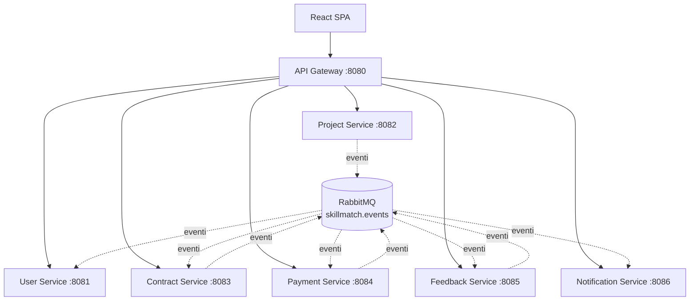

# ADR-001 - Microservice Architecture

| Campo        | Valore                                       |
|--------------|-----------------------------------------------|
| **Status**   | Accepted                                      |
| **Data**     | 2026-09-04                                    |
| **Autore**   | Team SkillMatch                               |
| **Contesto** | Decomposizione architetturale del sistema     |

---

## Contesto

SkillMatch nasce come progetto d'esame per il corso di Progettazione di Architetture di Servizi (Prof. Luca Mainetti, Università del Salento, A.A. 2025/26). La traccia richiede esplicitamente l'adozione del pattern **Microservice Architecture** come stile architetturale di riferimento, da dimostrare concretamente e documentare.

Il contesto reale del progetto impone però vincoli molto diversi da quelli di un'azienda che sceglie i microservizi per scalabilità o autonomia dei team:

- Il team è composto da 1-2 persone (limite massimo imposto dalla traccia d'esame).
- La deadline è fissata ad agosto 2026.
- Il deploy di produzione avviene su una singola VM Oracle Cloud Always Free (Ampere A1, 4 OCPU, 24 GB RAM), condivisa tra tutti i componenti: 7 microservizi applicativi, API Gateway, Keycloak, RabbitMQ, PostgreSQL, MongoDB. Non esiste un cluster multi-nodo con risorse elastiche.
- Non ci sono requisiti reali di scalabilità indipendente dei servizi, dato il carico atteso (demo d'esame, non produzione con utenti reali).

Questo secondo punto è centrale: i microservizi vengono adottati non perché il carico o l'organizzazione del team lo richiedano, ma perché il pattern è esplicitamente richiesto dalla traccia e il suo apprendimento pratico è l'obiettivo didattico dell'esame. Di conseguenza il numero di JVM concorrenti sulla stessa VM è alto rispetto alla RAM disponibile, ed è per questo che ogni servizio Spring Boot viene avviato con `-Xmx256m -Xms128m`: senza questo tuning, 7 JVM con heap di default esaurirebbero rapidamente i 24 GB condivisi con Keycloak, RabbitMQ, PostgreSQL e MongoDB.

---

## Decisione

Il sistema è decomposto in **7 microservizi Spring Boot indipendenti**, ciascuno con ciclo di vita, repository di codice (nel monorepo) e build/deploy separati:

| Servizio | Porta | Responsabilità |
|----------|-------|-----------------|
| API Gateway | 8080 | Punto di ingresso unico, validazione JWT, routing, Circuit Breaker |
| User Service | 8081 | Identità applicativa, profili, ruoli, reputazione |
| Project Service | 8082 | Progetti, candidature |
| Contract Service | 8083 | Micro-contratti |
| Payment Service | 8084 | Pagamenti, commissioni, fatture |
| Feedback Service | 8085 | Recensioni reciproche |
| Notification Service | 8086 | Notifiche, timeline eventi |

Ogni servizio:

- Possiede il proprio database logico (**Database per Service**, vedi ADR-003).
- Espone API REST versionate (`/api/v1/...`) verso l'esterno tramite l'API Gateway.
- Comunica in modo asincrono con gli altri servizi tramite eventi RabbitMQ su un topic exchange condiviso (`skillmatch.events`, vedi ADR-006), per i flussi che devono essere disaccoppiati temporalmente.
- È internamente strutturato secondo il pattern **3-Tier** (`controller/`, `service/`, `repository/`).
- È containerizzato con un proprio `Dockerfile` multi-stage per `linux/arm64` e ha una propria pipeline CI/CD path-filtrata (vedi ADR-005).

---

## Il trade-off per un progetto accademico piccolo

Adottare i microservizi per un team di 1-2 persone con una deadline fissa comporta un costo operativo reale, che va riconosciuto esplicitamente invece di ignorarlo:

- **7 pipeline CI/CD** da mantenere invece di una sola.
- **7 database logici** da gestire, versionare (Flyway) e tenere coerenti.
- **Gestione di eventi distribuiti**: idempotenza dei consumer, ordinamento non garantito, necessità di message converter compatibili tra servizi con classi Java separate (vedi ADR-006).
- **Debug distribuito**: un flusso end-to-end (es. candidatura accettata → creazione contratto → notifica) attraversa più servizi e più log stream, rendendo il troubleshooting più lento rispetto a un monolite con uno stack trace unico.

Questo costo viene accettato consapevolmente per due motivi:

1. **Valore didattico**: la traccia d'esame richiede esplicitamente di dimostrare il pattern Microservice Architecture insieme ai pattern correlati (API Gateway, Pub/Sub, Database per Service, Circuit Breaker, 3-Tier). Un monolite, per quanto più semplice da operare, non permetterebbe di soddisfare l'obiettivo dell'esame.
2. **Coerenza con bounded context reali**: la separazione scelta (identità, progetti, contratti, pagamenti, feedback, notifiche) non è arbitraria ma rispecchia domini di business abbastanza disaccoppiati da giustificare la scelta anche fuori dal contesto accademico. Ad esempio, il Payment Service non ha bisogno di conoscere la logica di matching tra professionisti e progetti, e il Notification Service è per natura un consumatore trasversale di eventi provenienti da tutti gli altri domini.

In altre parole, il costo operativo aggiuntivo è il prezzo pagato per l'obiettivo dell'esame, mentre la decomposizione per dominio scelta è comunque una decomposizione sensata indipendentemente dal vincolo accademico.

---

## Alternative Considerate

| Alternativa | Motivo del rifiuto |
|-------------|---------------------|
| Monolite modulare (moduli Maven/package separati, singolo deploy) | La traccia d'esame impone esplicitamente il pattern Microservice Architecture come stile architetturale da adottare e documentare; un monolite non soddisferebbe l'obiettivo dell'esame, indipendentemente dai suoi meriti tecnici per un team piccolo |
| Monolite a moduli con split futuro pianificato ("monolito prima, microservizi poi") | Nessun beneficio concreto dato che il vincolo della traccia richiede i microservizi fin da subito per la consegna di agosto 2026; rimandare lo split introdurrebbe solo rischio di non avere nulla di valutabile secondo la traccia entro la deadline |

---

## Conseguenze

**Positive:**
- Il sistema dimostra concretamente tutti i pattern richiesti dalla traccia d'esame (Microservice Architecture, API Gateway, Pub/Sub, Database per Service, Circuit Breaker, 3-Tier).
- La decomposizione per bounded context rende ogni servizio comprensibile e testabile in isolamento.
- Ogni servizio può essere buildato, testato e distribuito indipendentemente grazie ai path filter delle pipeline CI/CD (vedi ADR-005).
- Il fallimento di un singolo servizio (es. Notification Service) non blocca le funzionalità core (es. pubblicazione progetti), specialmente in combinazione con il Circuit Breaker sull'API Gateway.

**Negative / Rischi:**
- Overhead operativo sproporzionato rispetto alla dimensione del team (1-2 persone) e al carico reale del sistema (demo d'esame).
- Consumo di risorse più alto rispetto a un monolite equivalente: 7 JVM invece di 1, ciascuna tarata a `-Xmx256m -Xms128m` per stare nei 24 GB della VM Oracle Free Tier condivisi con Keycloak, RabbitMQ, PostgreSQL e MongoDB.
- Debug distribuito più complesso: un singolo flusso di business attraversa più servizi, più log stream e più code RabbitMQ.
- Necessità di gestire esplicitamente l'idempotenza dei consumer di eventi, dato che RabbitMQ non garantisce consegna esattamente una volta (vedi ADR-006).

---

## File di Riferimento

| File | Scopo |
|------|-------|
| [infra/docker-compose.yml](../../infra/docker-compose.yml) | Definizione di tutti i 7 microservizi, JVM tuning, dipendenze di avvio |
| [services/](../../services/) | Codice sorgente dei 7 microservizi, ciascuno standalone con proprio `pom.xml` e `Dockerfile` |
| [infra/k8s/](../../infra/k8s/) | Manifesti Kubernetes per il deploy su K3s, un set per servizio |
| [ADR-003-database-strategy.md](ADR-003-database-strategy.md) | Dettaglio della strategia Database per Service |
| [ADR-005-monorepo-strategy.md](ADR-005-monorepo-strategy.md) | Come i 7 microservizi convivono in un unico repository |
| [ADR-006-event-driven-communication.md](ADR-006-event-driven-communication.md) | Dettaglio della comunicazione asincrona tra servizi |
