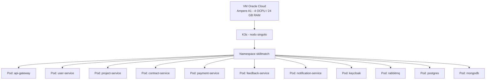

# ADR-004 - Oracle Cloud Always Free + K3s

| Campo        | Valore                                      |
|--------------|-----------------------------------------------|
| **Status**   | Accepted                                      |
| **Data**     | 2026-09-04                                    |
| **Autore**   | Team SkillMatch                               |
| **Contesto** | Infrastruttura di deploy e orchestrazione     |

---

## Contesto

SkillMatch è un progetto accademico con budget pari a zero, una deadline fissa (agosto 2026) e nessuna carta di credito aziendale da associare a un provider cloud. Allo stesso tempo, il progetto vuole seguire buone pratiche cloud-native e dimostrare containerizzazione e orchestrazione Kubernetes reale, non solo su carta.

Serve quindi un'infrastruttura che sia:

- Gratuita a tempo indeterminato (non un trial a scadenza), dato che il progetto deve rimanere disponibile per la valutazione e la demo d'esame.
- Sufficiente a ospitare 7 microservizi Spring Boot, API Gateway, Keycloak, RabbitMQ, PostgreSQL, MongoDB e il frontend React contemporaneamente.
- Basata su un'orchestrazione dichiarativa reale (non solo `docker compose up` su una VM), per dimostrare padronanza dei pattern di deploy Kubernetes-native.

---

## Decisione

Si usa **Oracle Cloud Infrastructure Always Free**, in particolare una VM **Ampere A1 (ARM)** con 4 OCPU e 24 GB di RAM, gratuita a tempo indeterminato e senza necessità di carta di credito per il tier free. Su questa VM gira **K3s**, la distribuzione Kubernetes leggera certificata CNCF, in configurazione a singolo nodo.

Conseguenza diretta della scelta hardware: l'architettura Ampere A1 è **ARM64**, quindi ogni immagine Docker del progetto deve essere buildata per la piattaforma `linux/arm64` (Dockerfile multi-stage, build con `docker buildx`). Questo vincolo si propaga fino alla pipeline CI/CD, che deve usare buildx con target ARM64 invece della piattaforma x86_64 di default dei runner GitHub Actions.

---

## Perché K3s e non un cluster Kubernetes completo

K3s è una distribuzione Kubernetes conforme alla certificazione CNCF, ma distribuita come singolo binario con footprint di memoria e CPU molto più basso rispetto a un'installazione "vanilla" tramite `kubeadm`. Le differenze principali che motivano la scelta:

- **Footprint ridotto**: K3s rimuove componenti non essenziali per un uso single-node (driver cloud provider non usati, storage in-tree legacy) e usa SQLite come datastore di default al posto di etcd, riducendo il consumo di RAM del control plane.
- **Singolo binario**: l'installazione è un solo eseguibile che include kubelet, kube-apiserver, kube-scheduler, kube-controller-manager e containerd, senza bisogno di orchestrare l'installazione di componenti separati.
- **Adatto a un nodo singolo**: il progetto ha una sola VM disponibile. Un cluster `kubeadm` con etcd standalone avrebbe un overhead di risorse pensato per topologie multi-nodo (alta disponibilità del control plane, storage distribuito) che qui non ha alcun beneficio, mentre sottrae RAM utile alle applicazioni.

In sintesi, K3s dà tutto ciò che serve per dimostrare i pattern di orchestrazione Kubernetes (Deployment, Service, ConfigMap, Secret, Ingress, health probe, rolling update) senza pagare l'overhead di un control plane dimensionato per scenari multi-nodo che qui non esistono.

---

## Natura cloud-agnostic della scelta

Un punto esplicitamente voluto nel design: i manifesti Kubernetes in `infra/k8s/` non usano alcuna risorsa proprietaria di Oracle Cloud (nessun `StorageClass` specifico OCI, nessun `LoadBalancer` gestito Oracle, nessuna integrazione IAM Oracle). Tutte le risorse usate (Deployment, Service ClusterIP, ConfigMap, Secret, Ingress via Traefik) sono standard Kubernetes, supportate identicamente da qualunque distribuzione conforme CNCF.

Questo significa che una futura migrazione verso **AKS** (Azure), **EKS** (AWS) o **GKE** (Google) richiederebbe zero modifiche al codice applicativo o ai manifesti Kubernetes: solo lo strato infrastrutturale (provisioning del cluster, eventuale adattamento delle credenziali cloud per i Secret) cambierebbe. Oracle Cloud con K3s è la scelta attuale perché il suo tier Always Free fornisce risorse sufficienti (24 GB RAM) gratuitamente e senza scadenza, non perché l'architettura dipenda in alcun modo da funzionalità specifiche di Oracle.

---

## Alternative Considerate

| Alternativa | Motivo del rifiuto |
|-------------|---------------------|
| EKS / AKS / GKE (Kubernetes gestito) | Costi mensili non sostenibili per un progetto studentesco; anche gli eventuali crediti gratuiti offerti dai provider sono limitati nel tempo e non coprono l'intero arco del progetto fino alla consegna di agosto 2026 |
| Docker Compose direttamente in produzione, senza Kubernetes | Non dimostrerebbe il pattern di orchestrazione richiesto dal contesto del corso; inoltre Compose non gestisce in modo dichiarativo restart automatici, health probe, rolling update e scaling dei pod come fa Kubernetes |
| PaaS gratuiti (Heroku, Render, Railway) | I tier gratuiti sono generosi ma temporanei o soggetti a sleep/limiti di utilizzo; soprattutto, un PaaS astrae completamente l'orchestrazione Kubernetes, quindi non permetterebbe di dimostrare le competenze richieste dalla traccia d'esame |

---

## Conseguenze

**Positive:**
- Infrastruttura gratuita a tempo indeterminato, senza rischio di scadenza durante il progetto o dopo la consegna.
- Dimostra concretamente orchestrazione Kubernetes reale (Deployment, Service, ConfigMap, Secret, Ingress, health probe).
- Design completamente cloud-agnostic: nessun lock-in verso Oracle Cloud.
- Risorse hardware (4 OCPU, 24 GB RAM) sufficienti per l'intero stack del progetto.

**Negative / Rischi:**
- Singolo nodo: nessuna alta disponibilità del control plane né dei pod applicativi; un riavvio della VM comporta downtime dell'intero stack.
- Architettura ARM64: ogni immagine Docker deve essere buildata esplicitamente per `linux/arm64`, aggiungendo un vincolo alla pipeline CI/CD (uso di `buildx` con target ARM invece della piattaforma nativa dei runner GitHub Actions).
- Datastore SQLite di K3s (invece di etcd) è meno robusto sotto carico multi-nodo, ma è un compromesso accettabile per una topologia a nodo singolo.
- Nessun accesso a servizi gestiti Oracle equivalenti a RDS/managed Kubernetes add-on: ogni componente stateful (PostgreSQL, MongoDB, RabbitMQ) va gestito manualmente come pod nel cluster.

---

## File di Riferimento

| File | Scopo |
|------|-------|
| [infra/k8s/namespace.yaml](../../infra/k8s/namespace.yaml) | Definizione del namespace `skillmatch` |
| [infra/k8s/ingress.yaml](../../infra/k8s/ingress.yaml) | Ingress Traefik per API Gateway e frontend |
| [infra/k8s/](../../infra/k8s/) | Manifesti Kubernetes completi (Deployment, Service, ConfigMap, Secret per servizio) |
| [infra/scripts/deploy-k8s.sh](../../infra/scripts/deploy-k8s.sh) | Script di deploy su K3s |
| [ADR-001-microservice-architecture.md](ADR-001-microservice-architecture.md) | Contesto dei 7 microservizi ospitati sul cluster |
