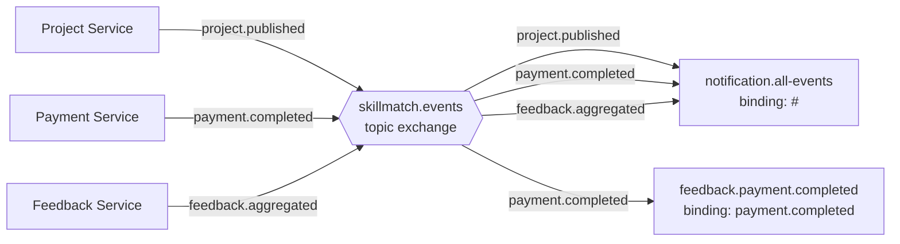

# ADR-006 - Event-Driven Communication con RabbitMQ

| Campo        | Valore                                       |
|--------------|-------------------------------------------------|
| **Status**   | Accepted                                        |
| **Data**     | 2026-09-04                                      |
| **Autore**   | Team SkillMatch                                 |
| **Contesto** | Comunicazione asincrona tra microservizi        |

---

## Contesto

Diversi flussi di business in SkillMatch devono disaccoppiare temporalmente chi genera un evento da chi lo consuma:

- La registrazione o l'aggiornamento di un utente non deve bloccarsi in attesa che il Notification Service scriva il documento corrispondente su MongoDB.
- Il completamento di un pagamento deve abilitare il feedback sul progetto senza che il Payment Service debba conoscere l'esistenza del Feedback Service, né attendere una sua risposta sincrona.
- L'accettazione di una candidatura deve generare un micro-contratto e, in parallelo, notificare le parti coinvolte, senza che il Project Service debba orchestrare esplicitamente due chiamate REST verso servizi diversi.

Serve quindi un meccanismo di comunicazione asincrona che permetta ai publisher di ignorare completamente chi sono i consumer dei propri eventi, mantenendo i servizi disaccoppiati sia a runtime sia a livello di conoscenza reciproca.

---

## Decisione

Si adotta **RabbitMQ** con un **singolo topic exchange** chiamato `skillmatch.events`, dichiarato in modo identico (stesso nome, tipo `topic`, `durable`) in ogni microservizio tramite una classe `RabbitMQConfig` propria di ciascun servizio:

```java
@Bean
public TopicExchange skillmatchExchange() {
    return new TopicExchange(EXCHANGE, true, false);
}
```

I publisher inviano i messaggi con una routing key nella forma `<dominio>.<azione>` (es. `project.published`, `candidature.accepted`, `payment.completed`, `feedback.aggregated`), **senza conoscere quali servizi consumeranno l'evento**. Ogni consumer dichiara la propria coda e la lega all'exchange con un binding sulla routing key (o sul pattern) che gli interessa:

```java
@Bean
public Binding candidatureAcceptedBinding(Queue candidatureAcceptedQueue, TopicExchange skillmatchExchange) {
    return BindingBuilder.bind(candidatureAcceptedQueue)
            .to(skillmatchExchange)
            .with("candidature.accepted");
}
```

**Eccezione: il Notification Service** lega la propria coda (`notification.all-events`) con il wildcard `#`, ricevendo così ogni evento pubblicato sull'exchange, qualunque sia la routing key:

```java
@Bean
public Binding allEventsBinding(Queue allEventsQueue, TopicExchange skillmatchExchange) {
    return BindingBuilder.bind(allEventsQueue)
            .to(skillmatchExchange)
            .with("#");
}
```

Questo rende il Notification Service un **sink universale** per la timeline di notifiche di un utente: al suo interno mantiene una mappa evento → destinatari → messaggio, con un ramo di default che gestisce gli eventi per cui non esiste ancora un template dedicato, senza scartarli.



---

## Nota tecnica: message converter e `__TypeId__`

Ogni publisher, tramite `Jackson2JsonMessageConverter`, marca automaticamente l'header AMQP `__TypeId__` con il nome completo della propria classe Java dell'evento (es. `com.skillmatch.paymentservice.event.PaymentCompletedEvent`). Questa classe **non esiste** nel classpath del servizio consumer, perché ogni servizio definisce le proprie classi/record evento in modo indipendente, senza condividere una libreria di schemi comune.

Se un consumer si fidasse ciecamente dell'header `__TypeId__` per decidere in che classe deserializzare il payload, otterrebbe un `ClassNotFoundException` a runtime, dato che quella classe appartiene al classpath del publisher, non del consumer. La soluzione adottata in ogni consumer è configurare il converter con `setAlwaysConvertToInferredType(true)`:

```java
@Bean
public MessageConverter jacksonMessageConverter() {
    Jackson2JsonMessageConverter converter = new Jackson2JsonMessageConverter();
    converter.setAlwaysConvertToInferredType(true);
    return converter;
}
```

Questo flag istruisce Spring AMQP a ignorare l'header `__TypeId__` del publisher e a deserializzare il payload JSON nel tipo dichiarato dal parametro del metodo annotato `@RabbitListener` nel consumer stesso. Ogni evento resta quindi definito da classi Java quasi identiche ma fisicamente separate per servizio: una scelta deliberata per non accoppiare i microservizi a un JAR condiviso di "schemi evento", che romperebbe l'indipendenza di build e di deploy voluta dal pattern Microservice Architecture (vedi ADR-001).

---

## Idempotenza dei consumer

RabbitMQ, come la maggior parte dei broker di messaggistica, non garantisce consegna "exactly-once": in presenza di redelivery (es. un consumer che va in errore dopo aver processato un messaggio ma prima di inviare l'ack), lo stesso evento può essere recapitato più di una volta. I consumer che eseguono operazioni di scrittura non idempotenti per natura verificano quindi esplicitamente l'esistenza di uno stato già creato per lo stesso identificativo di dominio, prima di procedere:

- **Contract Service**, nel metodo `createFromCandidatureAccepted`, verifica se esiste già un contratto per il `projectId` ricevuto nell'evento `candidature.accepted` prima di crearne uno nuovo; in caso positivo, logga un warning e scarta l'evento duplicato senza sollevare errore.
- **Feedback Service**, nel metodo `enableFeedback`, verifica se esiste già un record di eligibilità per il `projectId` ricevuto nell'evento `payment.completed` prima di crearne uno nuovo, con la stessa logica di skip silenzioso in caso di duplicato.

Questo pattern (verifica di esistenza per chiave di dominio prima della scrittura) tollera la redelivery del broker senza duplicare dati, senza richiedere infrastruttura aggiuntiva (es. una tabella di deduplica dedicata o outbox pattern), sufficiente per il volume di eventi di questo progetto.

---

## Alternative Considerate

| Alternativa | Motivo del rifiuto |
|-------------|---------------------|
| Apache Kafka | Overhead operativo e di risorse (JVM aggiuntiva, ZooKeeper o KRaft, gestione dei topic/partizioni) non giustificato per il volume di eventi di un progetto accademico su hardware gratuito limitato (vedi ADR-004); RabbitMQ è inoltre più semplice da configurare e integrare con Spring tramite Spring AMQP |
| Una coda dedicata per ogni coppia publisher-consumer, senza exchange condiviso | Accoppierebbe esplicitamente ogni publisher ai nomi delle code (e quindi ai consumer) a cui deve inviare, perdendo il disaccoppiamento tipico del pattern Pub/Sub; aggiungere un nuovo consumer richiederebbe modificare il codice del publisher |
| Chiamate REST sincrone per tutti i flussi, invece di eventi | Introdurrebbe accoppiamento temporale tra servizi che non devono conoscersi a runtime: ad esempio il Payment Service dovrebbe chiamare direttamente il Feedback Service ad ogni pagamento completato, legando la disponibilità del primo alla disponibilità del secondo, e obbligando il Payment Service a conoscere l'esistenza e l'API del Feedback Service |

---

## Conseguenze

**Positive:**
- I publisher restano completamente disaccoppiati dai consumer: aggiungere un nuovo consumer di un evento esistente richiede solo un nuovo binding, zero modifiche al publisher.
- Il fallimento temporaneo di un consumer (es. Notification Service giù) non blocca il publisher né gli altri consumer, grazie alla natura asincrona della comunicazione.
- Un singolo exchange condiviso mantiene la configurazione uniforme e semplice da replicare in ogni servizio.
- Il Notification Service, come sink universale con binding `#`, non richiede modifiche ogni volta che viene introdotto un nuovo tipo di evento nel sistema.

**Negative / Rischi:**
- Nessuna garanzia di ordinamento globale degli eventi tra code diverse, e nessuna garanzia "exactly-once": ogni consumer deve gestire esplicitamente l'idempotenza dove rilevante.
- L'assenza di una libreria di schemi condivisa (scelta deliberata) comporta il rischio che le classi evento di publisher e consumer divergano nel tempo (es. un campo rinominato solo da un lato), errore che verrebbe scoperto solo a runtime e non a compile-time.
- Il debug di un flusso end-to-end che attraversa più servizi via eventi è più complesso rispetto a una chiamata REST sincrona con uno stack trace unico, richiedendo di correlare log su più servizi e code diverse.
- RabbitMQ è un ulteriore componente stateful da mantenere in esecuzione sulla VM, con il proprio consumo di RAM (vedi ADR-004).

---

## File di Riferimento

| File | Scopo |
|------|-------|
| [services/notification-service/src/main/java/com/skillmatch/notificationservice/config/RabbitMQConfig.java](../../services/notification-service/src/main/java/com/skillmatch/notificationservice/config/RabbitMQConfig.java) | Configurazione del binding universale `#` (sink di tutti gli eventi) |
| [services/contract-service/src/main/java/com/skillmatch/contractservice/config/RabbitMQConfig.java](../../services/contract-service/src/main/java/com/skillmatch/contractservice/config/RabbitMQConfig.java) | Esempio di binding su routing key specifica (`candidature.accepted`) |
| [services/payment-service/src/main/java/com/skillmatch/paymentservice/config/RabbitMQConfig.java](../../services/payment-service/src/main/java/com/skillmatch/paymentservice/config/RabbitMQConfig.java) | Esempio di configurazione lato publisher (`payment.completed`) |
| [services/contract-service/src/main/java/com/skillmatch/contractservice/service/ContractServiceImpl.java](../../services/contract-service/src/main/java/com/skillmatch/contractservice/service/ContractServiceImpl.java) | Esempio di idempotenza del consumer (`createFromCandidatureAccepted`) |
| [services/feedback-service/src/main/java/com/skillmatch/feedbackservice/service/FeedbackServiceImpl.java](../../services/feedback-service/src/main/java/com/skillmatch/feedbackservice/service/FeedbackServiceImpl.java) | Esempio di idempotenza del consumer (`enableFeedback`) |
| [infra/k8s/rabbitmq/](../../infra/k8s/rabbitmq/) | Manifesti Kubernetes per il deploy di RabbitMQ su K3s |
| [ADR-001-microservice-architecture.md](ADR-001-microservice-architecture.md) | Contesto della comunicazione tra i 7 microservizi |
