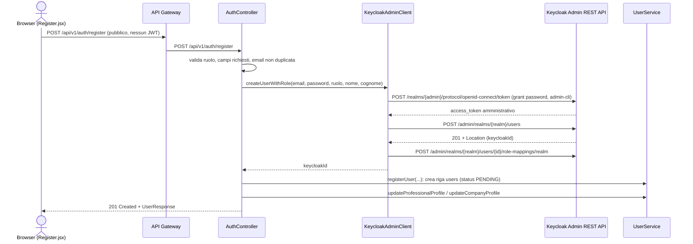

# ADR-007: Registrazione Self-Service tramite Keycloak Admin API

| Campo        | Valore                                          |
|--------------|--------------------------------------------------|
| **Status**   | Accepted                                         |
| **Data**     | 2026-09-06                                       |
| **Autore**   | Aura Andrioli                                    |
| **Contesto** | Onboarding di professionisti e aziende            |

---

## Contesto

Nella versione iniziale del sistema (vedi [ADR-002](ADR-002-keycloak-configuration.md)) un nuovo utente doveva crearsi l'account direttamente dalla UI di login di Keycloak e poi, separatamente, completare il proprio profilo applicativo (`PUT /api/v1/users/{userId}/professional-profile` o `.../company-profile`) dopo il primo login. Questo lasciava un utente "a metà": un'identità Keycloak esisteva già, ma senza uno stato applicativo coerente finché il primo login non veniva effettuato manualmente, e non c'era modo di validare lato server, in un unico posto, i campi minimi richiesti dal ruolo (nome e cognome per un professionista, ragione sociale per un'azienda) prima ancora che l'account fosse utilizzabile.

Serve un unico punto di ingresso che crei atomicamente identità Keycloak, riga `users` e profilo minimo, restituendo un solo errore comprensibile se qualcosa fallisce (email duplicata, campi mancanti, ruolo non consentito).

---

## Decisione

Lo User Service espone `POST /api/v1/auth/register` (`AuthController`), pubblico sia a livello di API Gateway sia di `SecurityConfig` interna del servizio, che orchestra in un'unica chiamata:

1. Validazione applicativa: rifiuta il ruolo `ADMIN` (gli admin non si autoregistrano) e i campi obbligatori mancanti per il ruolo scelto (nome/cognome per `PROFESSIONAL`, ragione sociale per `COMPANY`); rifiuta email già registrate nel database applicativo.
2. Creazione dell'identità su Keycloak tramite `KeycloakAdminClient`, che usa la **Admin REST API** di Keycloak: ottiene un token amministrativo con grant `password` sul client `admin-cli`, crea l'utente con password permanente e `emailVerified: true` (per non bloccare il primo login dietro il required action `VERIFY_PROFILE`), quindi gli assegna il realm role corrispondente al ruolo scelto.
3. Creazione della riga `users` (stato `PENDING`, come ogni registrazione) tramite lo stesso `UserService.registerUser(...)` già usato dal flusso precedente.
4. Completamento del profilo minimo (`ProfessionalProfileRequest` o `CompanyProfileRequest`) nella stessa richiesta HTTP.

Sul lato Keycloak, `registrationAllowed` resta `false`: il tema di login personalizzato (`infra/keycloak/themes/skillmatch/login/`) aggiunge invece un link "Registrati" che porta l'utente alla pagina `/register` del frontend, così Keycloak resta esclusivamente l'Identity Provider e l'applicazione resta l'unica proprietaria del flusso di onboarding end-to-end.

---

## Nota di sicurezza: credenziali amministrative condivise

`KeycloakAdminClient` si autentica come lo stesso utente amministratore bootstrap usato per inizializzare l'intero realm Keycloak (`KEYCLOAK_ADMIN`/`KEYCLOAK_ADMIN_PASSWORD`, le stesse credenziali configurate in `infra/k8s/config.yaml`), tramite il client pubblico `admin-cli` e il grant `password` (Resource Owner Password Credentials). Non è stato definito un client di servizio dedicato con un ruolo Keycloak a permessi minimi (es. solo `manage-users` sul realm applicativo). Questa è una scelta deliberata di scope per un progetto accademico con deadline fissa: un client a permessi minimi richiederebbe configurare client roles Keycloak dedicati e gestirne il secret, lavoro non giustificato dal tempo disponibile. **Prima di qualunque uso oltre il contesto dell'esame**, questo va sostituito con un client di servizio Keycloak dedicato, con un ruolo ristretto alla sola gestione utenti sul realm applicativo, per non esporre credenziali con privilegi di amministrazione completa del realm a un microservizio applicativo.

---

## Alternative Considerate

| Alternativa | Motivo del rifiuto |
|---|---|
| Registrazione nativa Keycloak (`registrationAllowed: true`) | Crea solo l'identità: lascerebbe comunque necessario un passo applicativo separato per creare la riga `users` e il profilo minimo, riproponendo esattamente il problema di stato incoerente che questo ADR vuole risolvere; inoltre Keycloak non conosce il concetto di ruolo applicativo PROFESSIONAL/COMPANY da assegnare in fase di creazione |
| Client Keycloak dedicato a permessi minimi fin da subito | Corretto a regime, ma richiede configurazione aggiuntiva (client roles `manage-users` sul realm) non giustificata dai tempi del progetto; annotato esplicitamente come debito tecnico da risolvere prima di un uso reale |
| Endpoint separato per creare l'identità e uno successivo per completare il profilo (due chiamate dal frontend) | Reintrodurrebbe la finestra in cui esiste un'identità Keycloak senza un profilo applicativo coerente, se l'utente abbandona il flusso tra le due chiamate |

---

## Conseguenze

**Positive:**
- Un utente che completa la registrazione ha sempre, atomicamente dal punto di vista applicativo, identità Keycloak + riga `users` + profilo minimo coerenti.
- Un solo punto di validazione lato server per i campi obbligatori per ruolo, prima ancora che l'account sia utilizzabile.
- Il tema di login personalizzato mantiene la separazione concettuale tra Keycloak (autenticazione) e applicazione (onboarding, dati di dominio).

**Negative / Rischi:**
- Le credenziali amministrative complete del realm sono note allo User Service (via env var), un privilegio più ampio di quanto la sola creazione utenti richieda.
- Se una qualsiasi delle chiamate sequenziali a Keycloak fallisce dopo aver creato l'utente (es. l'assegnazione del ruolo), rimane un utente Keycloak orfano senza riga `users` corrispondente: non c'è ancora una compensazione/rollback automatico.
- Il flusso richiede più chiamate HTTP sequenziali verso Keycloak (token, creazione, lookup ruolo, assegnazione ruolo), per cui il timeout del Circuit Breaker dedicato (`userServiceCB`) è stato alzato a 10s rispetto al default di 4s.

---

## File di Riferimento

| File | Scopo |
|---|---|
| [services/user-service/src/main/java/com/skillmatch/userservice/controller/AuthController.java](../../services/user-service/src/main/java/com/skillmatch/userservice/controller/AuthController.java) | Endpoint `POST /api/v1/auth/register` e validazione applicativa |
| [services/user-service/src/main/java/com/skillmatch/userservice/client/KeycloakAdminClient.java](../../services/user-service/src/main/java/com/skillmatch/userservice/client/KeycloakAdminClient.java) | Chiamate alla Admin REST API di Keycloak (token, creazione utente, assegnazione ruolo) |
| [infra/keycloak/themes/skillmatch/login/](../../infra/keycloak/themes/skillmatch/login/) | Tema di login personalizzato con link "Registrati" verso il frontend |
| [frontend/src/pages/Register.jsx](../../frontend/src/pages/Register.jsx) | Form di registrazione self-service lato frontend |
| [docs/sequence-diagrams/registration-flow.md](../sequence-diagrams/registration-flow.md) | Flusso completo, incluso il caso self-service |
