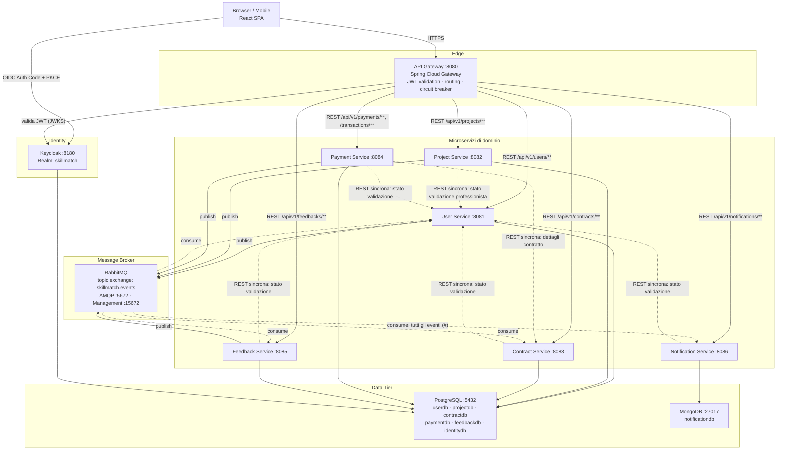

# SkillMatch: Architettura di Alto Livello

> **Corso**: Progettazione di Architetture di Servizi
> **Università**: Università del Salento, Prof. Luca Mainetti, A.A. 2025/26

## Panoramica

SkillMatch è una web application a microservizi che mette in contatto professionisti e aziende per micro-progetti di collaborazione a breve termine (formazione, consulenza, prototipazione). Il sistema è composto da sette microservizi Spring Boot indipendenti, ciascuno proprietario del proprio database (pattern Database per Service), da un frontend React a pagina singola e da un livello di infrastruttura condivisa (API Gateway, Keycloak, RabbitMQ) che rende possibile la comunicazione sincrona e asincrona tra i componenti senza accoppiarli direttamente tra loro.

Il frontend è responsive, requisito indicato come opzionale dalla traccia d'esame ("dispositivi laptop e desktop in primis ed opzionalmente dispositivi mobile"). Non è un effetto collaterale casuale: è una conseguenza diretta della scelta di **Material UI** come libreria di componenti, che adotta i breakpoint responsive (`xs`/`sm`/`md`) come parte nativa del proprio sistema di layout (`sx`, `Grid`), non un livello aggiunto in un secondo momento. La navigazione principale (`AppLayout.jsx`) ne è l'esempio più concreto: sotto la soglia `md` mostra un `Drawer` temporaneo apribile da un pulsante hamburger, sopra la soglia mostra invece un `Drawer` permanente sempre visibile; più pagine (dashboard, liste, form) riflowano la propria griglia da una singola colonna su mobile a più colonne su schermi larghi con lo stesso meccanismo (`gridTemplateColumns: { xs: '1fr', sm: 'repeat(3, 1fr)' }`).

L'accesso esterno passa sempre attraverso l'API Gateway (Spring Cloud Gateway), unico punto di ingresso che valida i JWT emessi da Keycloak, instrada le richieste al microservizio competente e applica un Circuit Breaker (Resilience4j) sulle chiamate verso i servizi a valle. La comunicazione tra microservizi è per lo più asincrona tramite un topic exchange RabbitMQ (`skillmatch.events`); l'unica eccezione sono alcune chiamate REST dirette service-to-service (es. Project → User, Payment → Contract) usate quando un servizio ha bisogno di un dato sincrono e aggiornato per validare un'operazione, invece di mantenerne una copia locale.

Ogni microservizio segue internamente un'architettura a 3 livelli (Presentation / Business / Data), con pacchetti `controller`, `service` e `repository` separati. La configurazione è esternalizzata tramite variabili d'ambiente (12-Factor III), i container sono costruiti per `linux/arm64` e distribuiti su un cluster K3s a singolo nodo ospitato su una VM Oracle Cloud Always Free.

Oltre al flusso di autenticazione standard via Keycloak, lo User Service espone anche una registrazione self-service (`POST /api/v1/auth/register`) che provisiona direttamente l'account su Keycloak tramite la sua Admin REST API, così un professionista o un'azienda possono creare l'account senza passare dalla UI di Keycloak (dettagli in [docs/adr/ADR-007-self-service-registration.md](adr/ADR-007-self-service-registration.md)). Sui due servizi core (User e Project) è inoltre attiva una gate di qualità in build (JaCoCo, copertura minima 90% linee; PMD, complessità ciclomatica massima 10 per metodo), coerente con i requisiti della traccia d'esame su complessità e test coverage (vedi [docs/three-layer/](three-layer/)).

## Diagramma dei Componenti

## Tabella dei Servizi

| Servizio | Porta | Database | Tipo |
|---|---|---|---|
| API Gateway | 8080 | n/d | Spring Cloud Gateway |
| User Service | 8081 | userdb (PostgreSQL) | Spring Boot |
| Project Service | 8082 | projectdb (PostgreSQL) | Spring Boot |
| Contract Service | 8083 | contractdb (PostgreSQL) | Spring Boot |
| Payment Service | 8084 | paymentdb (PostgreSQL) | Spring Boot |
| Feedback Service | 8085 | feedbackdb (PostgreSQL) | Spring Boot |
| Notification Service | 8086 | notificationdb (MongoDB) | Spring Boot |
| Keycloak (Identity) | 8180 | identitydb (PostgreSQL) | Keycloak 26.0 |
| RabbitMQ | 5672 (AMQP), 15672 (mgmt) | n/d | RabbitMQ 3-management |

Tutti i database PostgreSQL vivono su un'unica istanza fisica (per risparmiare RAM sulla VM Always Free), ma restano database logici separati: nessun microservizio ha credenziali per accedere allo schema di un altro, rispettando il pattern Database per Service.

## Design Pattern Applicati

| Pattern | Dove |
|---|---|
| Microservice Architecture | Scomposizione del sistema in sette servizi indipendenti, ciascuno con ciclo di vita e deploy autonomo |
| Client-Server | React SPA come client, API Gateway come server applicativo |
| REST | Tutte le API esposte da ogni microservizio (`/api/v1/...`), incluse le chiamate sincrone service-to-service |
| API Gateway | Spring Cloud Gateway come unico entry point esterno |
| Pub/Sub | Topic exchange RabbitMQ `skillmatch.events`; i publisher non conoscono i consumer (vedi [docs/events.md](events.md)) |
| Database per Service | Ogni servizio possiede il proprio schema logico; nessun accesso incrociato al DB |
| Circuit Breaker | Resilience4j sulle chiamate REST sincrone tra servizi (es. Payment → Contract, tutti i servizi → User) |
| 3-Tier Architecture | Pacchetti `controller` / `service` / `repository` in ogni microservizio (vedi [docs/three-layer/](three-layer/)) |
| Externalized Configuration | Configurazione via `${ENV_VAR:default}`, ConfigMap e Secret Kubernetes (12-Factor III) |

## Flusso degli Eventi (sintesi)

| Evento | Publisher | Consumer |
|---|---|---|
| `user.registered` | user-service | notification-service |
| `user.validated` | user-service | notification-service |
| `project.published` | project-service | notification-service |
| `candidature.submitted` | project-service | notification-service |
| `candidature.accepted` | project-service | contract-service, notification-service |
| `project.completed` | project-service | notification-service |
| `payment.completed` | payment-service | feedback-service, notification-service |
| `feedback.aggregated` | feedback-service | user-service, notification-service |

Dettaglio completo (routing key, code, payload) in [docs/events.md](events.md).

## Infrastruttura

- **Sviluppo locale**: `cd infra && docker compose up` avvia tutti i servizi, PostgreSQL, MongoDB, RabbitMQ e Keycloak.
- **Produzione**: K3s su VM Oracle Cloud ARM (Always Free, 4 OCPU, 24 GB RAM), esposta tramite Ingress Traefik (incluso di default in K3s) + cert-manager (Let's Encrypt), con anche il frontend React containerizzato e distribuito come pod. Dettagli in [docs/deployment.md](deployment.md).
- **CI/CD**: un workflow GitHub Actions per servizio, filtrato per path (`services/<nome>/**`) → build Maven + test → Docker buildx `linux/arm64` → push su GHCR → `kubectl set image` via SSH.
- **Observability**: Spring Boot Actuator + Prometheus + Grafana per le metriche, Loki + Promtail per i log.
