# Introduzione

SkillMatch è una web application a microservizi sviluppata per il corso di Progettazione di Architetture di Servizi (Prof. Luca Mainetti, Università del Salento, A.A. 2025/26). La piattaforma mette in contatto professionisti e aziende per micro-progetti di collaborazione a breve termine: formazione, consulenza, prototipazione. Un amministratore valida l'iscrizione dei professionisti, le aziende pubblicano progetti e selezionano candidati, la piattaforma gestisce contratto, pagamento (con trattenuta di una commissione configurabile), fattura unica e feedback reciproco a fine collaborazione.

Questo manuale aggrega in un unico documento tutta la documentazione tecnica del progetto, già disponibile in forma modulare nella cartella `docs/` del repository (`architecture.md`, `use-cases/`, `er-diagrams/`, `sequence-diagrams/`, `three-layer/`, `deployment.md`, `events.md`, `adr/`, `development-process.md`). Ogni fatto tecnico riportato (endpoint REST, schema tabelle, routing key degli eventi, nomi di classi) è stato verificato direttamente sul codice sorgente dei sette microservizi, non dedotto dai soli documenti di progetto.

Il sistema è composto da sette microservizi Spring Boot indipendenti (API Gateway, User, Project, Contract, Payment, Feedback, Notification Service), un frontend React a pagina singola, e uno strato di infrastruttura condivisa (Keycloak per l'identità, RabbitMQ per la comunicazione asincrona, PostgreSQL e MongoDB per la persistenza), distribuito su un cluster K3s a singolo nodo su una VM Oracle Cloud Always Free.

\newpage

# Architettura High-Level

SkillMatch è una web application a microservizi che mette in contatto professionisti e aziende per micro-progetti di collaborazione a breve termine (formazione, consulenza, prototipazione). Il sistema è composto da sette microservizi Spring Boot indipendenti, ciascuno proprietario del proprio database (pattern Database per Service), da un frontend React a pagina singola e da un livello di infrastruttura condivisa (API Gateway, Keycloak, RabbitMQ) che rende possibile la comunicazione sincrona e asincrona tra i componenti senza accoppiarli direttamente tra loro.

L'accesso esterno passa sempre attraverso l'API Gateway (Spring Cloud Gateway), unico punto di ingresso che valida i JWT emessi da Keycloak, instrada le richieste al microservizio competente e applica un Circuit Breaker (Resilience4j) sulle chiamate verso i servizi a valle. La comunicazione tra microservizi è per lo più asincrona tramite un topic exchange RabbitMQ (`skillmatch.events`); l'unica eccezione sono alcune chiamate REST dirette service-to-service (es. Project verso User, Payment verso Contract) usate quando un servizio ha bisogno di un dato sincrono e aggiornato per validare un'operazione, invece di mantenerne una copia locale.

Ogni microservizio segue internamente un'architettura a 3 livelli (Presentation / Business / Data), con pacchetti `controller`, `service` e `repository` separati. La configurazione è esternalizzata tramite variabili d'ambiente (12-Factor III), i container sono costruiti per `linux/arm64` e distribuiti su un cluster K3s a singolo nodo ospitato su una VM Oracle Cloud Always Free.

Oltre al flusso di autenticazione standard via Keycloak, lo User Service espone anche una registrazione self-service (`POST /api/v1/auth/register`) che provisiona direttamente l'account su Keycloak tramite la sua Admin REST API, così un professionista o un'azienda possono creare l'account senza passare dalla UI di Keycloak (dettagli in [ADR-007](#adr-007-registrazione-self-service-tramite-keycloak-admin-api)). Sui due servizi core (User e Project) è inoltre attiva una gate di qualità in build (JaCoCo, copertura minima 90% linee; PMD, complessità ciclomatica massima 10 per metodo), approfondita nel capitolo [Qualità del Codice](#qualità-del-codice).

Il frontend è responsive, requisito indicato come opzionale dalla traccia d'esame ("dispositivi laptop e desktop in primis ed opzionalmente dispositivi mobile"). Non è un effetto collaterale casuale: è una conseguenza diretta della scelta di **Material UI** come libreria di componenti, che adotta i breakpoint responsive (`xs`/`sm`/`md`) come parte nativa del proprio sistema di layout (`sx`, `Grid`), non un livello aggiunto in un secondo momento. La navigazione principale (`AppLayout.jsx`) ne è l'esempio più concreto: sotto la soglia `md` mostra un `Drawer` temporaneo apribile da un pulsante hamburger, sopra la soglia mostra invece un `Drawer` permanente sempre visibile; più pagine (dashboard, liste, form) riflowano la propria griglia da una singola colonna su mobile a più colonne su schermi larghi con lo stesso meccanismo (`gridTemplateColumns: { xs: '1fr', sm: 'repeat(3, 1fr)' }`).

## Diagramma dei Componenti

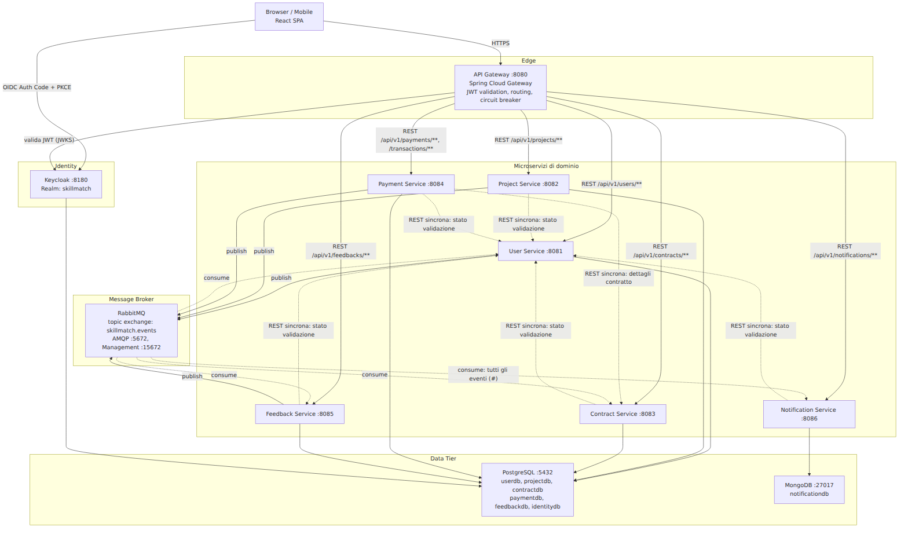

## Tabella dei Servizi

| Servizio | Porta | Database | Tipo |
|---|---|---|---|
| API Gateway | 8080 | n/d | Spring Cloud Gateway |
| User Service | 8081 | userdb (PostgreSQL) | Spring Boot |
| Project Service | 8082 | projectdb (PostgreSQL) | Spring Boot |
| Contract Service | 8083 | contractdb (PostgreSQL) | Spring Boot |
| Payment Service | 8084 | paymentdb (PostgreSQL) | Spring Boot |
| Feedback Service | 8085 | feedbackdb (PostgreSQL) | Spring Boot |
| Notification Service | 8086 | notificationdb (MongoDB) | Spring Boot |
| Keycloak (Identity) | 8180 | identitydb (PostgreSQL) | Keycloak 26.0 |
| RabbitMQ | 5672 (AMQP), 15672 (mgmt) | n/d | RabbitMQ 3-management |

Tutti i database PostgreSQL vivono su un'unica istanza fisica (per risparmiare RAM sulla VM Always Free), ma restano database logici separati: nessun microservizio ha credenziali per accedere allo schema di un altro, rispettando il pattern Database per Service (approfondito in [ADR-003](#adr-003---database-strategy-polyglot-persistence)).

\newpage

# Design Pattern

| Pattern | Dove |
|---|---|
| Microservice Architecture | Scomposizione del sistema in sette servizi indipendenti, ciascuno con ciclo di vita e deploy autonomo |
| Client-Server | React SPA come client, API Gateway come server applicativo |
| REST | Tutte le API esposte da ogni microservizio (`/api/v1/...`), incluse le chiamate sincrone service-to-service |
| API Gateway | Spring Cloud Gateway come unico entry point esterno |
| Pub/Sub | Topic exchange RabbitMQ `skillmatch.events`; i publisher non conoscono i consumer |
| Database per Service | Ogni servizio possiede il proprio schema logico; nessun accesso incrociato al DB |
| Circuit Breaker | Resilience4j sulle chiamate REST sincrone tra servizi (es. Payment verso Contract, tutti i servizi verso User, e all'API Gateway su ogni route) |
| 3-Tier Architecture | Pacchetti `controller` / `service` / `repository` in ogni microservizio |
| Externalized Configuration | Configurazione via `${ENV_VAR:default}`, ConfigMap e Secret Kubernetes (12-Factor III) |
| DTO Pattern | Ogni controller usa classi di richiesta/risposta dedicate, mai le entità JPA |
| Repository Pattern | Spring Data JPA in ogni servizio relazionale |
| Mapper/Adapter Pattern | MapStruct converte tra entità ed entità di trasferimento |
| Service Layer Pattern | Interfaccia + implementazione (`XxxService` / `XxxServiceImpl`) in ogni servizio |
| Controller Advice | `GlobalExceptionHandler` centralizza la gestione degli errori in ogni servizio |

Il dettaglio dell'applicazione di ciascun pattern per singolo servizio è nel capitolo [Dettaglio dei Microservizi](#dettaglio-dei-microservizi).

# 12-Factor App

Il progetto segue esplicitamente i principi 12-Factor richiesti da CLAUDE.md, verificabili nel codice:

1. **Codebase**: un unico repository Git (monorepo, vedi [ADR-005](#adr-005---monorepo-strategy)), un solo codebase per tutti i deploy (dev locale via Docker Compose, produzione via K3s).
2. **Dependencies**: ogni servizio dichiara le proprie dipendenze in un `pom.xml` Maven indipendente; nessuna dipendenza di sistema implicita.
3. **Config**: nessun valore di configurazione è hard-coded. Ogni `application.yml` usa la sintassi `${ENV_VAR:default}` (es. `DB_HOST`, `RABBITMQ_HOST`, `KEYCLOAK_ISSUER_URI`), sovrascrivibile tramite ConfigMap/Secret Kubernetes in produzione.
4. **Backing services**: PostgreSQL, MongoDB, RabbitMQ e Keycloak sono trattati come risorse allegate, raggiunte solo via URL/host configurabile, mai referenziate come parte del codice applicativo.
5. **Build, release, run**: separazione netta tra build (Maven + Docker multi-stage buildx), release (immagine taggata con lo SHA del commit, pubblicata su GHCR) e run (`kubectl set image` sul Deployment).
6. **Processes**: ogni istanza di servizio è stateless; lo stato applicativo vive solo nei database, mai in memoria di processo (coerente con l'autenticazione JWT stateless, che non richiede sessioni server-side).
7. **Port binding**: ogni servizio espone la propria porta tramite `server.port: ${SERVER_PORT:808x}`, senza dipendere da un application server esterno.
8. **Concurrency**: il modello di scalabilità è orizzontale via repliche del Deployment Kubernetes (attualmente `replicas: 1` per servizio, coerente con le risorse limitate della VM Always Free).
9. **Disposability**: avvio rapido delle JVM Spring Boot (tarate `-Xmx256m -Xms128m`), Actuator espone `/actuator/health` usato dalle probe Kubernetes per startup/liveness/readiness, permettendo restart e rolling update sicuri.
10. **Dev/prod parity**: `infra/docker-compose.yml` replica localmente la stessa topologia di servizi definita nei manifesti K8s di produzione, con le stesse variabili d'ambiente.
11. **Logs**: nessun servizio scrive log su file; tutti scrivono su stdout in formato JSON strutturato (`logging.structured.format.console: json`), pronto per essere raccolto da Loki/Promtail senza parsing ad-hoc.
12. **Admin processes**: le migrazioni di schema (Flyway) girano come task one-off all'avvio di ogni servizio, separate dal ciclo di vita delle richieste applicative.

\newpage

# Dettaglio dei Microservizi

Questo capitolo descrive, per ciascun microservizio, la struttura interna a 3 livelli (Presentation / Business / Data), lo schema del database di competenza, le API REST esposte e gli eventi RabbitMQ pubblicati o consumati. Il trattamento più approfondito (diagramma dei livelli, mapping esplicito dei design pattern) è riservato a User Service e Project Service, i due servizi core scelti come riferimento per il modello 3-layer richiesto dalla traccia d'esame; gli altri servizi sono descritti con lo stesso livello di dettaglio su API, eventi e schema dati, con una sintesi più compatta della struttura a livelli, che segue comunque identica convenzione di package (`controller` / `service` / `repository` / `model` / `dto` / `event` / `exception` / `mapper` / `config`).

## API Gateway

L'API Gateway (Spring Cloud Gateway, porta 8080) è l'unico punto di ingresso esterno del sistema. Non possiede un database proprio: il suo compito è validare il JWT (OAuth2 Resource Server, stessa configurazione `issuer-uri`/`jwk-set-uri` verso Keycloak di tutti gli altri servizi), instradare la richiesta al microservizio competente in base al path, e applicare un Circuit Breaker Resilience4j per route, con un endpoint di fallback dedicato quando il servizio a valle non risponde.

### Tabella di Routing

| Route id | Path predicate | Servizio a valle | Circuit Breaker | Fallback |
|---|---|---|---|---|
| user-service | `/api/v1/users/**`, `/api/v1/professionals/**`, `/api/v1/companies/**`, `/api/v1/admin/users/**` | User Service :8081 | `userServiceCB` | `forward:/fallback/user-service` |
| project-service | `/api/v1/projects/**`, `/api/v1/candidatures/**` | Project Service :8082 | `projectServiceCB` | `forward:/fallback/project-service` |
| contract-service | `/api/v1/contracts/**` | Contract Service :8083 | `contractServiceCB` | `forward:/fallback/contract-service` |
| payment-service | `/api/v1/payments/**`, `/api/v1/transactions/**`, `/api/v1/admin/commission-config/**`, `/api/v1/commission-config/**` | Payment Service :8084 | `paymentServiceCB` | `forward:/fallback/payment-service` |
| feedback-service | `/api/v1/feedbacks/**` | Feedback Service :8085 | `feedbackServiceCB` | `forward:/fallback/feedback-service` |
| notification-service | `/api/v1/notifications/**` | Notification Service :8086 | `notificationServiceCB` | `forward:/fallback/notification-service` |

Ogni istanza di Circuit Breaker condivide la stessa configurazione di base (`sliding-window-size: 10`, `failure-rate-threshold: 50`, `wait-duration-in-open-state: 10s`, `permitted-number-of-calls-in-half-open-state: 3`, timeout `4s`), gestita da `FallbackController` che risponde con un errore controllato invece di propagare timeout indefiniti al client.

### Struttura interna

- **Presentation/Routing**: la configurazione delle route vive dichiarativamente in `application.yml` (non in classi Java dedicate, a differenza degli altri servizi), secondo l'approccio nativo di Spring Cloud Gateway.
- `FallbackController`: unico controller applicativo, gestisce le risposte di fallback per ciascun servizio a valle.
- `SecurityConfig`: configura il Gateway come Resource Server OAuth2, validando il JWT prima di instradare qualunque richiesta.

## User Service

Lo User Service gestisce la registrazione degli utenti (professionisti e aziende, inclusa la registrazione self-service), i relativi profili (con catalogo skill condiviso e portfolio), le segnalazioni tra le parti, la validazione da parte dell'admin e il calcolo della reputazione dei professionisti.

### Struttura a 3 Livelli

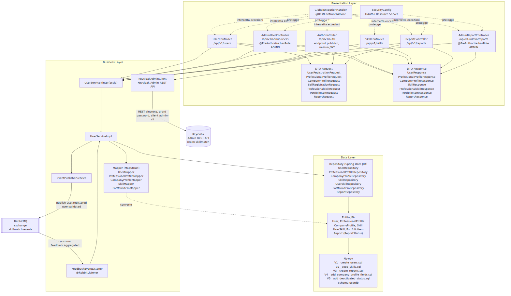

**Presentation Layer**: `UserController` espone `/api/v1/users` (registrazione manuale, lettura, aggiornamento profili, ricerca professionisti, e ora anche gestione skill/portfolio con `PUT /{userId}/skills` e `PUT /{userId}/portfolio-items`, entrambi ruolo PROFESSIONAL, più la lettura del profilo dedicato per ruolo `GET /{userId}/professional-profile`, ruolo PROFESSIONAL o, di aggiunta recente, COMPANY per consultare un candidato, e `GET /{userId}/company-profile`, ruolo COMPANY); `AdminUserController` espone `/api/v1/admin/users` (intera classe `@PreAuthorize("hasRole('ADMIN')")`), con in più `GET /{userId}/reports` per consultare le segnalazioni su un utente, `GET /{userId}/company-profile` (di aggiunta più recente, per esaminare una registrazione azienda in attesa) e `POST /{userId}/deactivate` (di aggiunta più recente, disattivazione permanente); anche `UserController` espone ora `GET /{userId}/reports`, ma ai ruoli PROFESSIONAL/COMPANY, non solo all'admin: chiunque di questi due ruoli può consultare le segnalazioni su un qualsiasi utente; `AuthController` espone l'unico endpoint pubblico `POST /api/v1/auth/register` per la registrazione self-service (vedi [ADR-007](#adr-007-registrazione-self-service-tramite-keycloak-admin-api)); `SkillController` espone `GET /api/v1/skills?search=` (catalogo condiviso, max 20 risultati); `ReportController` espone `POST /api/v1/reports` (ruoli PROFESSIONAL/COMPANY); `AdminReportController` espone `POST /api/v1/admin/reports/{reportId}/close`. I DTO applicano il **DTO Pattern**; `GlobalExceptionHandler` applica **Controller Advice** (ora anche su `KeycloakAdminException` e `ReportNotFoundException`); `SecurityConfig` applica **Externalized Configuration** per i parametri Keycloak.

**Business Layer**: `UserService`/`UserServiceImpl` applicano il **Service Layer Pattern** (registrazione, validazione/sospensione admin, calcolo reputazione, e ora anche `emailExists`, `updateSkills`, `updatePortfolioItems`, `createReport`, `closeReport`, `listReportsForUser`). `EventPublisherService` e `FeedbackEventListener` implementano rispettivamente il lato publisher e subscriber del pattern **Pub/Sub (Observer distribuito)** (le due classi originarie `EventPublisherService`/`UserEventPublisher` sono state consolidate: `UserEventPublisher`, marcata `@Deprecated(forRemoval = true)`, è stata rimossa come codice morto durante l'analisi di copertura). `KeycloakAdminClient`, di aggiunta recente, comunica con la Admin REST API di Keycloak (non con un altro microservizio applicativo) per creare l'utente e assegnargli il ruolo realm durante la registrazione self-service, autenticandosi con grant `password` come admin bootstrap del realm sul client `admin-cli`; espone anche `disableUser(keycloakId)` (`PUT /admin/realms/{realm}/users/{id}` con `enabled: false`), di aggiunta più recente, usato dalla disattivazione permanente. I Mapper MapStruct applicano il pattern **Adapter/Mapper**.

**Data Layer**: entità JPA `User`, `ProfessionalProfile`, `CompanyProfile`, `Skill`, `UserSkill`, `PortfolioItem` e, di aggiunta recente, `Report` (enum `ReportStatus`: OPEN/CLOSED); repository Spring Data JPA (**Repository Pattern**), incluso il nuovo `ReportRepository`; Flyway su schema `userdb` (**Database per Service**), con le migrazioni `V2__seed_skills.sql` (circa 35 skill di partenza), `V3__create_reports.sql` (tabella `reports`), `V4__add_company_profile_fields.sql` (`description` e `payment_account` su `company_profiles`) e `V5__add_deactivated_status.sql` (estende il CHECK su `users.status` con `DEACTIVATED`).

| Pattern | Layer | Dove (classe/file) |
|---|---|---|
| DTO Pattern | Presentation | `UserRegistrationRequest`, `ProfessionalProfileRequest`, `CompanyProfileRequest`, `SelfRegistrationRequest`, `ProfessionalSkillRequest`, `PortfolioItemRequest`, `ReportRequest`, `UserResponse`, `ProfessionalProfileResponse`, `CompanyProfileResponse`, `SkillResponse`, `ProfessionalSkillResponse`, `PortfolioItemResponse`, `ReportResponse` |
| Controller Advice | Presentation | `GlobalExceptionHandler` |
| Repository Pattern | Data | `UserRepository`, `ProfessionalProfileRepository`, `CompanyProfileRepository`, `SkillRepository`, `UserSkillRepository`, `PortfolioItemRepository`, `ReportRepository` |
| Mapper/Adapter Pattern | Business | `UserMapper`, `ProfessionalProfileMapper`, `CompanyProfileMapper`, `SkillMapper`, `PortfolioItemMapper` (MapStruct) |
| Service Layer Pattern | Business | `UserService` / `UserServiceImpl` |
| Pub/Sub Observer | Business | `EventPublisherService` (publisher), `FeedbackEventListener` (subscriber) |
| Client Pattern (REST verso sistema esterno) | Business | `KeycloakAdminClient` (Admin REST API di Keycloak, non un altro microservizio applicativo) |
| Dependency Injection | Trasversale | Costruttori `@RequiredArgsConstructor` (Lombok) |
| Database per Service | Data | Schema `userdb`, `db/migration/V1__create_users.sql`, `V2__seed_skills.sql`, `V3__create_reports.sql` |

### Schema Dati (userdb)

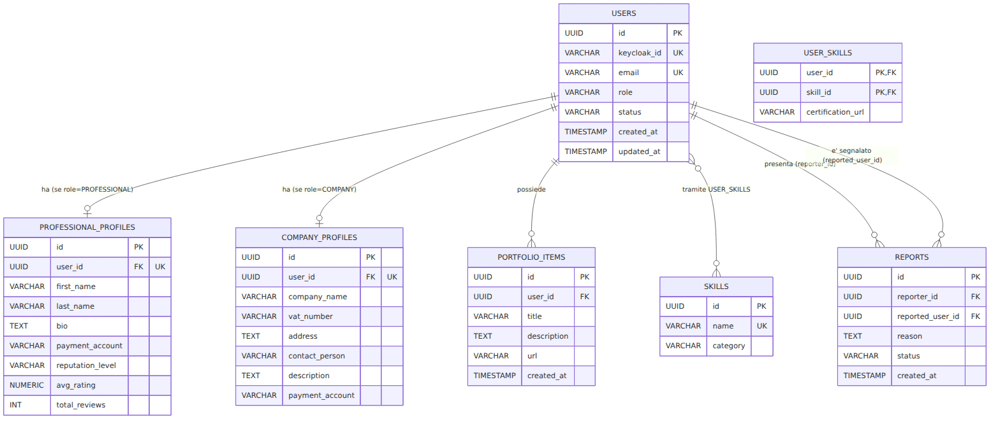

`status` è vincolato da CHECK a `PENDING`, `VALIDATED`, `SUSPENDED`, `DEACTIVATED` (`V5__add_deactivated_status.sql`); sia un professionista sia un'azienda devono essere `VALIDATED` prima di poter agire (il professionista prima di candidarsi, l'azienda prima di creare un progetto), tramite lo stesso endpoint admin. `SUSPENDED` è reversibile (l'admin puo tornare a `VALIDATED` richiamando lo stesso endpoint di validazione); `DEACTIVATED` è permanente, disabilita anche l'account Keycloak e non ha un endpoint di ripristino; gli account `DEACTIVATED` sono esclusi da `GET /api/v1/admin/users`. `reputation_level` è vincolato a `JUNIOR`, `AFFIDABILE`, `TOP_PERFORMER` e ricalcolato quando arriva l'evento `feedback.aggregated`. `reports.status` è vincolato a `OPEN`/`CLOSED` (default `OPEN`); chiudere una segnalazione è puro bookkeeping amministrativo e non sospende automaticamente nessuno. Il catalogo `skills` è precaricato con circa 35 voci raggruppate per categoria (`V2__seed_skills.sql`), ma resta estendibile al volo (get-or-create). `company_profiles` ha anche `description` e `payment_account` (quest'ultimo, a differenza dell'omonimo campo su `professional_profiles`, è il conto da cui l'azienda invia i pagamenti, non da cui li riceve).

### API REST

| Metodo | Path | Ruolo | Descrizione |
|---|---|---|---|
| POST | `/api/v1/auth/register` | pubblico | Registrazione self-service: crea identità Keycloak, utente e profilo minimo in un'unica chiamata |
| POST | `/api/v1/users` | autenticato | Registrazione manuale, crea l'utente con `status=PENDING` |
| GET | `/api/v1/users/{userId}` | autenticato | Dettaglio utente |
| GET | `/api/v1/users/me` | autenticato | Risolve l'utente corrente dal JWT |
| GET | `/api/v1/users/{userId}/professional-profile` | PROFESSIONAL, COMPANY | Dettaglio profilo professionale (anche l'azienda, per consultare un candidato) |
| PUT | `/api/v1/users/{userId}/professional-profile` | PROFESSIONAL | Aggiorna il profilo professionale |
| PUT | `/api/v1/users/{userId}/skills` | PROFESSIONAL | Aggiorna le skill dal catalogo condiviso |
| PUT | `/api/v1/users/{userId}/portfolio-items` | PROFESSIONAL | Aggiorna il portfolio |
| GET | `/api/v1/users/{userId}/company-profile` | COMPANY | Dettaglio profilo azienda |
| PUT | `/api/v1/users/{userId}/company-profile` | COMPANY | Aggiorna il profilo azienda |
| GET | `/api/v1/users/professionals/search` | autenticato | Ricerca professionisti |
| GET | `/api/v1/skills` | autenticato | Ricerca nel catalogo skill condiviso (`search`, max 20 risultati) |
| POST | `/api/v1/reports` | PROFESSIONAL, COMPANY | Presenta una segnalazione contro la controparte |
| GET | `/api/v1/users/{userId}/reports` | PROFESSIONAL, COMPANY | Segnalazioni a carico di un utente (non solo l'admin, nessun vincolo di controparte) |
| GET | `/api/v1/admin/users` | ADMIN | Elenco utenti (esclusi gli account `DEACTIVATED`) |
| GET | `/api/v1/admin/users/{userId}/professional-profile` | ADMIN | Dettaglio profilo professionale |
| GET | `/api/v1/admin/users/{userId}/company-profile` | ADMIN | Dettaglio profilo azienda |
| GET | `/api/v1/admin/users/{userId}/reports` | ADMIN | Segnalazioni a carico di un utente |
| POST | `/api/v1/admin/users/{userId}/validate` | ADMIN | Valida l'utente, professionista o azienda (`PENDING`/`SUSPENDED` → `VALIDATED`) |
| POST | `/api/v1/admin/users/{userId}/suspend` | ADMIN | Sospende l'utente (reversibile) |
| POST | `/api/v1/admin/users/{userId}/deactivate` | ADMIN | Disattiva permanentemente l'utente e disabilita l'identità Keycloak (irreversibile) |
| POST | `/api/v1/admin/reports/{reportId}/close` | ADMIN | Chiude una segnalazione (bookkeeping, non sospende) |

### Eventi

Pubblica `user.registered` e `user.validated` (entrambi i percorsi di registrazione, manuale e self-service, passano dallo stesso `UserService.registerUser(...)` e quindi dallo stesso evento). Consuma `feedback.aggregated` (coda `user-service.feedback.aggregated`) per ricalcolare la reputazione del professionista.

## Project Service

Il Project Service gestisce il ciclo di vita dei progetti pubblicati dalle aziende e delle candidature dei professionisti, comunicando in modo sincrono con lo User Service e in modo asincrono con RabbitMQ.

### Struttura a 3 Livelli

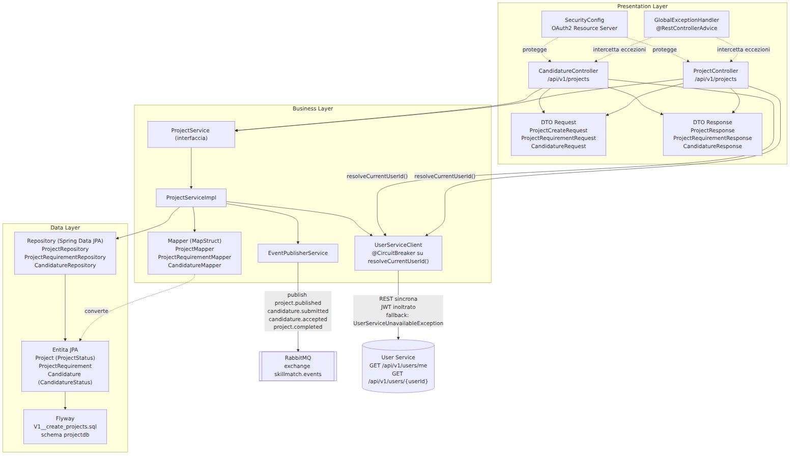

**Presentation Layer**: `ProjectController` (creazione, pubblicazione, completamento progetto) e `CandidatureController` (candidatura, accettazione e, di aggiunta recente, `PUT /{projectId}/candidatures/{candidatureId}/reject` per rifiutare una singola candidatura PENDING senza toccare lo stato del progetto né le altre candidature, senza pubblicare eventi), entrambi risolvono l'id del chiamante tramite `UserServiceClient.resolveCurrentUserId()`.

**Business Layer**: `ProjectService`/`ProjectServiceImpl` (**Service Layer Pattern**); `createProject`, di aggiunta recente, verifica sincronamente (stessa chiamata a `UserServiceClient.getUserStatus`) che il chiamante sia una COMPANY con stato VALIDATED prima di creare il progetto: la regola di validazione admin, prima riservata ai soli professionisti, ora vale anche per le aziende; `applyToProject` pubblica ora anche il nuovo evento `candidature.submitted`; `acceptCandidature(...)`, di aggiunta recente, non si limita più a salvare la candidatura ACCEPTED: rifiuta automaticamente (metodo privato `rejectRemainingPendingCandidatures`) tutte le altre candidature ancora PENDING sullo stesso progetto e porta esplicitamente il progetto allo stato ASSIGNED, prima di pubblicare `candidature.accepted`; il nuovo metodo `rejectCandidature(...)` verifica ownership, appartenenza al progetto e stato PENDING, poi porta la candidatura a REJECTED senza pubblicare eventi. `EventPublisherService` (**Pub/Sub Observer**) pubblica quindi `project.published`, `candidature.submitted`, `candidature.accepted`, `project.completed`. `UserServiceClient`, con `@CircuitBreaker(name="default", fallbackMethod=...)` (**Circuit Breaker**) annotato direttamente sul metodo pubblico `resolveCurrentUserId()`, inoltra il JWT del chiamante verso lo User Service invece di usare un client machine-to-machine separato.

**Nota tecnica su un bug corretto (Circuit Breaker e self-invocation)**: l'annotazione `@CircuitBreaker` deve stare direttamente sul metodo pubblico invocato dall'esterno della classe, mai su un metodo che ne delega poi la logica a un metodo privato annotato. Spring AOP realizza il Circuit Breaker con un proxy che intercetta solo le chiamate provenienti dall'esterno dell'istanza: una self-invocation bypassa il proxy silenziosamente, e con esso l'intera logica di fallback, senza generare alcun errore visibile. Il codice sembra funzionare normalmente, ma il fallback non scatta mai in caso di guasto a valle. Questo bug era presente in `UserServiceClient` (e in client analoghi di altri servizi) ed è stato corretto spostando l'annotazione sul metodo pubblico.

**Data Layer**: entità `Project`, `ProjectRequirement`, `Candidature`; repository Spring Data JPA; Flyway su schema `projectdb`.

| Pattern | Layer | Dove (classe/file) |
|---|---|---|
| DTO Pattern | Presentation | `ProjectCreateRequest`, `ProjectRequirementRequest`, `CandidatureRequest`, `ProjectResponse`, `ProjectRequirementResponse`, `CandidatureResponse` |
| Controller Advice | Presentation | `GlobalExceptionHandler` |
| Repository Pattern | Data | `ProjectRepository`, `ProjectRequirementRepository`, `CandidatureRepository` |
| Mapper/Adapter Pattern | Business | `ProjectMapper`, `ProjectRequirementMapper`, `CandidatureMapper` (MapStruct) |
| Service Layer Pattern | Business | `ProjectService` / `ProjectServiceImpl` |
| Circuit Breaker | Business | `UserServiceClient` (Resilience4j, annotazione su `resolveCurrentUserId()`, mai su un metodo privato delegato) |
| Pub/Sub Observer | Business | `EventPublisherService` (publish `project.published`, `candidature.submitted`, `candidature.accepted`, `project.completed`) |
| Dependency Injection | Trasversale | Costruttori `@RequiredArgsConstructor` (Lombok) |
| Database per Service | Data | Schema `projectdb`, `db/migration/V1__create_projects.sql` |

### Schema Dati (projectdb)

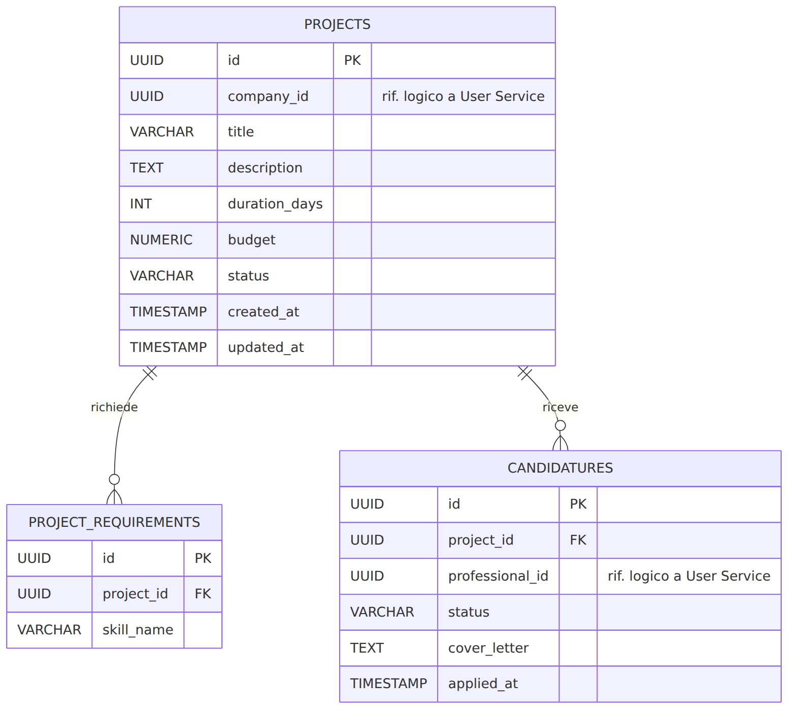

`status` di `projects` è vincolato a `DRAFT`, `OPEN`, `ASSIGNED`, `IN_PROGRESS`, `COMPLETED`, `CLOSED`. Il vincolo `UNIQUE(project_id, professional_id)` su `candidatures` impedisce candidature duplicate. `project_requirements` aveva anche una colonna `min_reputation_level`, rimossa (`V2__drop_min_reputation_level.sql`): veniva raccolta alla creazione del progetto ma non era mai stata applicata né mostrata ai professionisti.

### API REST

| Metodo | Path | Ruolo | Descrizione |
|---|---|---|---|
| POST | `/api/v1/projects` | COMPANY | Crea progetto in `DRAFT`; l'azienda deve essere `VALIDATED` (stessa regola di validazione ammin dei professionisti) |
| PUT | `/api/v1/projects/{projectId}/publish` | COMPANY | `DRAFT` → `OPEN`, pubblica `project.published` |
| GET | `/api/v1/projects/{projectId}` | autenticato | Dettaglio progetto |
| GET | `/api/v1/projects/open` | autenticato | Elenco progetti aperti |
| GET | `/api/v1/projects/mine` | COMPANY | Progetti dell'azienda |
| PUT | `/api/v1/projects/{projectId}/complete` | COMPANY | Segna il progetto completato, pubblica `project.completed` |
| POST | `/api/v1/projects/{projectId}/candidatures` | PROFESSIONAL | Candidatura (verifica sincrona VALIDATED) |
| GET | `/api/v1/projects/candidatures/mine` | PROFESSIONAL | Candidature del professionista |
| GET | `/api/v1/projects/{projectId}/candidatures` | COMPANY | Candidati ricevuti |
| PUT | `/api/v1/projects/{projectId}/candidatures/{candidatureId}/accept` | COMPANY | Accetta candidatura: rifiuta automaticamente le altre PENDING, progetto → `ASSIGNED`, pubblica `candidature.accepted` |
| PUT | `/api/v1/projects/{projectId}/candidatures/{candidatureId}/reject` | COMPANY | Rifiuta una singola candidatura PENDING, nessun evento pubblicato |

### Eventi

Pubblica `project.published`, `candidature.submitted` (quando un professionista invia una candidatura), `candidature.accepted`, `project.completed`. Non consuma eventi asincroni; verifica lo stato del professionista tramite chiamata REST sincrona (Circuit Breaker) verso lo User Service.

## Contract Service

Il Contract Service gestisce i micro-contratti che formalizzano l'accordo tra azienda e professionista, creati automaticamente alla ricezione dell'evento `candidature.accepted`.

### Struttura interna

- **Presentation**: `ContractController` (`/api/v1/contracts`); DTO `ContractResponse`; `GlobalExceptionHandler` gestisce `ContractNotFoundException`, `InvalidContractOperationException`, `UserServiceUnavailableException`; `SecurityConfig` Resource Server.
- **Business**: `ContractService`/`ContractServiceImpl` (creazione da evento, firma a due passi, completamento); `CandidatureAcceptedListener` (`@RabbitListener`, consuma `candidature.accepted` e invoca `createFromCandidatureAccepted`, verificando idempotenza tramite `existsByProjectId`); `UserServiceClient` con `@CircuitBreaker`; `ContractMapper` (MapStruct).
- **Data**: entità `Contract` (enum `ContractStatus`); `ContractRepository`; Flyway su schema `contractdb`.

### Schema Dati (contractdb)

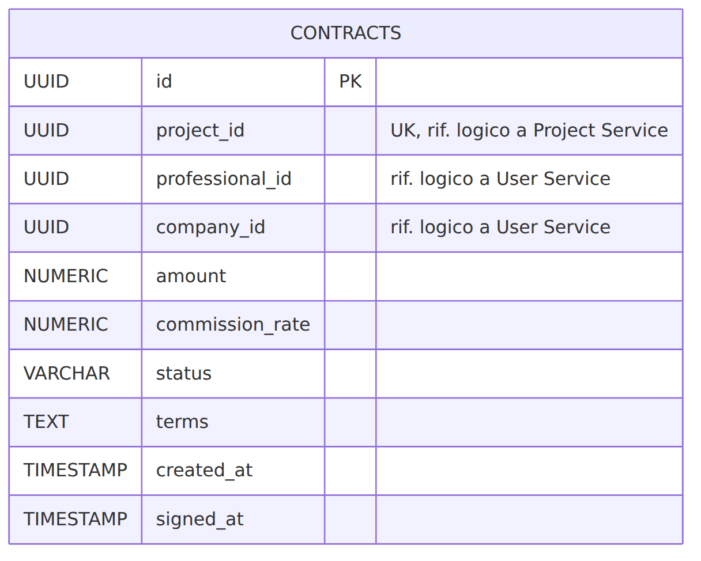

Un solo contratto per progetto (`UNIQUE(project_id)`). `status` è vincolato a `DRAFT`, `PENDING_SIGNATURES`, `ACTIVE`, `COMPLETED`, `CANCELLED`. La firma avviene in due passi: l'azienda firma per prima (`DRAFT` → `PENDING_SIGNATURES`), poi il professionista (`PENDING_SIGNATURES` → `ACTIVE`, valorizza `signed_at`).

### API REST

| Metodo | Path | Ruolo | Descrizione |
|---|---|---|---|
| GET | `/api/v1/contracts/{contractId}` | autenticato | Dettaglio contratto |
| GET | `/api/v1/contracts/company/mine` | COMPANY | Contratti dell'azienda |
| GET | `/api/v1/contracts/professional/mine` | PROFESSIONAL | Contratti del professionista |
| PUT | `/api/v1/contracts/{contractId}/sign` | COMPANY o PROFESSIONAL | Firma (transizione di stato in base al chiamante) |
| PUT | `/api/v1/contracts/{contractId}/complete` | COMPANY | `ACTIVE` → `COMPLETED` |

### Eventi

Consuma `candidature.accepted` (coda `contract.candidature.accepted`) per creare il contratto. Non pubblica eventi.

## Payment Service

Il Payment Service elabora il pagamento di un contratto completato, calcola la commissione trattenuta dalla piattaforma e genera la fattura unica per l'azienda.

### Struttura interna

- **Presentation**: `PaymentController` (`/api/v1/payments`), `TransactionController` (`/api/v1/transactions`), `AdminCommissionController` (`/api/v1/admin/commission-config`, ruolo ADMIN), `CommissionConfigController` (`/api/v1/commission-config`, di aggiunta più recente, aperto a qualunque utente autenticato: espone in sola lettura lo stesso tasso corrente, così un'azienda o un professionista possono mostrare una stima corretta prima ancora del pagamento, che coincida con quella davvero applicata); DTO `InitiatePaymentRequest`, `CommissionConfigRequest`, `TransactionResponse`, `InvoiceResponse`, `CommissionConfigResponse`; `GlobalExceptionHandler`.
- **Business**: `PaymentService`/`PaymentServiceImpl` (calcolo commissione/netto, creazione transazione e fattura, generazione numero fattura progressivo `INV-<anno>-<seq>`); `EventPublisherService` (pubblica `payment.completed`); `ContractServiceClient` e `UserServiceClient`, entrambi `@CircuitBreaker`; `PaymentMapper`.
- **Data**: entità `CommissionConfig`, `Transaction` (enum `TransactionStatus`), `Invoice`; repository dedicati; Flyway su schema `paymentdb`.

### Schema Dati (paymentdb)

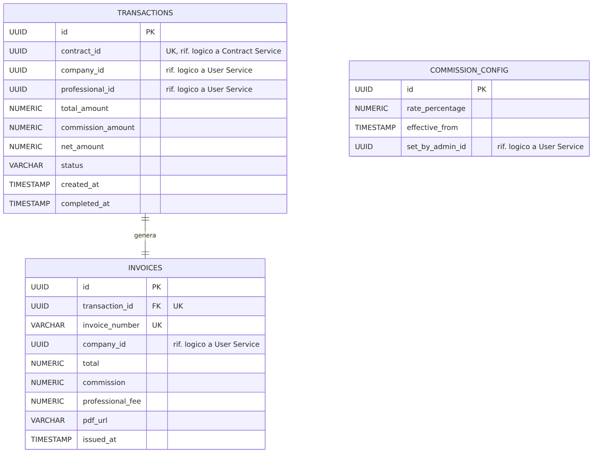

`commission_config` è storicizzata: il tasso attivo è quello con `effective_from` più recente (default 8.00%, inserito dalla migrazione V1). Un solo pagamento per contratto (`UNIQUE(contract_id)`).

### API REST

| Metodo | Path | Ruolo | Descrizione |
|---|---|---|---|
| POST | `/api/v1/payments` | COMPANY | Avvia il pagamento di un contratto `COMPLETED` |
| GET | `/api/v1/transactions/{transactionId}` | autenticato (parte coinvolta) | Dettaglio transazione |
| GET | `/api/v1/transactions/{transactionId}/invoice` | autenticato (parte coinvolta) | Fattura della transazione |
| GET | `/api/v1/transactions/company/mine` | COMPANY | Transazioni dell'azienda |
| GET | `/api/v1/transactions/professional/mine` | PROFESSIONAL | Transazioni del professionista |
| GET | `/api/v1/transactions/admin/all` | ADMIN | Tutte le transazioni (paginato) |
| GET | `/api/v1/admin/commission-config` | ADMIN | Tasso di commissione corrente |
| PUT | `/api/v1/admin/commission-config` | ADMIN | Aggiorna il tasso di commissione |
| GET | `/api/v1/commission-config/current` | autenticato | Tasso di commissione corrente, in sola lettura, per qualunque utente (non solo l'admin) |

### Eventi

Pubblica `payment.completed`. Non consuma eventi asincroni; recupera i dettagli del contratto tramite chiamata REST sincrona (Circuit Breaker) verso il Contract Service.

## Feedback Service

Il Feedback Service gestisce le recensioni reciproche tra azienda e professionista al termine di un progetto pagato e il ricalcolo della reputazione aggregata.

### Struttura interna

- **Presentation**: `FeedbackController` (`/api/v1/feedbacks`); DTO `SubmitFeedbackRequest`, `FeedbackResponse`; `GlobalExceptionHandler` gestisce `FeedbackNotFoundException`, `InvalidFeedbackOperationException`, `UserServiceUnavailableException`.
- **Business**: `FeedbackService`/`FeedbackServiceImpl` (verifica eleggibilità, salvataggio recensione, ricalcolo `avg_rating`/`total_reviews` quando il destinatario è un professionista); `PaymentCompletedListener` (`@RabbitListener`, consuma `payment.completed`, verifica idempotenza tramite `existsByProjectId`); `EventPublisherService` (pubblica `feedback.aggregated`); `FeedbackMapper`.
- **Data**: entità `Feedback`, `FeedbackEligibility`; repository dedicati; Flyway su schema `feedbackdb`.

### Schema Dati (feedbackdb)

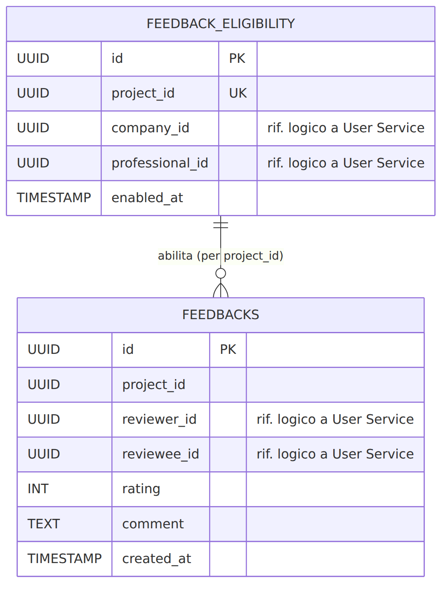

`feedback_eligibility` non fa parte dello schema "ideale" originale, ma è stata aggiunta nel codice reale: memorizza le due parti di un progetto alla ricezione di `payment.completed`, per autorizzare le submission senza una chiamata sincrona di ritorno. `rating` è vincolato tra 1 e 5; `UNIQUE(project_id, reviewer_id, reviewee_id)` impedisce recensioni duplicate.

### API REST

| Metodo | Path | Ruolo | Descrizione |
|---|---|---|---|
| POST | `/api/v1/feedbacks` | COMPANY o PROFESSIONAL | Invia una recensione (1-5 + commento opzionale) |
| GET | `/api/v1/feedbacks/{feedbackId}` | autenticato | Dettaglio recensione |
| GET | `/api/v1/feedbacks/project/{projectId}` | autenticato | Recensioni di un progetto |
| GET | `/api/v1/feedbacks/given/mine` | autenticato | Recensioni date dal chiamante |
| GET | `/api/v1/feedbacks/received/mine` | autenticato | Recensioni ricevute dal chiamante |

### Eventi

Consuma `payment.completed` (coda `feedback.payment.completed`) per abilitare l'eleggibilità. Pubblica `feedback.aggregated` solo quando il destinatario della recensione è un professionista.

## Notification Service

Il Notification Service è un sink universale di tutti gli eventi del sistema: consuma qualunque evento pubblicato su `skillmatch.events` e genera notifiche testuali per l'utente destinatario, persistite su MongoDB.

### Struttura interna

- **Presentation**: `NotificationController` (`/api/v1/notifications`, unico endpoint `GET /mine`); DTO `NotificationResponse`; `SecurityConfig` Resource Server.
- **Business**: `NotificationService`/`NotificationServiceImpl`, con il metodo privato `resolveRecipients(eventType, data)` che mappa ogni tipo di evento a destinatari e messaggio testuale, con un ramo `default` per eventi senza template dedicato; `NotificationListener` (`@RabbitListener` sulla coda `notification.all-events`, binding `#`); `UserServiceClient` con `@CircuitBreaker`; `NotificationMapper`.
- **Data**: nessun database relazionale. Il documento `Notification` (MongoDB, collezione `notifications`) è mappato con Spring Data MongoDB (`@Document`), non con JPA/Flyway.

### Schema Documento (notificationdb, collezione `notifications`)

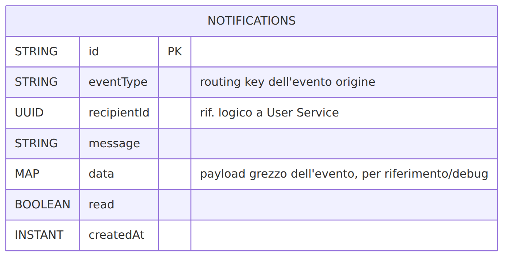

Il campo `data` è una mappa libera (`Map<String, Object>`), non uno schema fisso: è la ragione per cui questo servizio usa MongoDB invece di un settimo database logico PostgreSQL (dettagliato in [ADR-003](#adr-003---database-strategy-polyglot-persistence)).

### API REST

| Metodo | Path | Ruolo | Descrizione |
|---|---|---|---|
| GET | `/api/v1/notifications/mine` | autenticato | Notifiche del chiamante, ordinate per data decrescente |

### Eventi

Consuma tutti gli eventi pubblicati sull'exchange (`binding #`, coda `notification.all-events`). Non pubblica eventi.

\newpage

# Flussi Principali

Questo capitolo mostra, tramite diagrammi di sequenza, i quattro flussi end-to-end più rilevanti del sistema: registrazione e validazione, pubblicazione progetto e candidatura, pagamento e fatturazione, feedback reciproco e aggiornamento della reputazione. In ogni diagramma le frecce piene rappresentano chiamate REST sincrone, le frecce tratteggiate gli eventi asincroni pubblicati sull'exchange RabbitMQ `skillmatch.events`.

## Registrazione Self-Service e Validazione

Questo diagramma descrive il percorso completo di registrazione di un nuovo utente (professionista o azienda) tramite l'endpoint applicativo self-service `POST /api/v1/auth/register`, fino alla validazione del professionista da parte di un amministratore. Il vecchio flusso, in cui il Browser veniva reindirizzato alla UI di Keycloak per la registrazione e completava poi il profilo in una chiamata separata, non è più quello primario: è stato sostituito da questo endpoint applicativo, che orchestra in un'unica chiamata la creazione dell'utente su Keycloak (tramite la sua Admin REST API), l'assegnazione del ruolo e la creazione del record applicativo nello User Service. Keycloak resta usato, invariato, solo per il login post-registrazione (Authorization Code + PKCE), non più per la registrazione stessa (vedi [ADR-007](#adr-007-registrazione-self-service-tramite-keycloak-admin-api)).

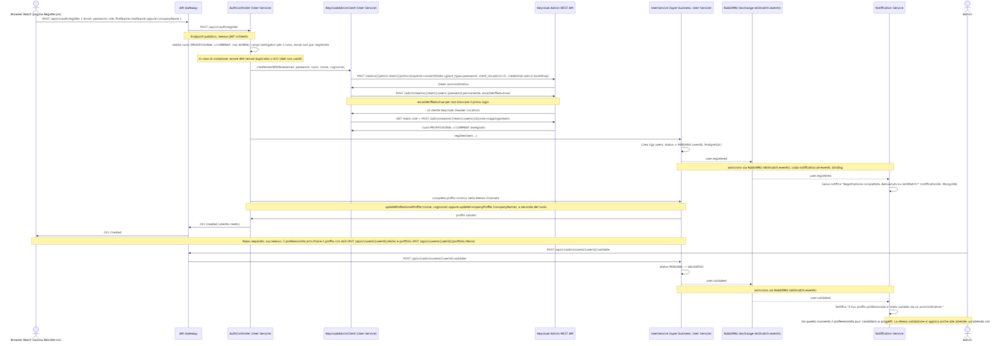

## Pubblicazione Progetto, Candidatura e Contratto

Questo diagramma copre la pubblicazione di un progetto da parte di un'azienda, la candidatura di un professionista validato, l'accettazione (o il rifiuto) della candidatura e la creazione automatica del micro-contratto. Include la chiamata REST sincrona protetta da Circuit Breaker verso lo User Service, la notifica generata all'invio della candidatura, il rifiuto automatico delle candidature concorrenti in caso di accettazione, il flusso alternativo di rifiuto di una singola candidatura, e gli eventi asincroni pubblicati sull'exchange `skillmatch.events`.

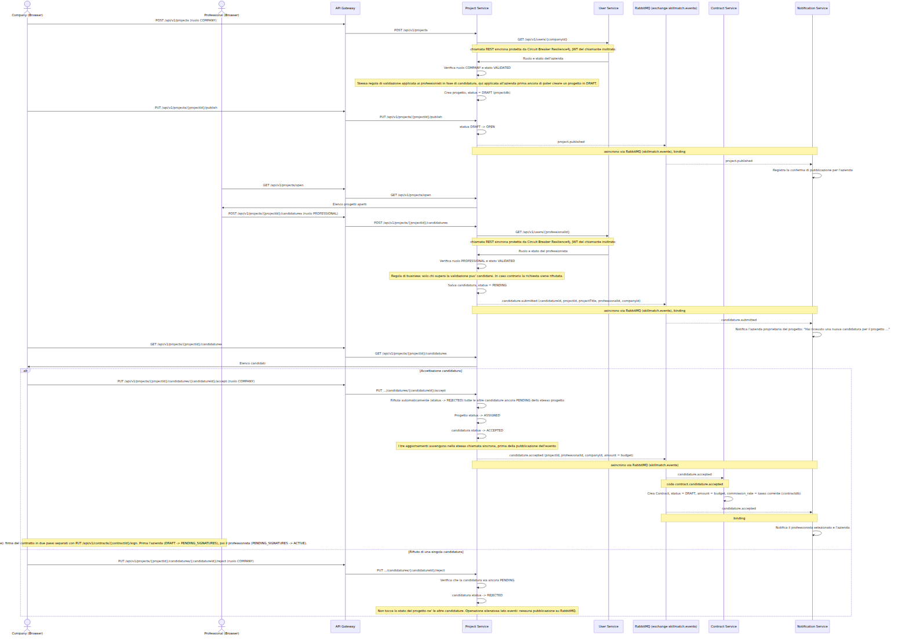

## Pagamento e Fatturazione

Questo diagramma descrive il pagamento di un contratto completato: la verifica sincrona dei dati del contratto tramite Circuit Breaker, il calcolo di commissione e importo netto, la generazione della fattura unica e gli eventi asincroni che abilitano il feedback reciproco e le notifiche. Precondizione: il contratto è già `ACTIVE`, cioè entrambe le parti lo hanno firmato.

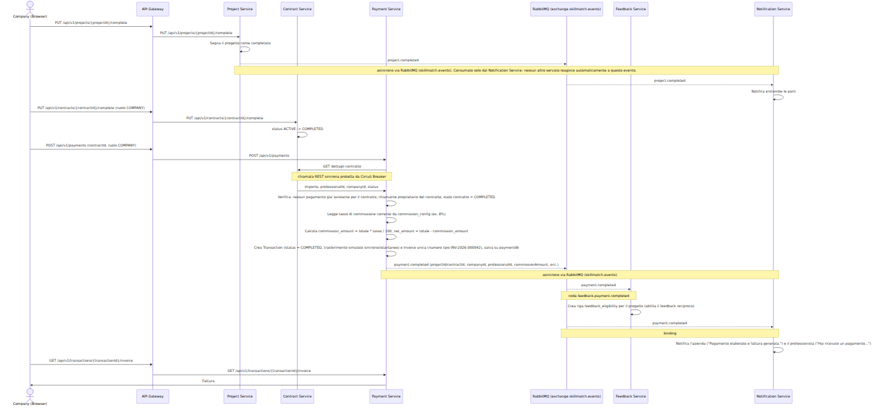

## Feedback Reciproco e Aggiornamento della Reputazione

Questo diagramma mostra come azienda e professionista si scambiano feedback al termine di un progetto pagato, e come il feedback ricevuto da un professionista aggiorni in modo asincrono la sua reputazione nello User Service. Precondizione: esiste già una riga `feedback_eligibility` per il progetto, creata dal flusso di pagamento.

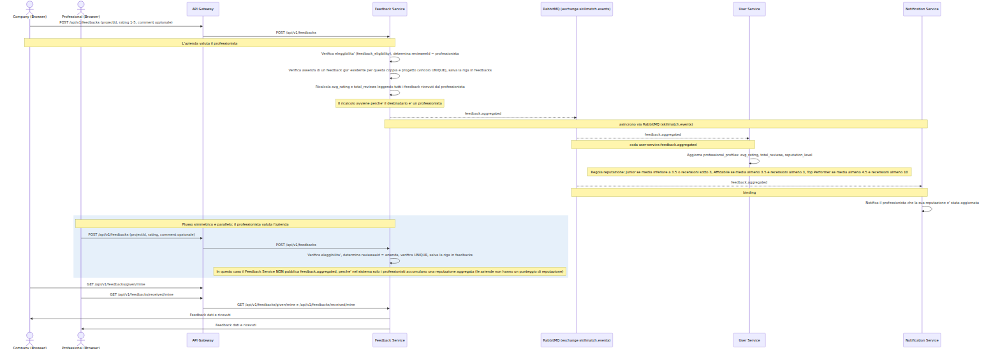

\newpage

# Eventi RabbitMQ

Tutti gli eventi asincroni del sistema attraversano un unico topic exchange, `skillmatch.events`, dichiarato in modo identico (stesso nome, stesso tipo `topic`, `durable`) nella classe `RabbitMQConfig` di ogni microservizio. Ogni publisher pubblica con una routing key nella forma `<dominio>.<azione>` senza conoscere chi la consumerà; ogni consumer dichiara una coda propria e la lega all'exchange con un binding sulla routing key (o sul wildcard `#`, come fa il Notification Service).

## Diagramma

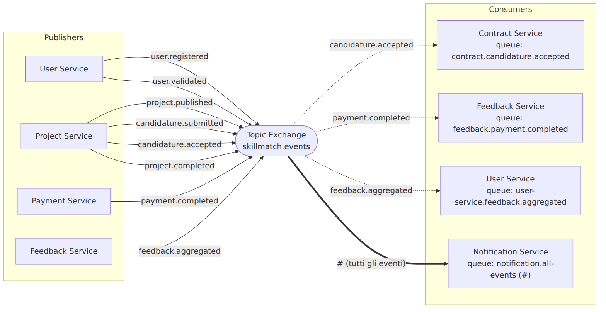

## Tabella Riepilogativa

| Evento (routing key) | Publisher | Consumer(s) | Coda | Descrizione |
|---|---|---|---|---|
| `user.registered` | user-service | notification-service | `notification.all-events` | Un nuovo utente si è registrato; il servizio notifiche crea un messaggio di benvenuto. |
| `user.validated` | user-service | notification-service | `notification.all-events` | Un amministratore ha validato il profilo di un professionista; da questo momento può candidarsi ai progetti. |
| `project.published` | project-service | notification-service | `notification.all-events` | Un'azienda ha pubblicato un progetto, passandolo da `DRAFT` a `OPEN`. |
| `candidature.submitted` | project-service | notification-service | `notification.all-events` | Un professionista si è candidato a un progetto. Il Notification Service avvisa l'azienda proprietaria. |
| `candidature.accepted` | project-service | contract-service, notification-service | `contract.candidature.accepted`, `notification.all-events` | L'azienda ha accettato una candidatura (rifiutando automaticamente le altre PENDING e portando il progetto ad `ASSIGNED`). Il Contract Service crea automaticamente un micro-contratto `DRAFT`; il Notification Service avvisa entrambe le parti. |
| `project.completed` | project-service | notification-service | `notification.all-events` | L'azienda segna il progetto come concluso. Non ha consumer applicativi diretti: completamento del contratto e avvio del pagamento restano azioni esplicite dell'azienda. |
| `payment.completed` | payment-service | feedback-service, notification-service | `feedback.payment.completed`, `notification.all-events` | Il pagamento è stato eseguito e la fattura generata. Il Feedback Service abilita il feedback reciproco; il Notification Service avvisa entrambe le parti. |
| `feedback.aggregated` | feedback-service | user-service, notification-service | `user-service.feedback.aggregated`, `notification.all-events` | Un professionista ha ricevuto un nuovo feedback. Lo User Service aggiorna media, conteggio e livello di reputazione. |

## Note di Implementazione

- **Notification Service come sink universale**: lega la coda `notification.all-events` con il wildcard `#`, ricevendo ogni evento pubblicato sull'exchange. La logica di smistamento vive in `NotificationServiceImpl.resolveRecipients(...)`, con un ramo `default` per eventi senza template dedicato.
- **Conversione dei messaggi**: ogni consumer configura `Jackson2JsonMessageConverter` con `setAlwaysConvertToInferredType(true)`, perché il publisher marca l'header `__TypeId__` con il proprio nome di classe completo, inesistente nel classpath del consumer; convertire in base al tipo dichiarato dal metodo `@RabbitListener` evita un `ClassNotFoundException` a runtime.
- **Idempotenza**: `ContractServiceImpl.createFromCandidatureAccepted` e `FeedbackServiceImpl.enableFeedback` verificano l'esistenza di una riga già creata per lo stesso `projectId` prima di procedere, per tollerare redelivery del broker.
- **Email reale per un sottoinsieme di eventi**: oltre alla notifica in-app, per `user.validated`, `candidature.accepted` e `payment.completed` il Notification Service invia anche una vera email transazionale (`MailService`, relay SMTP Brevo), per non riempire le caselle di posta ad ogni evento. Per risolvere l'email del destinatario, il listener RabbitMQ (senza JWT utente da inoltrare) autentica `GET /api/v1/users/{id}` verso lo User Service con un token OAuth2 **Client Credentials**, ottenuto dal client Keycloak confidenziale `notification-service`: è l'unico uso concreto nel sistema del flusso Client Credentials descritto in [ADR-002](#adr-002-keycloak-configuration-and-realm-management) (tutte le altre chiamate REST sincrone service-to-service inoltrano invece il JWT dell'utente chiamante).

\newpage

# Sicurezza

L'autenticazione e l'autorizzazione sono interamente esternalizzate a **Keycloak 26.0** (realm `skillmatch`), secondo il principio 12-Factor III. Nessun microservizio implementa una propria logica di login: ogni servizio, incluso l'API Gateway, è configurato come **OAuth2 Resource Server** e valida in autonomia i JWT firmati da Keycloak tramite le sue chiavi pubbliche (JWKS), senza chiamare Keycloak ad ogni richiesta.

## Flussi OAuth 2.0 / OIDC

- **Authorization Code + PKCE** (client `skillmatch-spa`, pubblico): usato dalla SPA React per l'autenticazione umana. PKCE (`code_challenge_method: S256`) protegge il flusso dall'intercettazione del code, dato che una SPA non può custodire un client secret in modo sicuro.
- **Client Credentials** (client `skillmatch-m2m`, confidenziale, con token a vita brevissima di 60 secondi): il flusso pensato per comunicazioni service-to-service senza utente umano associato. In pratica, quasi tutte le chiamate REST sincrone tra servizi inoltrano semplicemente il JWT dell'utente chiamante, senza bisogno di un client separato. L'unico punto del sistema che usa davvero Client Credentials è il Notification Service quando reagisce a un evento RabbitMQ (nessun utente da cui inoltrare un token) per risolvere l'email del destinatario presso lo User Service: per questo caso è stato definito un client dedicato e distinto, `notification-service` (confidenziale, `serviceAccountsEnabled`), il cui secret è generato da Keycloak e iniettato al pod come variabile d'ambiente.

I ruoli applicativi (`PROFESSIONAL`, `COMPANY`, `ADMIN`) sono **realm roles** Keycloak, propagati nel claim `roles` dell'access token tramite un protocol mapper dedicato (`realm-roles-mapper`) e letti da ogni servizio con un `JwtAuthenticationConverter` che li traduce in authority Spring (`ROLE_*`).

## Difesa in Profondità

Il JWT viene validato due volte lungo il percorso di ogni richiesta: prima dall'API Gateway (che scarta subito le richieste non autenticate, prima ancora di instradarle), poi di nuovo dal microservizio di destinazione, che applica anche i propri controlli `@PreAuthorize` per ruolo. Questo significa che nessun microservizio si fida ciecamente del Gateway: anche una richiesta che raggiungesse direttamente la porta interna di un servizio (bypassando il Gateway, scenario non esposto pubblicamente ma possibile all'interno del cluster) verrebbe comunque respinta se priva di un JWT valido.

## Autorizzazione per Ruolo (sintesi)

| Ruolo | Può |
|---|---|
| PROFESSIONAL | Completare il proprio profilo, candidarsi a progetti aperti (se `VALIDATED`), firmare contratti, inviare/ricevere feedback |
| COMPANY | Pubblicare progetti, accettare candidature, firmare e completare contratti, avviare pagamenti, inviare/ricevere feedback |
| ADMIN | Validare/sospendere professionisti, consultare profili, configurare la commissione, monitorare tutte le transazioni |

Il dettaglio endpoint-per-endpoint è nella sezione API di ciascun servizio nel capitolo [Dettaglio dei Microservizi](#dettaglio-dei-microservizi).

## Registrazione e Provisioning degli Account

PROFESSIONAL e COMPANY si registrano autonomamente tramite `POST /api/v1/auth/register`, che provisiona l'identità direttamente su Keycloak attraverso la sua Admin REST API (vedi [ADR-007](#adr-007-registrazione-self-service-tramite-keycloak-admin-api)); la registrazione nativa di Keycloak resta disattivata (`registrationAllowed: false`), un link "Registrati" nel tema di login personalizzato rimanda semplicemente alla pagina `/register` del frontend. Un `ADMIN`, per contro, non può mai auto-registrarsi (`AuthController.rejectAdminRole`): l'unico modo per crearne uno è lo script interattivo `infra/scripts/create-admin.sh`, eseguito da chi già possiede le credenziali admin di Keycloak, che genera una password temporanea (`temporary: true`, funzionalità nativa di Keycloak che obbliga il cambio password al primo login). A differenza di PROFESSIONAL/COMPANY, un ADMIN non ha alcuna riga nel database dello User Service: l'identità Keycloak con il ruolo realm è sufficiente.

## Gestione dei Segreti

In sviluppo, credenziali e client secret vivono in chiaro in `infra/docker-compose.yml` e nel realm JSON versionato (valori placeholder come `change-me-in-production`). In produzione, gli stessi valori sono iniettati tramite **Secret Kubernetes** (`keycloak-admin-secret`, `postgres-secret`, ecc.), mai committati nel repository. Il dettaglio completo della configurazione del realm, dei client e dei protocol mapper è nell'[ADR-002](#adr-002-keycloak-configuration-and-realm-management).

\newpage

# Infrastruttura e Deployment

SkillMatch viene distribuito su un singolo nodo K3s in esecuzione su una VM Oracle Cloud Infrastructure Always Free (Ampere A1, 4 OCPU, 24 GB RAM, ARM64). L'intero namespace `skillmatch` è definito tramite manifesti dichiarativi in `infra/k8s/`: un Deployment + Service ClusterIP per ciascun microservizio stateless (frontend incluso), uno StatefulSet per PostgreSQL, uno per MongoDB e uno per RabbitMQ, oltre a ConfigMap/Secret per la configurazione esternalizzata. Lo script `infra/scripts/deploy-k8s.sh` applica tutti i manifesti nell'ordine corretto, rigenerando prima le ConfigMap derivate da file sorgente (init SQL, realm Keycloak, tema di login).

Il traffico esterno entra da un unico Ingress **Traefik**, incluso di default in K3s (nessun controller aggiuntivo da installare), che termina TLS con certificati Let's Encrypt gestiti da cert-manager. Espone due host distinti sullo stesso dominio gratuito `nip.io`: l'host principale instrada `/` al frontend e `/api` all'API Gateway, mentre un host separato (`keycloak.<ip>.nip.io`) espone la sola console/endpoint OIDC di Keycloak, con un certificato TLS proprio. HTTPS qui non è opzionale: il flusso Authorization Code + PKCE richiede la Web Crypto API del browser (per calcolare `code_challenge = SHA-256(code_verifier)`), disponibile solo in un contesto sicuro (HTTPS, o `localhost`). Le immagini Docker (build `linux/arm64` multi-stage, una per servizio, frontend incluso) sono pubblicate su GitHub Container Registry (GHCR) da GitHub Actions, che dopo il push si collega in SSH alla VM ed esegue `kubectl set image` sul Deployment del solo servizio modificato.

## Diagramma

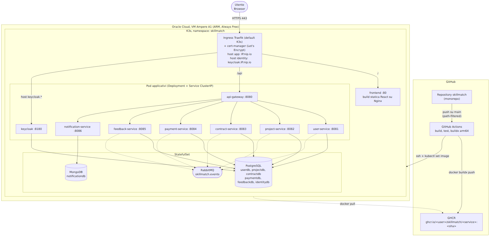

## Componenti Chiave

| Componente | Ruolo |
|---|---|
| VM Oracle Cloud (Ampere A1) | Unico nodo del cluster K3s; 4 OCPU / 24 GB RAM, gratuita a tempo indeterminato |
| K3s | Distribuzione Kubernetes leggera, certificata CNCF |
| Ingress Traefik + cert-manager | Incluso di default in K3s; due host TLS distinti (app e Keycloak) con certificati Let's Encrypt separati |
| Frontend containerizzato | Build statica React su Nginx; un endpoint `/actuator/health` fittizio in `nginx.conf` uniforma le probe K8s a quelle dei servizi Spring Boot |
| GitHub Actions | Un workflow per servizio, frontend incluso, path-filtrato: build Maven o npm, test, `docker buildx build --platform linux/arm64`, push su GHCR |
| GHCR | Registry immagini gratuito e illimitato sui repository pubblici, pacchetti resi pubblici per il pull senza credenziali |
| Deploy SSH + `kubectl set image` | Aggiorna solo l'immagine del Deployment interessato |
| `startupProbe` sui 7 servizi Java | Postgres + JPA impiegano circa 80s ad avviarsi, più della sola `livenessProbe`: aggiunta dopo un crash loop in un deploy reale |
| Security List Oracle Cloud | Solo le porte 22, 80, 443 sono esposte pubblicamente |

Migrare su AKS, EKS o GKE richiederebbe solo di sostituire lo strato infrastrutturale: zero modifiche al codice applicativo o ai manifesti stessi, dato che nessuna risorsa Kubernetes usata è proprietaria Oracle.

\newpage

# Qualità del Codice

## Testing

Ogni microservizio segue la stessa strategia di test a due livelli, coerente con CLAUDE.md:

- **Unit test** (JUnit 5 + Mockito): classi `*ServiceImplTest` (logica di business isolata, dipendenze mockate) e `*ControllerTest` (layer REST, con `TestSecurityConfig` dedicato per simulare i ruoli).
- **Integration test** (`@SpringBootTest` + Testcontainers): classi `*IntegrationTest`, che avviano container reali (PostgreSQL o MongoDB, RabbitMQ) per verificare il comportamento end-to-end del servizio, incluse le migrazioni Flyway.

| Servizio | File di test |
|---|---|
| User Service | 15 |
| Project Service | 8 |
| Contract Service | 4 |
| Payment Service | 6 |
| Feedback Service | 4 |
| Notification Service | 4 |
| API Gateway | 0 |

L'API Gateway non ha test dedicati: la sua logica è quasi interamente dichiarativa (routing e Circuit Breaker configurati in `application.yml`), con l'eccezione del `FallbackController`.

## Metriche di Qualità (JaCoCo + PMD)

User Service e Project Service, i due servizi core scelti per il trattamento 3-layer completo, hanno anche un gate di qualità automatico nel proprio `pom.xml`: **JaCoCo** (`jacoco-maven-plugin`) misura la copertura dei test e fa fallire `mvn verify` se la copertura di linee scende sotto il **90%**; **PMD** (`maven-pmd-plugin`, regola `category/java/design.xml/CyclomaticComplexity`) fa fallire la build se un metodo supera **complessità ciclomatica 10**. I numeri qui sotto sono presi direttamente dai report generati in `target/site/jacoco/jacoco.csv` e `target/pmd.xml` dopo un'esecuzione reale di `./mvnw verify` su entrambi i servizi (le classi generate da MapStruct e la classe `*Application` di bootstrap sono escluse dal calcolo, perché non contengono logica scritta a mano).

| Servizio | Line coverage | Instruction coverage | Branch coverage | Method coverage | Violazioni PMD (complessità &gt; 10) |
|---|---|---|---|---|---|
| User Service | 98,1% (687/700) | 93,7% (3440/3670) | 77,6% (76/98) | 92,3% (421/456) | 0 |
| Project Service | 99,6% (471/473) | 90,9% (2594/2855) | 72,7% (48/66) | 90,9% (301/331) | 0 |

Numeri rigenerati eseguendo `./mvnw verify` su entrambi i servizi durante l'ultima revisione di questo manuale (le funzionalità nel frattempo aggiunte, in particolare la registrazione self-service, il catalogo skill e le segnalazioni sullo User Service, sono quindi già incluse nel calcolo). Entrambi i servizi superano la soglia richiesta (line coverage ≥ 90%) e non hanno alcun metodo che supera la soglia di complessità: `mvn verify` completa con successo su entrambi. La copertura per branch resta più bassa (73-78%) perché alcuni rami difensivi (es. i metodi di fallback del Circuit Breaker, invocati solo quando lo User Service è realmente irraggiungibile) sono testati direttamente in isolamento con `ReflectionTestUtils` piuttosto che facendo scattare per davvero l'interruttore Resilience4j in un contesto Spring completo, e alcuni branch del filtro di sicurezza (`filterChain()`) vengono eseguiti solo una volta in fase di avvio del contesto e non per ogni combinazione di richiesta.

Per raggiungere il traguardo iniziale del 90%, oltre a scrivere nuovi test mirati (gestione degli errori, converter dei ruoli JWT, client HTTP verso lo User Service, ascoltatore dell'evento `feedback.aggregated`), erano state anche rimosse due classi dello User Service risultate codice morto durante l'analisi di copertura: `UserEventPublisher` (esplicitamente marcata `@Deprecated(forRemoval = true)`, sostituita da `EventPublisherService`) e `FeedbackSubmittedEvent` (evento mai collegato a nessun listener, residuo di un'iterazione precedente in cui l'evento si chiamava `feedback.submitted` invece di `feedback.aggregated`). Le funzionalità aggiunte successivamente (registrazione self-service, `KeycloakAdminClient`, catalogo skill, portfolio, segnalazioni) sono arrivate corredate dei propri test (`AuthControllerTest`, `KeycloakAdminClientTest`, `SkillControllerTest`, `ReportControllerTest`, `AdminReportControllerTest`), motivo per cui la copertura è rimasta sopra soglia anche dopo l'espansione della superficie di codice.

Gli altri cinque servizi (Contract, Payment, Feedback, Notification, API Gateway) non hanno ancora questo gate configurato: restano coperti dalla stessa strategia di test a due livelli descritta sopra, ma senza una soglia numerica imposta automaticamente. Estendere JaCoCo e PMD a tutti i servizi è un miglioramento naturale per un'iterazione futura del progetto, seguendo lo stesso schema già validato su User Service e Project Service.

## Documentazione API

Ogni servizio espone la propria documentazione OpenAPI tramite `springdoc-openapi-starter-webmvc-ui` (`OpenApiConfig`, con schema di sicurezza `bearerAuth` per incollare un JWT Keycloak direttamente dalla UI), consultabile su `/swagger-ui.html` e `/v3/api-docs`.

## Convenzioni di Codice

Tutti i servizi condividono la stessa struttura di package (`controller`, `service`, `repository`, `model`, `dto.request`, `dto.response`, `event`, `exception`, `mapper`, `config`), la stessa convenzione di gestione errori (`GlobalExceptionHandler` per servizio), e lo stesso pattern DTO/Mapper (mai esporre un'entità JPA in una risposta REST). Queste convenzioni sono applicate per disciplina di progetto, non imposte da uno strumento automatico: non è configurato né Checkstyle né Spotless in nessun `pom.xml`. Anche questo è un miglioramento naturale per un'iterazione futura.

\newpage

# Processo di Sviluppo

Il progetto è sviluppato da una sola persona (Aura Andrioli), con sviluppo assistito da agenti AI. Questo capitolo descrive come è stato effettivamente condotto lo sviluppo: metodologia, ruoli, ciclo di lavoro, gestione Git, controlli di qualità e limiti onestamente riconosciuti della metodologia adottata. Ogni affermazione qui riportata è stata verificata contro la cronologia Git reale, i file effettivamente presenti nel repository e i report di build, non dedotta a posteriori per far apparire il processo più ordinato di quanto sia stato. Le motivazioni della scelta di sviluppo assistito da AI sono discusse in dettaglio in [ADR-008](#adr-008-sviluppo-assistito-da-agenti-ai), più avanti in questo stesso capitolo.

## Metodologia

L'architettura (decomposizione in servizi, pattern, modello dati concettuale, scelte infrastrutturali) è stata decisa a monte e fissata in documenti versionati nel repository, prima della generazione di codice. Da questi documenti è stata derivata una roadmap con step atomici (una feature o un endpoint alla volta, non un intero servizio in un colpo solo). Ogni step segue lo stesso schema: generazione assistita del codice per quello step specifico, verifica funzionale del risultato, commit, passaggio allo step successivo. Non si è proceduto a uno step successivo se il checkpoint di verifica del precedente non passava.

## Artefatti di Contesto

`CLAUDE.md` e `CLAUDE-SERVICES.md` sono documenti versionati nel repository, non messaggi di una conversazione: un agente che apre una nuova sessione su questo progetto li carica automaticamente come contesto architetturale, indipendentemente dalla macchina o dalla sessione precedente. Questo risolve due problemi concreti dello sviluppo assistito da agenti: la **portabilità tra macchine** (aprire il progetto da un computer diverso non richiede di ricostruire a voce il contesto) e la **continuità tra sessioni** (una nuova sessione riparte dallo stesso contesto invece che da zero, perché il contesto vive nel repository, non nella conversazione).

Usando la terminologia corrente del *context engineering*, gli artefatti di un progetto assistito da agenti si dividono in due categorie: **guide** (controlli feedforward, che orientano l'agente prima dell'azione: `CLAUDE.md`, `CLAUDE-SERVICES.md`, l'archivio ADR, la roadmap a step) e **sensori** (controlli feedback, che verificano dopo l'azione: compilazione, avvio del servizio, test automatici, CI, JaCoCo, PMD). Le due categorie insieme, non l'una senza l'altra, sono state il meccanismo di controllo effettivamente usato: una guida da sola non impedisce codice plausibile ma sbagliato, un sensore da solo non dice come si sarebbe dovuto scomporre il sistema.

## Divisione delle Responsabilità

| Attività | Umano | Agente |
|---|---|---|
| Decisioni architetturali (decomposizione in servizi, pattern) | ✓ | |
| Scelta dello stack tecnologico | ✓ | |
| Modello dati (schema concettuale) | ✓ | ✓ (migrazioni SQL concrete) |
| Configurazione Keycloak (realm, client, ruoli) | | ✓ (sotto indicazione umana sui flussi OAuth2 richiesti) |
| Provisioning e configurazione della VM Oracle Cloud | ✓ | |
| Gestione del backlog | ✓ (avviato con GitHub Issues, poi abbandonato) | |
| Generazione del codice applicativo | | ✓ |
| Generazione dei manifesti Kubernetes e delle pipeline CI/CD | | ✓ |
| Generazione della documentazione tecnica | | ✓ (diretta e rivista dall'umano) |
| Verifica funzionale (compilazione, avvio, chiamata reale agli endpoint) | ✓ | ✓ |
| Debugging in produzione sulla VM | ✓ | ✓ |

Sul backlog: è stato aperto un set di GitHub Issues a inizio progetto per tracciare il lavoro pianificato, poi abbandonato in corsa. Con una sola persona che apre, assegna a se stessa ed evade ogni issue, la sovrastruttura di un tracker formale non aggiungeva informazione utile rispetto alla cronologia dei commit: un limite/scelta reale del processo, riportato qui invece che ricostruito come se non fosse mai successo.

## Ciclo di Lavoro

Il ciclo effettivo per ogni step: definizione dello step (una feature o un endpoint, dalla roadmap) → generazione assistita → verifica (compilazione, avvio del servizio, esecuzione dei test, chiamata reale all'endpoint) → commit → step successivo. Non si avanza allo step successivo se il checkpoint di verifica dello step corrente non passa. Questo ha tenuto sotto controllo la deriva dell'implementazione rispetto ai documenti di contesto, pur senza le garanzie più forti di un ciclo TDD (vedi sezione Limiti più avanti).

## Gestione Git

Lo sviluppo è **trunk-based**: tutti i commit sono diretti su `main`, non esistono branch di feature di lunga durata né merge commit nella cronologia (verificato: `git log --merges` restituisce zero risultati, `git branch -a` non mostra branch oltre `main`). Non è stato quindi seguito un flusso GitHub Flow con pull request: per una sola persona che lavora in sequenza su `main`, l'overhead di una pull request contro se stessi non avrebbe aggiunto valore.

La cronologia Git segue la convenzione **Conventional Commits** (`tipo(scope): descrizione`), con lo scope quasi sempre allineato al nome del servizio toccato. Esempi reali dalla cronologia del repository:

```text
feat(frontend): add admin panel (user validation, commission, transactions)
feat(payment): add admin endpoint to list all transactions
feat(user): add admin endpoint to view a professional's profile
fix(payment): enforce ownership check on transaction and invoice retrieval
fix(infra): add startupProbe to all microservices, stop crash loop
feat(notification): add catch-all event consumer with per-event notification templates
docs: add complete SkillMatch documentation
```

I tipi osservati sono `feat`, `fix`, `docs`, `chore`, `test`, `ci`: la cronologia dei commit funziona di fatto da changelog leggibile dell'evoluzione del sistema, dalla configurazione dell'infrastruttura, ai singoli microservizi backend uno alla volta, al frontend, fino alla documentazione. È anche, come notato sopra, il motivo per cui un backlog formale separato non è stato mantenuto: la cronologia assolve già quella funzione di tracciabilità per una sola persona.

## CI/CD

`ci-base.yml` valida `infra/docker-compose.yml` (`docker compose config --quiet`) ad ogni push o pull request su `main` (trigger configurato nel workflow, anche se in pratica nessuna pull request è mai stata aperta, per le ragioni di cui sopra). Ogni servizio ha inoltre una propria pipeline dedicata e path-filtrata (`.github/workflows/<servizio>.yml`), che si attiva solo quando cambiano file dentro `services/<servizio>/**`: build Maven, esecuzione dei test, build Docker `linux/arm64` con buildx, push su GHCR e deploy via SSH con `kubectl set image`, limitato al solo servizio modificato.

### Limiti della pipeline: cosa resta manuale

Ogni pipeline per-servizio esegue solo `kubectl set image` + `kubectl rollout status`: sostituisce l'immagine Docker, non applica mai i manifest YAML. Questo significa che un push su `main` **non è sufficiente** in tre casi:

**1. Modifiche ai file `infra/k8s/**/*.yaml`** (nuove variabili d'ambiente, nuovi riferimenti a secret, limiti di risorse, ecc.), vanno applicate a mano sulla VM:

```bash
git pull
kubectl apply -f infra/k8s/config.yaml
kubectl apply -f infra/k8s/<nome-servizio>/
```

Se non lo fai, non succede nulla di grave: il pod continua a girare con la configurazione precedente finché non applichi il manifest aggiornato.

**2. Nuovi secret Kubernetes**, per credenziali reali (non i placeholder di sviluppo già in `infra/k8s/config.yaml`), vanno creati una tantum, a mano, mai tramite un manifest committato (altrimenti finirebbero in chiaro in git):

```bash
kubectl create secret generic <nome> --namespace skillmatch --from-literal=chiave=valore
```

I comandi esatti per i secret esistenti (`notification-service-oauth`, `smtp-credentials`) sono documentati come commento in `infra/k8s/notification-service/deployment.yaml`.

**3. Configurazione di Keycloak** (client OAuth2, SMTP, flag `verifyEmail`/`resetPasswordAllowed`): **non basta nemmeno riavviare il pod di Keycloak**. Il realm `skillmatch` esiste già nel suo database, e l'import (`--import-realm`) salta i realm già esistenti (strategia `IGNORE_EXISTING`, vedi [ADR-002](#adr-002-keycloak-configuration-and-realm-management)). Le modifiche a `infra/keycloak/skillmatch-realm.json` servono solo a documentare lo stato atteso e a garantire che un ambiente creato *da zero* parta già configurato: su un ambiente esistente vanno applicate a mano via Admin API:

```bash
TOKEN=$(curl -s -X POST https://keycloak.92.4.167.195.nip.io/realms/master/protocol/openid-connect/token \
  -d "client_id=admin-cli" -d "username=admin" -d "password=<password>" -d "grant_type=password" \
  | jq -r '.access_token')
curl -X PUT -H "Authorization: Bearer $TOKEN" -H "Content-Type: application/json" \
  https://keycloak.92.4.167.195.nip.io/admin/realms/skillmatch -d @realm-changes.json
```

Dopo qualsiasi modifica manuale al realm live, rigenera l'export committato per tenerlo sincronizzato: `./infra/scripts/export-realm.sh --method api` (ricordati di rimuovere eventuali segreti prima di committare, come nota già lo script stesso).

## Limiti della Metodologia Adottata

Sezione deliberatamente onesta e non difensiva: elenca cosa non è stato fatto, non solo cosa è andato bene.

- **Test scritti dopo il codice, non prima.** Il TDD è considerato uno dei controlli più efficaci nello sviluppo assistito da agenti, perché il test funge da vincolo verificabile che limita la deriva dell'implementazione *prima* che il codice esista. In questo progetto i test sono stati scritti sistematicamente dopo l'implementazione: hanno svolto una funzione di verifica a posteriori, non di specifica a priori.
- **Frammentazione tra sessioni.** Come discusso in [ADR-008](#adr-008-sviluppo-assistito-da-agenti-ai), lo sviluppo è avvenuto su più sessioni distinte, in alcuni casi parallele, che non condividono contesto conversazionale tra loro (solo i documenti versionati). Questo ha causato incoerenze reali tra parti del sistema sviluppate in parallelo, poi individuate e corrette in una fase di revisione successiva, invece di essere prevenute a monte.
- **Tracciabilità della generazione.** I commit non distinguono il codice generato da un agente da quello scritto o corretto a mano, né, quando più sessioni sono coinvolte, quale sessione abbia prodotto cosa. Questa distinzione non è ricostruibile a posteriori senza riscrivere la cronologia Git, operazione scartata perché avrebbe prodotto una documentazione non fedele ai fatti.
- **Review dell'output prevalentemente funzionale.** La verifica di ogni step si è basata su compilazione, esito dei test e comportamento reale dell'endpoint, più che su una review architetturale sistematica del codice generato rispetto alla specifica. Non è stato adottato un processo formale di code review.
- **Assenza di specifiche formali.** L'approccio adottato è *prompt-driven strutturato*: contesto architetturale ricco e versionato, ma espresso in linguaggio naturale, non machine-readable. Approcci *spec-driven* (contratti OpenAPI da cui generare gli stub, framework che impongono un ciclo propose/approve/implement) offrirebbero garanzie più forti di aderenza. Non sono stati adottati.

## Cosa Farei Diversamente

Se dovessi ripetere questo processo, i punti sopra indicano dove intervenire prima, non a posteriori:

- Introdurrei almeno un test-first per la logica di business più delicata (calcolo commissione, transizioni di stato di candidature e contratti, regola di reputazione), lasciando il resto della suite test-after.
- Userei una sola sessione lunga per area di dominio, esplicitamente, invece di lasciare che sessioni parallele si sovrappongano sulla stessa area senza coordinamento.
- Deciderei in anticipo se adottare o no un tracker di backlog, invece di iniziare con GitHub Issues e abbandonarli in corsa.
- Estenderei JaCoCo e PMD a tutti i servizi fin dall'inizio, invece che solo ai due scelti come core per la documentazione: il gate ha effettivamente forzato la scrittura di test mirati sui due servizi dove è presente, un segnale che probabilmente vale anche per gli altri cinque.

## Artefatti di Processo

La traccia d'esame indica sprint backlog e burndown chart come **opzionali**. Il progetto non li adotta formalmente: per una sola persona con iterazione diretta su `main`, la cronologia dei commit Conventional Commits assolve di fatto la stessa funzione di tracciabilità dell'avanzamento. Un tentativo iniziale di usare GitHub Issues per pianificare il lavoro è stato abbandonato in corsa proprio per questo motivo (vedi sezione Divisione delle Responsabilità sopra): con una sola persona sia ad aprire sia a evadere ogni voce, il tracker non aggiungeva informazione che la cronologia dei commit non desse già.

\newpage

# Architecture Decision Record (ADR)

Questo capitolo raccoglie tutte le Architecture Decision Record del progetto, che documentano le scelte architetturali significative con relativo contesto, alternative considerate e conseguenze accettate. La versione sorgente di ogni ADR, mantenuta indipendentemente, è in `docs/adr/`.

## ADR-001 - Microservice Architecture

**Status**: Accepted · **Data**: 2026-09-04 · **Autore**: Aura Andrioli

### Contesto

SkillMatch nasce come progetto d'esame per il corso di Progettazione di Architetture di Servizi. La traccia richiede esplicitamente l'adozione del pattern **Microservice Architecture** come stile architetturale di riferimento, da dimostrare concretamente e documentare.

Il contesto reale del progetto impone vincoli molto diversi da quelli di un'azienda che sceglie i microservizi per scalabilità o autonomia dei team: una sola persona (resa sostenibile su questo scope solo dallo sviluppo assistito da AI, vedi [ADR-008](#adr-008-sviluppo-assistito-da-agenti-ai)), deadline vincolata alla sessione d'esame, deploy su una singola VM Oracle Cloud Always Free condivisa tra tutti i componenti, nessun requisito reale di scalabilità indipendente. I microservizi vengono adottati perché il pattern è esplicitamente richiesto dalla traccia, non perché il carico lo richieda: per questo ogni servizio Spring Boot viene avviato con `-Xmx256m -Xms128m`, senza il quale 7 JVM con heap di default esaurirebbero rapidamente i 24 GB condivisi con Keycloak, RabbitMQ, PostgreSQL e MongoDB.

### Decisione

Il sistema è decomposto in **7 microservizi Spring Boot indipendenti** (API Gateway, User, Project, Contract, Payment, Feedback, Notification Service), ciascuno con database logico proprio, API REST versionate, comunicazione asincrona via RabbitMQ, struttura interna 3-Tier, containerizzazione `linux/arm64` e pipeline CI/CD path-filtrata indipendente.

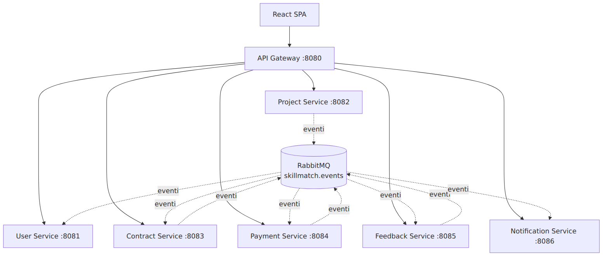

### Il Trade-off per un Progetto Accademico Piccolo

Il costo operativo (7 pipeline CI/CD, 7 database logici, gestione di eventi distribuiti, debug distribuito) è accettato consapevolmente per due motivi: il valore didattico (la traccia richiede esplicitamente di dimostrare questi pattern) e la coerenza con bounded context reali (la separazione per dominio, identità/progetti/contratti/pagamenti/feedback/notifiche, è sensata anche fuori dal contesto accademico).

### Alternative Considerate

| Alternativa | Motivo del rifiuto |
|-------------|---------------------|
| Monolite modulare | La traccia impone esplicitamente Microservice Architecture; un monolite non soddisferebbe l'obiettivo dell'esame |
| Monolite con split futuro pianificato | Nessun beneficio dato che il vincolo richiede i microservizi fin da subito entro la deadline |

### Conseguenze

**Positive**: dimostra tutti i pattern richiesti dalla traccia; decomposizione per bounded context comprensibile e testabile in isolamento; build/test/deploy indipendenti per servizio; il fallimento di un servizio non core (es. Notification) non blocca le funzionalità principali.

**Negative**: overhead operativo sproporzionato rispetto al team; consumo di risorse più alto di un monolite equivalente; debug distribuito più complesso; necessità di gestire idempotenza dei consumer di eventi.

## ADR-002: Keycloak Configuration and Realm Management

**Status**: Accepted · **Data**: 2026-06-19 · **Autore**: Aura Andrioli

### Contesto

SkillMatch richiede un sistema di autenticazione e autorizzazione centralizzato che supporti registrazione/login via SPA React (Authorization Code + PKCE), tre ruoli applicativi (`PROFESSIONAL`, `COMPANY`, `ADMIN`), comunicazione service-to-service (Client Credentials) e validazione JWT distribuita, senza chiamare Keycloak ad ogni richiesta.

### Decisione

Si usa **Keycloak 26.0**. Il realm `skillmatch` è definito e versionato come file JSON (`infra/keycloak/skillmatch-realm.json`), importato automaticamente all'avvio con `--import-realm`.

Il client `skillmatch-spa` (pubblico, `standardFlowEnabled`, PKCE `S256`, `accessTokenLifespan` 300s) serve l'autenticazione umana; PKCE mitiga l'intercettazione del code dato che una SPA non può custodire un client secret. Il client `skillmatch-m2m` (confidenziale, `serviceAccountsEnabled`, `accessTokenLifespan` 60s) era pensato per le comunicazioni service-to-service via Client Credentials, ma nella pratica quasi tutte le chiamate inter-servizio inoltrano il JWT del chiamante; l'unico uso reale di Client Credentials è invece il client dedicato `notification-service` (vedi capitolo Sicurezza). I tre ruoli applicativi sono **realm roles**, propagati nel claim `roles` via un protocol mapper dedicato (`realm-roles-mapper`) e letti da ogni servizio con un `JwtAuthenticationConverter` (`authoritiesClaimName: roles`, prefisso `ROLE_`). Il realm ha inoltre `verifyEmail: true` e `resetPasswordAllowed: true` (introdotti insieme alla registrazione self-service), mentre `registrationAllowed` resta `false`: la registrazione nativa di Keycloak non è usata, si passa sempre dall'endpoint applicativo (vedi [ADR-007](#adr-007-registrazione-self-service-tramite-keycloak-admin-api)).

### Flusso di Autenticazione (Authorization Code + PKCE)

Il Browser genera `code_verifier`/`code_challenge`, viene reindirizzato a Keycloak per il login, riceve un `authorization_code`, lo scambia (con `code_verifier`, senza client secret) per un `access_token`. L'API Gateway verifica la firma JWT contro le JWKS pubbliche di Keycloak (nessuna chiamata remota per ogni richiesta) e instrada al microservizio, che ripete la stessa verifica più il controllo del ruolo richiesto.

### Sicurezza in Produzione

| Elemento | Sviluppo | Produzione |
|---|---|---|
| `KEYCLOAK_ADMIN` | `admin` | Secret K8s |
| `skillmatch-m2m.secret` / `notification-service.secret` | `change-me-in-production` | Generato da Keycloak e iniettato via K8s Secret |
| `sslRequired` | `external` | `all` (dietro Ingress con TLS) |

### Alternative Considerate

| Alternativa | Motivo del rifiuto |
|---|---|
| Spring Security + DB proprio | Richiederebbe reimplementare login, token management, PKCE da zero |
| Auth0 / Okta | Vendor lock-in, costo non trascurabile, nessun self-hosted gratuito |
| Cognito (AWS) | Accoppia l'architettura ad AWS, contraddice il requisito cloud-agnostic |

### Conseguenze

**Positive**: nessuna logica di autenticazione nei microservizi, solo validazione JWT stateless; configurazione realm versionata in Git; `--import-realm` rende `docker compose up` self-contained.

**Negative**: componente aggiuntivo con memoria propria (JVM Keycloak ~512 MB); le modifiche al realm in produzione richiedono un processo manuale (export, commit, deploy); i token short-lived richiedono una gestione corretta del refresh nel frontend.

## ADR-003 - Database Strategy: Polyglot Persistence

**Status**: Accepted · **Data**: 2026-09-04 · **Autore**: Aura Andrioli

### Contesto

Il pattern Database per Service, applicato in modo letterale, richiederebbe un'istanza dedicata per ciascuno dei 6 microservizi relazionali più un settimo storage per il Notification Service. Sulla VM Oracle Cloud Always Free (4 OCPU, 24 GB RAM), 6 istanze PostgreSQL separate sarebbero troppo pesanti in RAM insieme a 7 JVM Spring Boot, Keycloak, RabbitMQ e MongoDB.

### Decisione

Una singola istanza fisica **PostgreSQL 16** ospita **6 database logici** (`identitydb`, `userdb`, `projectdb`, `contractdb`, `paymentdb`, `feedbackdb`), creati da `infra/init-databases.sql`. L'isolamento è garantito a livello di database logico e privilegi, non di processo fisico separato. Il **Notification Service** usa **MongoDB** dedicato (`notificationdb`), perché una notifica è un documento semi-strutturato che incapsula il payload originale dell'evento (`data: Map<String, Object>`), con struttura diversa a seconda del tipo di evento.

Ogni servizio relazionale gestisce il proprio schema con **Flyway**, con Hibernate configurato `ddl-auto: validate` (mai `update`/`create`).

### Il Trade-off

Condividere un'unica istanza fisica indebolisce l'isolamento rispetto a 6 istanze separate: un carico anomalo su un database logico compete per IO/CPU/connection pool con gli altri, e un fault del processo PostgreSQL è un single point of failure per 6 servizi su 7. È accettato come scelta pragmatica per stare nei limiti hardware gratuiti; la migrazione futura verso istanze separate richiederebbe solo un cambio di stringa di connessione, zero modifiche al codice.

### Alternative Considerate

| Alternativa | Motivo del rifiuto |
|---|---|
| Un'istanza PostgreSQL per servizio | Costo RAM proibitivo sulla VM Free Tier |
| Un unico database condiviso senza separazione logica | Violerebbe il pattern Database per Service, accoppiamento implicito tra schemi |
| PostgreSQL managed su cloud provider | Costo ricorrente non sostenibile, lock-in verso un provider |

### Conseguenze

**Positive**: rispetta lo spirito del pattern con costo hardware sostenibile; MongoDB evita schema rigido non necessario per dati semi-strutturati; Flyway garantisce schema riproducibile e versionato.

**Negative**: single point of failure per 6 microservizi su 7; contesa di risorse in caso di carico anomalo; isolamento garantito solo a livello di privilegi applicativi, non di processo.

## ADR-004 - Oracle Cloud Always Free + K3s

**Status**: Accepted · **Data**: 2026-09-04 · **Autore**: Aura Andrioli

### Contesto

Progetto accademico con budget zero, deadline fissa, nessuna carta di credito aziendale. Serve un'infrastruttura gratuita a tempo indeterminato, sufficiente per l'intero stack (7 microservizi, API Gateway, Keycloak, RabbitMQ, PostgreSQL, MongoDB, frontend), basata su orchestrazione dichiarativa reale.

### Decisione

Si usa **Oracle Cloud Infrastructure Always Free**, VM **Ampere A1 (ARM)** con 4 OCPU e 24 GB RAM, gratuita a tempo indeterminato. Su questa VM gira **K3s**, distribuzione Kubernetes leggera certificata CNCF, a singolo nodo. Conseguenza diretta: l'architettura ARM64 impone che ogni immagine Docker sia buildata per `linux/arm64` (buildx), vincolo che si propaga alla pipeline CI/CD.

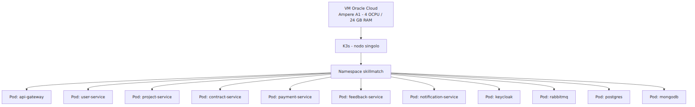

### Perché K3s

K3s è certificato CNCF ma distribuito come singolo binario con footprint molto più basso di un'installazione `kubeadm`: rimuove componenti non essenziali per uso single-node, usa SQLite invece di etcd. Un cluster `kubeadm` con etcd standalone avrebbe un overhead pensato per topologie multi-nodo che qui non ha alcun beneficio.

### Natura Cloud-Agnostica

I manifesti in `infra/k8s/` non usano alcuna risorsa proprietaria Oracle Cloud. Una futura migrazione verso AKS, EKS o GKE richiederebbe zero modifiche al codice applicativo o ai manifesti: solo lo strato infrastrutturale cambierebbe.

### Alternative Considerate

| Alternativa | Motivo del rifiuto |
|---|---|
| EKS / AKS / GKE | Costi mensili non sostenibili, crediti gratuiti limitati nel tempo |
| Docker Compose in produzione, senza Kubernetes | Non dimostrerebbe il pattern di orchestrazione richiesto |
| PaaS gratuiti (Heroku, Render, Railway) | Tier gratuiti temporanei; astrarrebbero completamente l'orchestrazione Kubernetes |

### Conseguenze

**Positive**: infrastruttura gratuita a tempo indeterminato; orchestrazione Kubernetes reale; design completamente cloud-agnostic.

**Negative**: singolo nodo, nessuna alta disponibilità; ogni immagine deve essere buildata per ARM64; datastore SQLite di K3s meno robusto sotto carico multi-nodo; ogni componente stateful va gestito manualmente come pod.

## ADR-005 - Monorepo Strategy

**Status**: Accepted · **Data**: 2026-09-04 · **Autore**: Aura Andrioli

### Contesto

SkillMatch è composto da 7 microservizi backend, un frontend React e uno strato di infrastruttura. Il vincolo determinante è che il progetto è sviluppato da una sola persona (la traccia consente il lavoro individuale in alternativa al gruppo di due). Gestire 7+ repository separati significherebbe duplicazione di README, configurazione CI, issue tracker e cronologia Git frammentata.

### Decisione

Si adotta un **repository unico** (`skillmatch`), organizzato per cartelle (`services/<nome>/`, `frontend/`, `infra/`, `docs/`, `.github/workflows/`). Il monorepo è un contenitore organizzativo, non un cambio di architettura: ogni servizio resta un progetto Maven standalone, senza dipendenze di build dirette verso altri servizi. L'indipendenza di deploy è preservata tramite **path filter** nelle pipeline GitHub Actions: un push che modifica solo il Payment Service non ricostruisce né ridistribuisce gli altri servizi.

### Vantaggi Concreti per un Team di 1-2 Persone

Un solo posto per issue/PR/documentazione; refactoring cross-service atomico in un'unica pull request (es. modificare il formato di un evento RabbitMQ tocca sia publisher che consumer in un solo commit); nessun overhead di gestione di N repository; changelog e history unificati.

### Svantaggi del Multi-repo che qui non si Applicano

Permessi granulari per team diversi (non necessari con una sola persona su tutti i servizi); dimensione del repository (non un problema con 7 servizi contenuti); CI che gira su tutto il repository (già mitigato dai path filter).

### Alternative Considerate

| Alternativa | Motivo del rifiuto |
|---|---|
| Un repository per microservizio | Overhead di coordinamento sproporzionato per una singola persona |
| Monorepo con un'unica pipeline che builda tutto | Tempi di build inutilmente lunghi rispetto ai path filter già adottati |

### Conseguenze

**Positive**: coordinamento semplificato; refactoring cross-service atomico; pipeline isolate per servizio; cronologia Git unificata.

**Negative**: richiede disciplina nel mantenere i servizi effettivamente indipendenti a livello di codice; una configurazione errata dei path filter potrebbe far scattare (o non scattare) pipeline in modo errato; una crescita futura del progetto oltre una singola persona richiederebbe di rivedere la strategia.

## ADR-006 - Event-Driven Communication con RabbitMQ

**Status**: Accepted · **Data**: 2026-09-04 · **Autore**: Aura Andrioli

### Contesto

Diversi flussi devono disaccoppiare temporalmente publisher e consumer: la registrazione di un utente non deve bloccarsi in attesa che il Notification Service scriva su MongoDB; il completamento di un pagamento deve abilitare il feedback senza che il Payment Service conosca l'esistenza del Feedback Service; l'accettazione di una candidatura deve generare un contratto e notificare le parti senza orchestrazione esplicita.

### Decisione

Si adotta **RabbitMQ** con un **singolo topic exchange** `skillmatch.events`, dichiarato identicamente in ogni servizio. I publisher inviano con routing key `<dominio>.<azione>` senza conoscere i consumer. Il **Notification Service** lega la propria coda con il wildcard `#`, ricevendo ogni evento e fungendo da sink universale, con una mappa interna evento → destinatari → messaggio e un ramo di default per eventi senza template.

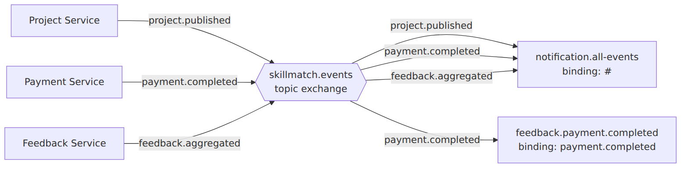

### Nota Tecnica: Message Converter e `__TypeId__`

Ogni publisher marca l'header AMQP `__TypeId__` con il nome completo della propria classe Java dell'evento, inesistente nel classpath del consumer (nessuna libreria di schemi condivisa). Ogni consumer configura quindi `Jackson2JsonMessageConverter` con `setAlwaysConvertToInferredType(true)`, che istruisce Spring AMQP a ignorare l'header e deserializzare nel tipo dichiarato dal parametro del metodo `@RabbitListener`.

### Idempotenza dei Consumer

RabbitMQ non garantisce consegna "exactly-once". Contract Service (`createFromCandidatureAccepted`) e Feedback Service (`enableFeedback`) verificano l'esistenza di uno stato già creato per lo stesso identificativo di dominio prima di scrivere, tollerando redelivery senza duplicare dati.

### Alternative Considerate

| Alternativa | Motivo del rifiuto |
|---|---|
| Apache Kafka | Overhead operativo non giustificato per il volume di eventi di un progetto accademico |
| Coda dedicata per ogni coppia publisher-consumer | Accoppierebbe esplicitamente i publisher ai consumer, perdendo il disaccoppiamento Pub/Sub |
| Chiamate REST sincrone per tutti i flussi | Introdurrebbe accoppiamento temporale tra servizi che non devono conoscersi a runtime |

### Conseguenze

**Positive**: publisher completamente disaccoppiati dai consumer; il fallimento temporaneo di un consumer non blocca gli altri; configurazione uniforme su un solo exchange condiviso.

**Negative**: nessuna garanzia di ordinamento globale né "exactly-once"; rischio di divergenza tra classi evento di publisher e consumer nel tempo (nessuna verifica a compile-time); debug end-to-end più complesso di una chiamata REST sincrona.

## ADR-007: Registrazione Self-Service tramite Keycloak Admin API

**Status**: Accepted · **Data**: 2026-09-06 · **Autore**: Aura Andrioli

### Contesto

Nella versione iniziale del sistema un nuovo utente doveva crearsi l'account direttamente dalla UI di login di Keycloak e poi, separatamente, completare il proprio profilo applicativo dopo il primo login: un utente restava "a metà" (identità Keycloak creata, ma nessuno stato applicativo coerente) finché il primo login non veniva effettuato manualmente, senza un punto unico per validare i campi minimi richiesti dal ruolo.

### Decisione

Lo User Service espone `POST /api/v1/auth/register` (`AuthController`), pubblico sia a livello di API Gateway sia di `SecurityConfig` interna, che orchestra in un'unica chiamata: validazione applicativa (rifiuta ruolo ADMIN e campi mancanti per il ruolo scelto, rifiuta email duplicate), creazione dell'identità su Keycloak tramite `KeycloakAdminClient` (Admin REST API: token con grant `password` su `admin-cli`, creazione utente con password permanente e `emailVerified: true`, assegnazione del realm role), creazione della riga `users` (`status=PENDING`) e completamento del profilo minimo, tutto nella stessa richiesta HTTP. Su Keycloak `registrationAllowed` resta `false`: il tema di login personalizzato aggiunge invece un link "Registrati" verso la pagina `/register` del frontend, così Keycloak resta esclusivamente l'Identity Provider.

**Nota di sicurezza**: `KeycloakAdminClient` si autentica come lo stesso admin bootstrap usato per inizializzare l'intero realm, tramite il client pubblico `admin-cli` e grant `password`, non tramite un client di servizio dedicato a permessi minimi. Scelta di scope deliberata per un progetto accademico con deadline fissa; da sostituire, prima di un uso oltre il contesto dell'esame, con un client Keycloak dedicato a permessi ristretti alla sola gestione utenti.

### Alternative Considerate

| Alternativa | Motivo del rifiuto |
|---|---|
| Registrazione nativa Keycloak (`registrationAllowed: true`) | Crea solo l'identità: lascerebbe comunque necessario un passo applicativo separato per creare riga `users` e profilo minimo, riproponendo il problema di stato incoerente |
| Client Keycloak dedicato a permessi minimi fin da subito | Corretto a regime, ma richiede configurazione non giustificata dai tempi del progetto; annotato come debito tecnico |
| Due chiamate separate (crea identità, poi completa profilo) | Reintrodurrebbe la finestra di stato incoerente se l'utente abbandona il flusso a metà |

### Conseguenze

**Positive**: identità Keycloak, riga `users` e profilo minimo sempre coerenti dal punto di vista applicativo; un solo punto di validazione server-side per ruolo; separazione concettuale mantenuta tra Keycloak (autenticazione) e applicazione (onboarding).

**Negative**: credenziali amministrative complete del realm note allo User Service, privilegio più ampio del necessario; nessuna compensazione automatica se una chiamata sequenziale a Keycloak fallisce dopo la creazione dell'utente; più chiamate HTTP sequenziali verso Keycloak, per cui il timeout del Circuit Breaker dedicato è stato alzato a 10s (default 4s).

## ADR-008: Sviluppo Assistito da Agenti AI

**Status**: Accepted · **Data**: 2026-09-06 · **Autore**: Aura Andrioli

### Contesto

SkillMatch è sviluppato da una sola persona, entro la deadline vincolata dalla sessione d'esame, con uno scope tecnico ampio: 7 microservizi Spring Boot (incluso l'API Gateway), un frontend React, due motori di database (PostgreSQL e MongoDB), un message broker (RabbitMQ), un identity provider (Keycloak), un orchestratore Kubernetes (K3s). Scrivere, collegare e distribuire tutto questo interamente a mano, da soli, non è compatibile con il tempo a disposizione. La traccia d'esame non impone né vieta l'uso di strumenti di assistenza allo sviluppo.

### Decisione

Si adotta uno sviluppo assistito da agenti AI (Claude, nelle varianti Sonnet e Opus a seconda della sessione), con separazione dei ruoli: le decisioni architetturali restano umane e vengono fissate in documenti versionati (`CLAUDE.md`, `CLAUDE-SERVICES.md`, l'archivio ADR), che ogni sessione dell'agente carica automaticamente come contesto; la generazione del codice è delegata all'agente, vincolata da quei documenti.

**Precisazione necessaria per l'onestà di questo ADR**: lo sviluppo non è avvenuto come un singolo thread continuo con un solo agente dall'inizio alla fine. Il lavoro è stato distribuito su più sessioni Claude Code distinte, spesso aperte in parallelo, ciascuna responsabile di un'area (documentazione, frontend e pannello admin, deploy K3s e infrastruttura). Sessioni diverse non condividono automaticamente lo stesso contesto conversazionale, solo gli stessi documenti versionati: questo ha causato, verificabilmente, incoerenze temporanee tra parti del sistema sviluppate in parallelo, poi individuate e corrette (vedi il capitolo Processo di Sviluppo, sezione Limiti). Inoltre alcuni artefatti nel repository (la configurazione dei gate JaCoCo/PMD, parte della suite di test dello User Service, il file `.github/copilot-instructions.md`) non sono riconducibili con certezza a nessuna delle sessioni Claude Code identificabili: è plausibile un contributo aggiuntivo di un altro strumento di assistenza (es. GitHub Copilot) o lavoro manuale non ricostruibile a posteriori con precisione.

### Alternative Considerate

| Alternativa | Motivo del rifiuto |
|---|---|
| Sviluppo interamente manuale | Tempi non sostenibili per una singola persona entro la deadline, dato lo scope richiesto dalla traccia |
| Un solo agente/sessione per l'intero progetto, in sequenza | Preferibile per la tracciabilità, ma la pratica reale (sessioni multiple, a volte parallele) non lo ha permesso |
| Pair programming con un secondo sviluppatore umano | La traccia consente esplicitamente il lavoro individuale |

### Conseguenze

**Positive**: ha reso sostenibile, per una singola persona, uno scope tecnico che tipicamente richiederebbe un team; le decisioni architetturali restano tracciabili e verificabili nei documenti versionati indipendentemente da quale sessione abbia scritto il codice; iterazione rapida su uno stack eterogeneo (Java/Spring Boot, React, Kubernetes, RabbitMQ, Keycloak).

**Negative**: dipendenza dalla qualità del contesto fornito; rischio di deriva architetturale su sessioni lunghe, aggravato dalla frammentazione tra sessioni parallele (successo concretamente, non solo teorico); necessità di verifica umana sistematica perché il codice generato è plausibile anche quando è sbagliato; sforzo di lettura e comprensione aggiuntivo rispetto a scrivere il codice a mano; tracciabilità parziale della generazione, non risolta retroattivamente per non falsificare la cronologia Git.

\newpage

# Riepilogo Database

| Database | Tipo | Servizio proprietario | Tabelle / Collezioni principali |
|---|---|---|---|
| `identitydb` | PostgreSQL | Keycloak | Gestito internamente da Keycloak, non applicativo |
| `userdb` | PostgreSQL | User Service | `users`, `professional_profiles`, `company_profiles`, `skills`, `user_skills`, `portfolio_items`, `reports` |
| `projectdb` | PostgreSQL | Project Service | `projects`, `project_requirements`, `candidatures` |
| `contractdb` | PostgreSQL | Contract Service | `contracts` |
| `paymentdb` | PostgreSQL | Payment Service | `commission_config`, `transactions`, `invoices` |
| `feedbackdb` | PostgreSQL | Feedback Service | `feedback_eligibility`, `feedbacks` |
| `notificationdb` | MongoDB | Notification Service | `notifications` |

Tutti i database PostgreSQL condividono una singola istanza fisica (vedi [ADR-003](#adr-003---database-strategy-polyglot-persistence)); ogni schema è comunque di proprietà esclusiva del rispettivo servizio, senza foreign key fisiche tra database diversi. I riferimenti cross-service (es. `company_id` nel Project Service, che punta a un utente nello User Service) sono sempre UUID logici, mai vincoli di integrità referenziale fisici, coerentemente con il pattern Database per Service. Lo schema dettagliato di ogni database, incluse le entità Mermaid `erDiagram` complete con vincoli CHECK e UNIQUE, è riportato nella rispettiva sezione del capitolo [Dettaglio dei Microservizi](#dettaglio-dei-microservizi).
