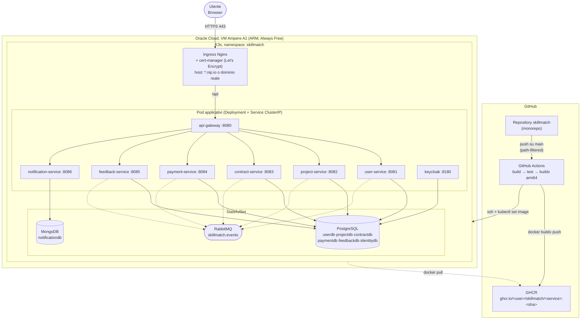

# SkillMatch: Diagramma di Deployment

SkillMatch viene distribuito su un singolo nodo K3s in esecuzione su una VM Oracle Cloud Infrastructure Always Free (Ampere A1, 4 OCPU, 24 GB RAM, ARM64). L'intero namespace `skillmatch` è definito tramite manifesti dichiarativi in [infra/k8s/](../infra/k8s/): un Deployment + Service ClusterIP per ciascun microservizio stateless, uno StatefulSet per PostgreSQL, uno per MongoDB e uno per RabbitMQ, oltre a ConfigMap/Secret per la configurazione esternalizzata (12-Factor III).

Il traffico esterno entra da un unico Ingress Nginx (`infra/k8s/ingress.yaml`), che termina TLS con un certificato Let's Encrypt gestito da cert-manager (`ClusterIssuer` HTTP-01) e instrada `/api` verso l'API Gateway; il dominio può essere un FQDN reale oppure, in assenza di uno, un dominio gratuito `nip.io` che risolve direttamente all'IP pubblico della VM (es. `132.145.10.4.nip.io`), sufficiente per il flusso di validazione HTTP-01. Le immagini Docker (build `linux/arm64` multi-stage, una per servizio) sono pubblicate su GitHub Container Registry (GHCR) da GitHub Actions, che dopo il push si collega in SSH alla VM ed esegue `kubectl set image` sul Deployment del solo servizio modificato (grazie ai path filter dei workflow in [.github/workflows/](../.github/workflows/)).

## Diagramma

## Componenti Chiave

| Componente | Ruolo |
|---|---|
| VM Oracle Cloud (Ampere A1) | Unico nodo del cluster K3s; 4 OCPU / 24 GB RAM, gratuita a tempo indeterminato (Always Free) |
| K3s | Distribuzione Kubernetes leggera, certificata CNCF; sostituisce un cluster Kubernetes completo senza controllo esterno del piano di controllo |
| Ingress Nginx + cert-manager | Unico punto di ingresso HTTPS; rinnovo automatico del certificato TLS tramite `ClusterIssuer` Let's Encrypt |
| GitHub Actions | Un workflow per servizio (`services/<nome>/**` come path filter): build Maven, test, `docker buildx build --platform linux/arm64`, push su GHCR |
| GHCR (GitHub Container Registry) | Registry immagini gratuito e illimitato sui repository pubblici |
| Deploy SSH + `kubectl set image` | L'ultimo step del workflow si collega alla VM e aggiorna solo l'immagine del Deployment interessato, senza toccare gli altri servizi |
| Security List Oracle Cloud | Solo le porte 22 (SSH), 80 e 443 sono esposte pubblicamente; tutto il traffico interno (Postgres, RabbitMQ, service-to-service) resta sulla rete del cluster |

## Note di Portabilità Cloud-Agnostica

I manifesti in `infra/k8s/` non contengono alcun riferimento a servizi proprietari Oracle Cloud: usano risorse Kubernetes standard (Deployment, StatefulSet, Service, Ingress, ConfigMap, Secret) compatibili con qualunque distribuzione conforme CNCF. Migrare su AKS, EKS o GKE richiede solo di sostituire lo strato infrastrutturale (nodo/i, storage class, eventuale load balancer gestito): zero modifiche al codice applicativo o ai manifesti stessi.
