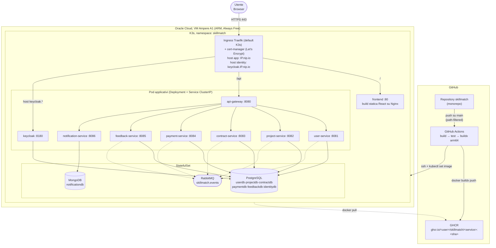

# SkillMatch: Diagramma di Deployment

SkillMatch viene distribuito su un singolo nodo K3s in esecuzione su una VM Oracle Cloud Infrastructure Always Free (Ampere A1, 4 OCPU, 24 GB RAM, ARM64). L'intero namespace `skillmatch` è definito tramite manifesti dichiarativi in [infra/k8s/](../infra/k8s/): un Deployment + Service ClusterIP per ciascun microservizio stateless (frontend incluso), uno StatefulSet per PostgreSQL, uno per MongoDB e uno per RabbitMQ, oltre a ConfigMap/Secret per la configurazione esternalizzata (12-Factor III). Lo script [infra/scripts/deploy-k8s.sh](../infra/scripts/deploy-k8s.sh) applica tutti i manifesti nell'ordine corretto (namespace/config → data store → Keycloak → microservizi → frontend → ingress), rigenerando prima le ConfigMap derivate da file sorgente (init SQL, realm Keycloak, tema di login).

Il traffico esterno entra da un unico Ingress **Traefik** (`infra/k8s/ingress.yaml`), incluso di default in K3s (nessun controller aggiuntivo da installare). Espone due host distinti sul dominio gratuito `nip.io`, che risolve `<qualsiasi-etichetta>.<IP-pubblico-VM>.nip.io` direttamente all'IP della VM senza bisogno di un dominio registrato: l'host principale (es. `92.4.167.195.nip.io`) instrada `/` al frontend e `/api` all'API Gateway, mentre un host separato (`keycloak.92.4.167.195.nip.io`) espone la sola console/endpoint OIDC di Keycloak. Entrambi terminano TLS con un certificato Let's Encrypt distinto, emesso da cert-manager tramite lo stesso `ClusterIssuer` HTTP-01. HTTPS qui non è opzionale: il flusso Authorization Code + PKCE richiede la Web Crypto API del browser (per calcolare `code_challenge = SHA-256(code_verifier)`), disponibile solo in un contesto sicuro (HTTPS, o `localhost`): su un host pubblico in HTTP semplice il login fallisce silenziosamente. Le immagini Docker (build `linux/arm64` multi-stage, una per servizio, frontend incluso) sono pubblicate su GitHub Container Registry (GHCR) da GitHub Actions, che dopo il push si collega in SSH alla VM ed esegue `kubectl set image` sul Deployment del solo servizio modificato (grazie ai path filter dei workflow in [.github/workflows/](../.github/workflows/)).

## Diagramma

## Componenti Chiave

| Componente | Ruolo |
|---|---|
| VM Oracle Cloud (Ampere A1) | Unico nodo del cluster K3s; 4 OCPU / 24 GB RAM, gratuita a tempo indeterminato (Always Free) |
| K3s | Distribuzione Kubernetes leggera, certificata CNCF; sostituisce un cluster Kubernetes completo senza controllo esterno del piano di controllo |
| Ingress Traefik + cert-manager | Incluso di default in K3s (nessuna installazione aggiuntiva); due host TLS distinti (app e Keycloak) con certificati Let's Encrypt separati tramite lo stesso `ClusterIssuer` |
| Frontend containerizzato | Build statica React servita da Nginx (`frontend/Dockerfile` multi-stage); un endpoint `/actuator/health` fittizio è definito in `nginx.conf` solo per uniformare le probe Kubernetes a quelle degli altri servizi Spring Boot |
| GitHub Actions | Un workflow per servizio, frontend incluso (`services/<nome>/**` o `frontend/**` come path filter): build Maven o npm, test, `docker buildx build --platform linux/arm64`, push su GHCR |
| GHCR (GitHub Container Registry) | Registry immagini gratuito e illimitato sui repository pubblici, pacchetti resi pubblici per permettere a K3s il pull senza credenziali |
| Deploy SSH + `kubectl set image` | L'ultimo step del workflow si collega alla VM e aggiorna solo l'immagine del Deployment interessato, senza toccare gli altri servizi |
| `startupProbe` sui 7 servizi Java | Aggiunta dopo un debug live: Postgres + JPA impiegano circa 80s ad avviarsi, tempo che la sola `livenessProbe` (pensata per un servizio già up) non tollerava, causando crash loop al primo deploy |
| Security List Oracle Cloud | Solo le porte 22 (SSH), 80 e 443 sono esposte pubblicamente; tutto il traffico interno (Postgres, RabbitMQ, service-to-service) resta sulla rete del cluster |

## Note di Portabilità Cloud-Agnostica

I manifesti in `infra/k8s/` non contengono alcun riferimento a servizi proprietari Oracle Cloud: usano risorse Kubernetes standard (Deployment, StatefulSet, Service, Ingress, ConfigMap, Secret) compatibili con qualunque distribuzione conforme CNCF. Migrare su AKS, EKS o GKE richiede solo di sostituire lo strato infrastrutturale (nodo/i, storage class, eventuale load balancer gestito): zero modifiche al codice applicativo o ai manifesti stessi.
