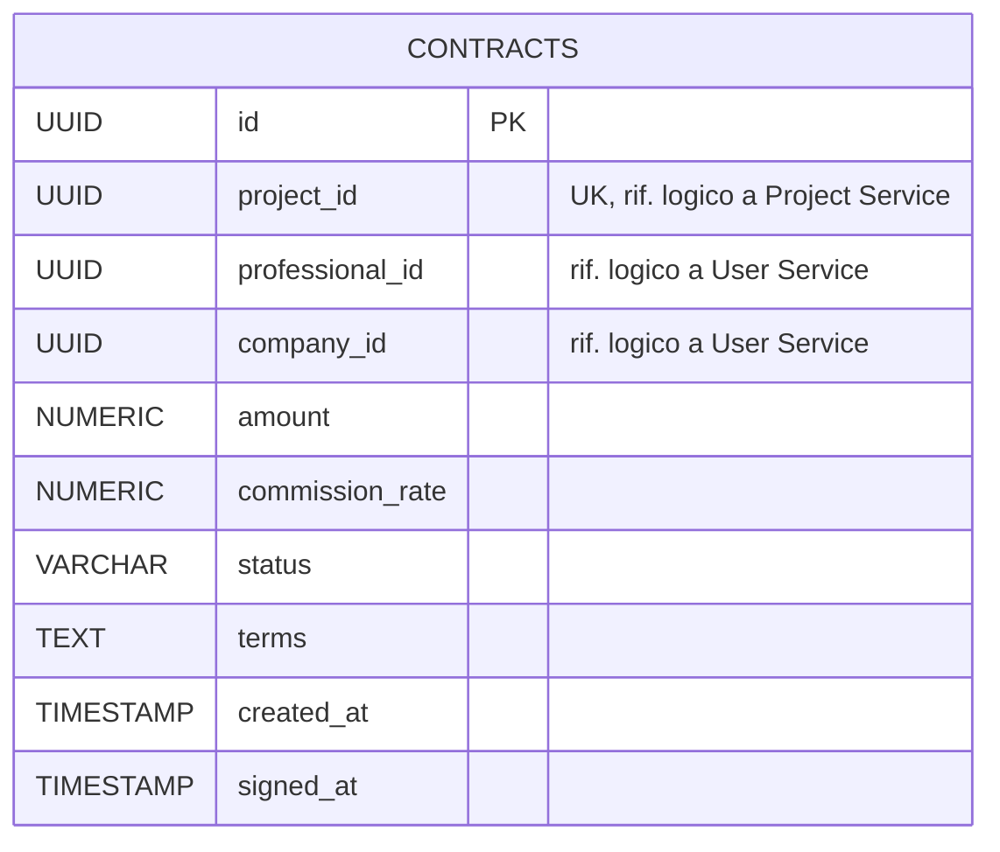

# Diagramma ER - Contract Service

Il database `contractdb` del Contract Service è responsabile della gestione dei micro-contratti che formalizzano l'accordo tra un'azienda e un professionista per un progetto, una volta che una candidatura è stata accettata. Il servizio non conosce i dettagli anagrafici di aziende e professionisti, né i dettagli del progetto: mantiene solo i riferimenti logici necessari e i dati contrattuali (importo, commissione, stato, termini).

## Entità e vincoli principali

- **contracts**: unica entità del servizio. Rappresenta il micro-contratto generato quando una candidatura viene accettata (evento `candidature.accepted`). `project_id`, `professional_id` e `company_id` sono riferimenti logici cross-service (rispettivamente a Project Service e User Service), senza FK fisiche perché appartengono a database diversi.
- Il vincolo `UNIQUE(project_id)` garantisce che possa esistere **un solo contratto per progetto**.
- `status` è vincolato da CHECK a `DRAFT`, `PENDING_SIGNATURES`, `ACTIVE`, `COMPLETED`, `CANCELLED`.
- `amount` e `commission_rate` sono valorizzati alla creazione del contratto e usati come base per il calcolo della transazione di pagamento nel Payment Service.
- `signed_at` è valorizzato solo quando il contratto passa allo stato firmato/attivo; resta `NULL` finché il contratto è in bozza o in attesa di firme.
