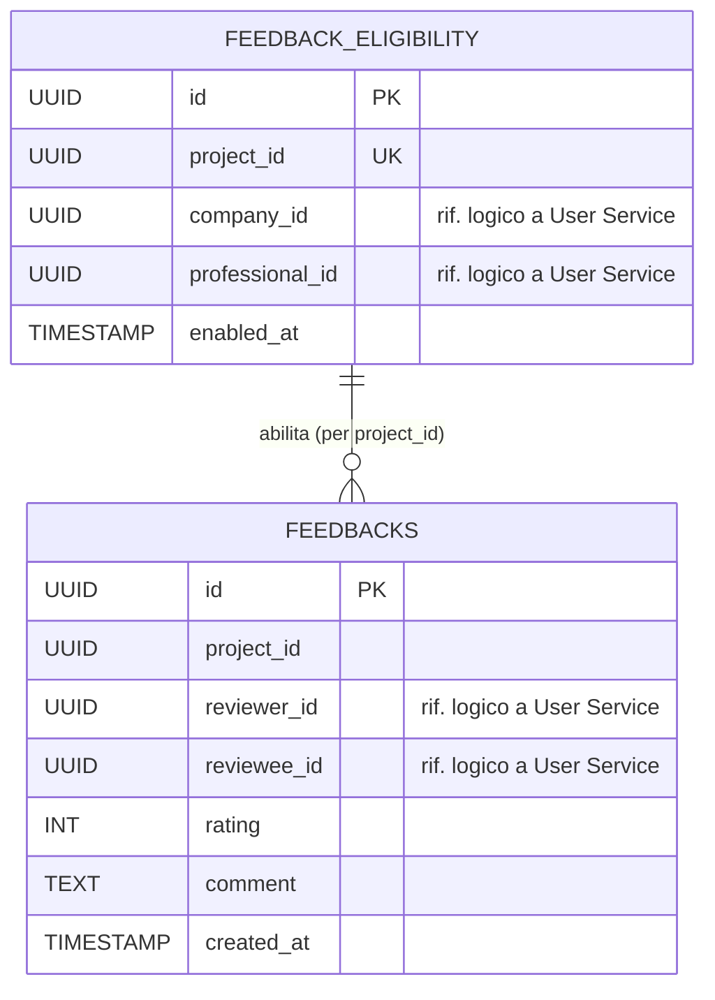

# Diagramma ER - Feedback Service

Il database `feedbackdb` del Feedback Service è responsabile della gestione delle recensioni reciproche tra azienda e professionista al termine di un progetto pagato, e dell'idoneità (eligibility) a lasciare tali recensioni. Le recensioni alimentano il calcolo della reputazione del professionista nello User Service tramite l'evento `feedback.aggregated`.

## Entità e vincoli principali

- **feedback_eligibility**: tabella non presente nello schema "ideale" originale, ma aggiunta realmente nel codice. Quando arriva l'evento `payment.completed`, il servizio memorizza in questa tabella le due parti coinvolte nel progetto (`company_id` e `professional_id`). In questo modo, quando arriva una submission di feedback, il servizio può autorizzarla e instradarla al destinatario corretto senza dover fare una chiamata sincrona di ritorno verso Project Service o Contract Service. `project_id` è vincolato `UNIQUE`: un solo record di eligibility per progetto.
- **feedbacks**: recensione lasciata da una parte (`reviewer_id`) verso l'altra (`reviewee_id`) per un dato progetto. `rating` è vincolato da CHECK tra 1 e 5. Il vincolo `UNIQUE(project_id, reviewer_id, reviewee_id)` impedisce recensioni duplicate dalla stessa parte verso la stessa controparte sullo stesso progetto.
- **Relazione logica**: `feedback_eligibility.project_id` è in relazione 1:N con `feedbacks.project_id` (non è una FK fisica dichiarata nello schema, ma un legame applicativo). Per ogni progetto possono esistere al massimo due righe in `feedbacks`, grazie al vincolo `UNIQUE` sulla tripla: una recensione azienda verso professionista e una recensione professionista verso azienda.
