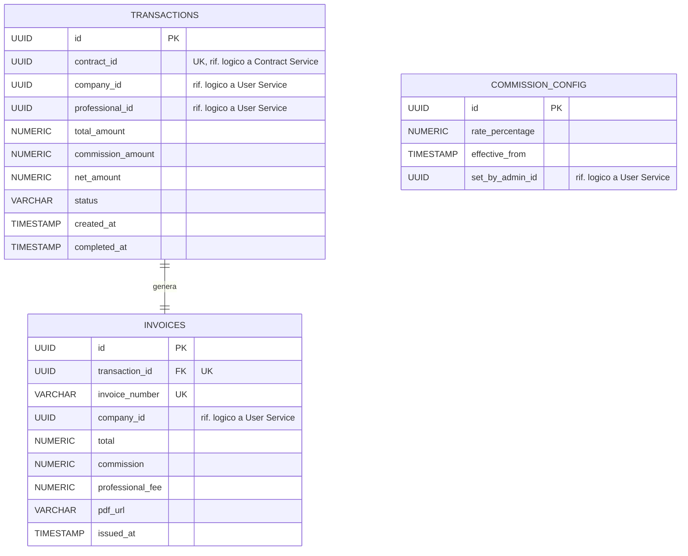

# Diagramma ER - Payment Service

Il database `paymentdb` del Payment Service è responsabile dell'elaborazione dei pagamenti relativi ai contratti completati, del calcolo della commissione trattenuta dalla piattaforma e della generazione della fattura unica per l'azienda. Include inoltre la configurazione storicizzata del tasso di commissione, modificabile dall'admin.

## Entità e vincoli principali

- **commission_config**: tabella di configurazione storicizzata, senza FK verso altre tabelle. Ogni riga rappresenta un tasso di commissione (`rate_percentage`) valido a partire da `effective_from`; il tasso attivo in un dato momento è quello con `effective_from` più recente non successivo alla data corrente. `set_by_admin_id` è un riferimento logico allo User Service, all'admin che ha impostato il tasso.
- **transactions**: rappresenta il pagamento associato a un contratto, avviato da un'azione esplicita dell'azienda (`POST /api/v1/payments`) quando il contratto è nello stato `COMPLETED`, non da un evento asincrono. `contract_id` è un riferimento logico cross-service al Contract Service, vincolato `UNIQUE` per garantire **un solo pagamento per contratto**. `company_id` e `professional_id` sono riferimenti logici allo User Service. `status` è vincolato da CHECK a `INITIATED`, `PROCESSING`, `COMPLETED`, `FAILED`, `REFUNDED`.
- **invoices**: fattura generata per l'azienda al completamento di una transazione, in relazione 1:1 con `transactions` (`transaction_id` è FK e `UNIQUE`). `invoice_number` è `UNIQUE`. La fattura include sia il compenso del professionista (`professional_fee`) sia la commissione trattenuta dalla piattaforma (`commission`), per un totale (`total`) unico verso l'azienda, coerentemente con la regola di business che prevede una fattura unica.
