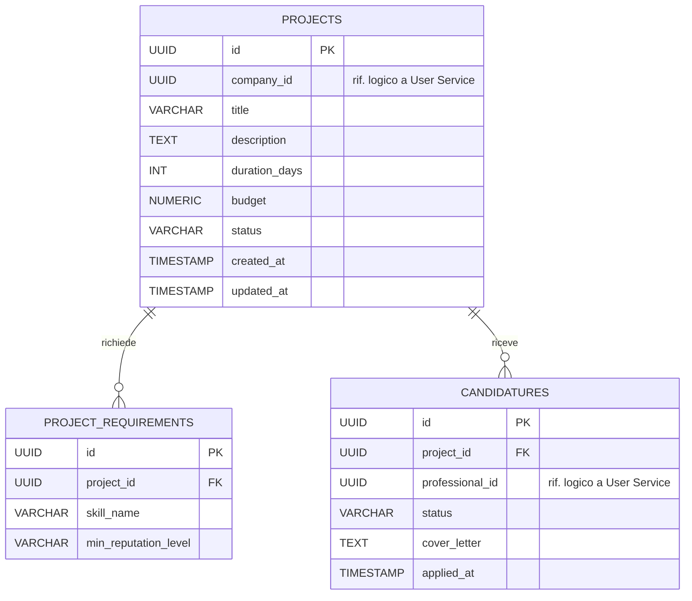

# Diagramma ER - Project Service

Il database `projectdb` del Project Service è responsabile della gestione dei progetti pubblicati dalle aziende, dei requisiti di competenza richiesti per ciascun progetto e delle candidature presentate dai professionisti. Non contiene dati anagrafici di utenti o aziende: quelli restano di competenza esclusiva dello User Service, coerentemente con il pattern Database per Service.

## Entità e vincoli principali

- **projects**: rappresenta un progetto pubblicato da un'azienda. `company_id` è un riferimento logico cross-service allo User Service (nessuna FK fisica, poiché appartiene a un database diverso). `status` è vincolato da CHECK a `DRAFT`, `OPEN`, `ASSIGNED`, `IN_PROGRESS`, `COMPLETED`, `CLOSED`.
- **project_requirements**: elenco dei requisiti di competenza richiesti da un progetto, in relazione 1:N con `projects` tramite `project_id` (`ON DELETE CASCADE`). `min_reputation_level` è opzionale e indica il livello minimo di reputazione richiesto per candidarsi.
- **candidatures**: candidature dei professionisti ai progetti, in relazione 1:N con `projects`. `professional_id` è un riferimento logico cross-service allo User Service. `status` è vincolato da CHECK a `PENDING`, `ACCEPTED`, `REJECTED`, `WITHDRAWN` (default `PENDING`). Il vincolo `UNIQUE(project_id, professional_id)` impedisce a un professionista di candidarsi più volte allo stesso progetto.
