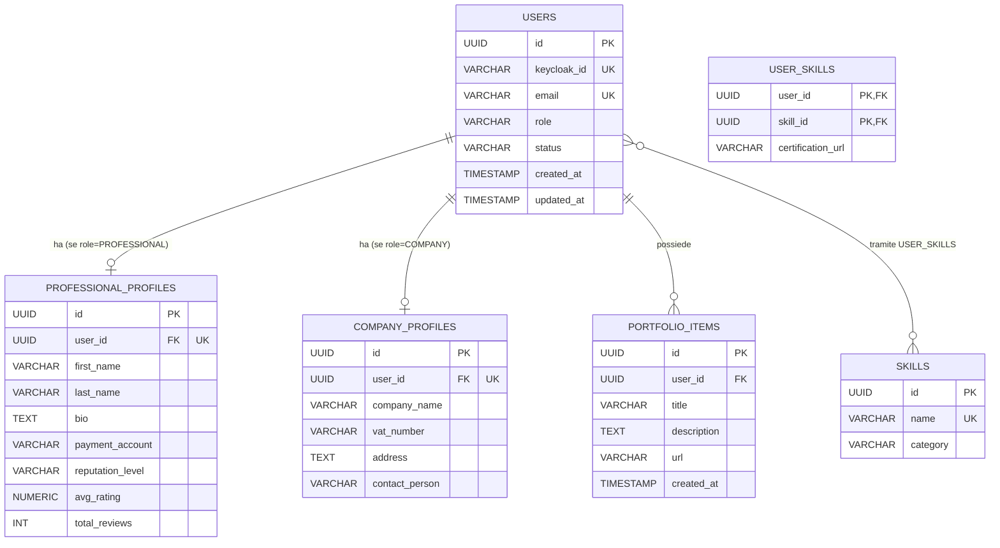

# Diagramma ER - User Service

Il database `userdb` dello User Service è responsabile della gestione degli account utente (professionisti, aziende e admin), dei relativi profili estesi, del catalogo delle competenze (skill) e del portfolio dei professionisti. Questo servizio è anche l'unica fonte di verità per lo stato di validazione degli account e per il livello di reputazione dei professionisti.

## Entità e vincoli principali

- **users**: tabella centrale degli account. `keycloak_id` ed `email` sono `UNIQUE`. `role` è vincolato da CHECK a `PROFESSIONAL`, `COMPANY`, `ADMIN`. `status` è vincolato da CHECK a `PENDING`, `VALIDATED`, `SUSPENDED` (default `PENDING`), e riflette la regola di business per cui un professionista deve essere validato da un admin prima di poter candidarsi ai progetti.
- **professional_profiles**: profilo esteso 1:1 con `users`, presente solo per gli utenti con `role = PROFESSIONAL`. `user_id` è `UNIQUE` oltre che FK. `reputation_level` è vincolato da CHECK a `JUNIOR`, `AFFIDABILE`, `TOP_PERFORMER` e viene ricalcolato in base a `avg_rating` e `total_reviews` quando arriva l'evento `feedback.aggregated`.
- **company_profiles**: profilo esteso 1:1 con `users`, presente solo per gli utenti con `role = COMPANY`. `user_id` è `UNIQUE` oltre che FK. `company_name` è obbligatorio.
- **skills**: catalogo delle competenze disponibili sulla piattaforma. `name` è `UNIQUE`.
- **user_skills**: tabella di associazione N:N tra `users` e `skills`, con chiave primaria composta `(user_id, skill_id)` e l'attributo aggiuntivo `certification_url` per l'eventuale link alla certificazione.
- **portfolio_items**: elementi del portfolio di un utente (tipicamente un professionista), in relazione 1:N con `users`.
