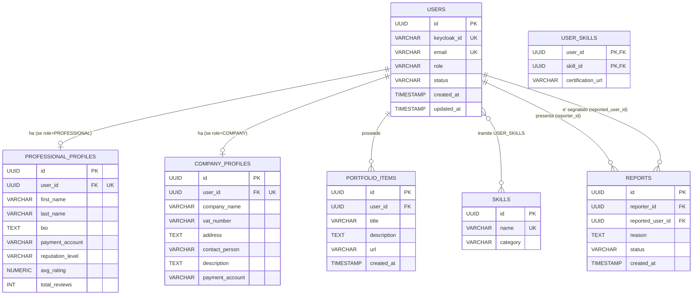

# Diagramma ER - User Service

Il database `userdb` dello User Service è responsabile della gestione degli account utente (professionisti, aziende e admin), dei relativi profili estesi, del catalogo delle competenze (skill), del portfolio dei professionisti e delle segnalazioni (reports) reciproche tra le parti di una collaborazione. Questo servizio è anche l'unica fonte di verità per lo stato di validazione degli account e per il livello di reputazione dei professionisti.

## Entità e vincoli principali

- **users**: tabella centrale degli account. `keycloak_id` ed `email` sono `UNIQUE`. `role` è vincolato da CHECK a `PROFESSIONAL`, `COMPANY`, `ADMIN`. `status` è vincolato da CHECK a `PENDING`, `VALIDATED`, `SUSPENDED`, `DEACTIVATED` (default `PENDING`, `DEACTIVATED` aggiunto da `V5__add_deactivated_status.sql`), e riflette la regola di business per cui sia un professionista sia un'azienda devono essere validati da un admin prima di poter agire: il professionista prima di candidarsi ai progetti, l'azienda prima di creare un progetto. Lo stesso endpoint (`POST /api/v1/admin/users/{userId}/validate`) valida entrambi i ruoli, senza distinzione. `SUSPENDED` è una sospensione reversibile che non tocca l'identità Keycloak; `DEACTIVATED` (`POST /api/v1/admin/users/{userId}/deactivate`) è permanente e disabilita anche l'account Keycloak, così l'utente non può più accedere, pur restando la riga nel database per mantenere risolvibili contratti, pagamenti e feedback già collegati a quell'id. Gli account `DEACTIVATED` sono esclusi da `GET /api/v1/admin/users`.
- **professional_profiles**: profilo esteso 1:1 con `users`, presente solo per gli utenti con `role = PROFESSIONAL`. `user_id` è `UNIQUE` oltre che FK. `reputation_level` è vincolato da CHECK a `JUNIOR`, `AFFIDABILE`, `TOP_PERFORMER` e viene ricalcolato in base a `avg_rating` e `total_reviews` quando arriva l'evento `feedback.aggregated`.
- **company_profiles**: profilo esteso 1:1 con `users`, presente solo per gli utenti con `role = COMPANY`. `user_id` è `UNIQUE` oltre che FK. `company_name` è obbligatorio. `description` e `payment_account` sono stati aggiunti in un secondo momento (migrazione `V4__add_company_profile_fields.sql`): a differenza di `professional_profiles.payment_account` (conto su cui il professionista riceve il compenso), qui `payment_account` è il conto da cui l'azienda invia i pagamenti. In entrambi i casi il campo resta puramente informativo: nessuno dei due è collegato a un vero gateway di pagamento, dato che Payment Service calcola solo gli importi e simula il trasferimento.
- **skills**: catalogo delle competenze disponibili sulla piattaforma. `name` è `UNIQUE`.
- **user_skills**: tabella di associazione N:N tra `users` e `skills`, con chiave primaria composta `(user_id, skill_id)` e l'attributo aggiuntivo `certification_url` per l'eventuale link alla certificazione.
- **portfolio_items**: elementi del portfolio di un utente (tipicamente un professionista), in relazione 1:N con `users`.
- **reports**: segnalazione che un professionista o un'azienda presenta contro la controparte di una collaborazione (es. un contratto problematico), per la revisione di un admin. `reporter_id` e `reported_user_id` sono entrambi FK verso `users` (due relazioni distinte dalla stessa tabella). `status` è vincolato da CHECK a `OPEN`/`CLOSED` (default `OPEN`); chiudere una segnalazione (`POST /api/v1/admin/reports/{reportId}/close`) è puro lavoro amministrativo di bookkeeping e non sospende automaticamente l'utente segnalato, che resta un'azione admin separata (`POST /api/v1/admin/users/{userId}/suspend`). Un indice su `reported_user_id` supporta la consultazione `GET /api/v1/admin/users/{userId}/reports`.
- **skills** (nota di seeding): la migrazione `V2__seed_skills.sql` popola circa 35 competenze di partenza raggruppate per categoria (Sviluppo software, DevOps, Design, Marketing, Gestione, ecc.), usate dall'autocomplete sia nel profilo professionista sia nei requisiti di un progetto; nuove skill possono comunque essere aggiunte al volo (pattern get-or-create) tramite `GET /api/v1/skills?search=`.
