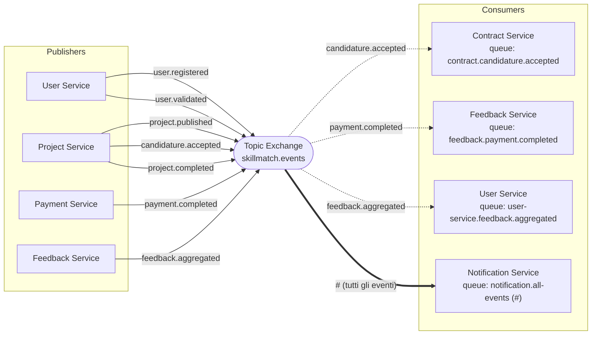

# SkillMatch: Mappa degli Eventi RabbitMQ

Tutti gli eventi asincroni del sistema attraversano un unico topic exchange, `skillmatch.events`, dichiarato in modo identico (stesso nome, stesso tipo `topic`, `durable`) nella classe `RabbitMQConfig` di ogni microservizio. Ogni publisher pubblica con una routing key nella forma `<dominio>.<azione>` senza conoscere chi la consumerà; ogni consumer dichiara una coda propria e la lega all'exchange con un binding sulla routing key (o sul wildcard `#`, come fa il Notification Service). Questo disaccoppiamento è l'implementazione concreta del pattern Pub/Sub descritto in [docs/architecture.md](architecture.md).

Il payload di ogni evento segue lo standard `{ eventId, eventType, timestamp, source, data }`; il campo `data` contiene gli identificatori di dominio (UUID) necessari al consumer per agire senza dover richiamare sincronamente il publisher.

## Diagramma

## Tabella Riepilogativa

| Evento (routing key) | Publisher | Consumer(s) | Coda | Descrizione |
|---|---|---|---|---|
| `user.registered` | user-service | notification-service | `notification.all-events` | Un nuovo utente (professionista o azienda) si è registrato; il servizio notifiche crea un messaggio di benvenuto per l'utente stesso. |
| `user.validated` | user-service | notification-service | `notification.all-events` | Un amministratore ha validato il profilo di un professionista (`POST /api/v1/admin/users/{userId}/validate`); il professionista viene notificato e può ora candidarsi ai progetti. |
| `project.published` | project-service | notification-service | `notification.all-events` | Un'azienda ha pubblicato un progetto (`PUT /api/v1/projects/{id}/publish`), passandolo da `DRAFT` a `OPEN`. |
| `candidature.accepted` | project-service | contract-service, notification-service | `contract.candidature.accepted`, `notification.all-events` | L'azienda ha accettato una candidatura (`PUT /api/v1/projects/{id}/candidatures/{candidatureId}/accept`). Il Contract Service crea automaticamente un micro-contratto in stato `DRAFT` con l'importo del progetto e la commissione corrente; il Notification Service avvisa sia il professionista selezionato sia l'azienda. |
| `project.completed` | project-service | notification-service | `notification.all-events` | L'azienda segna il progetto come concluso (`PUT /api/v1/projects/{id}/complete`). Notifica entrambe le parti; non ha consumer applicativi diretti: il completamento del contratto e l'avvio del pagamento restano azioni esplicite dell'azienda (vedi [docs/sequence-diagrams/payment-flow.md](sequence-diagrams/payment-flow.md)). |
| `payment.completed` | payment-service | feedback-service, notification-service | `feedback.payment.completed`, `notification.all-events` | Il pagamento è stato eseguito e la fattura generata (`POST /api/v1/payments`). Il Feedback Service registra l'idoneità al feedback reciproco per il progetto; il Notification Service avvisa entrambe le parti. |
| `feedback.aggregated` | feedback-service | user-service, notification-service | `user-service.feedback.aggregated`, `notification.all-events` | Un professionista ha ricevuto un nuovo feedback dall'azienda; il Feedback Service ricalcola media e conteggio e pubblica l'aggregato. Lo User Service aggiorna `avg_rating`, `total_reviews` e `reputation_level`; il Notification Service informa il professionista. |

## Note di Implementazione

- **Notification Service come sink universale**: a differenza degli altri consumer, che si legano a una singola routing key, il Notification Service lega la coda `notification.all-events` con il wildcard `#`, ricevendo così ogni evento pubblicato sull'exchange. La logica di smistamento (destinatari e testo del messaggio) vive interamente in `NotificationServiceImpl.resolveRecipients(...)`, con un ramo `default` che registra comunque un record generico per eventi senza un template dedicato.
- **Conversione dei messaggi**: ogni consumer configura `Jackson2JsonMessageConverter` con `setAlwaysConvertToInferredType(true)`. Il publisher marca l'header `__TypeId__` con il proprio nome di classe completo (es. `com.skillmatch.projectservice.event.CandidatureAcceptedEvent`), che non esiste nel classpath del consumer; convertire in base al tipo dichiarato dal metodo `@RabbitListener`, anziché fidarsi dell'header, evita un `ClassNotFoundException` a runtime.
- **Idempotenza**: sia `ContractServiceImpl.createFromCandidatureAccepted` sia `FeedbackServiceImpl.enableFeedback` verificano l'esistenza di una riga già creata per lo stesso `projectId` prima di procedere, per tollerare eventuali redelivery del broker senza duplicare contratti o abilitazioni al feedback.
- **`feedback.aggregated` non `feedback.submitted`**: la reputazione viene ricalcolata e pubblicata solo quando il *reviewee* è il professionista (una recensione del professionista verso l'azienda non genera l'evento, perché il sistema calcola la reputazione solo per i professionisti, per regola di business).
