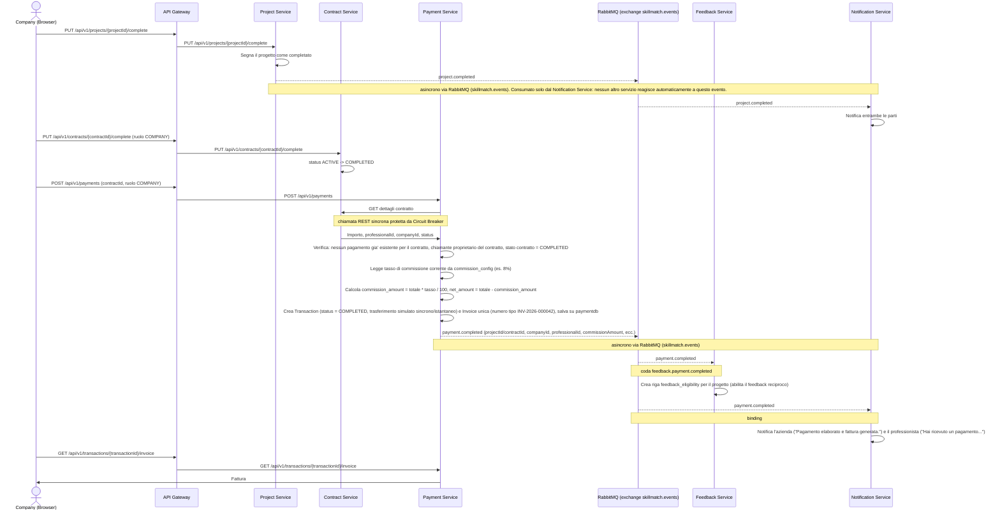

# Flusso di pagamento e fatturazione

Questo diagramma descrive il pagamento di un contratto completato: la verifica sincrona dei dati del contratto tramite Circuit Breaker, il calcolo di commissione e importo netto, la generazione della fattura unica e gli eventi asincroni che abilitano il feedback reciproco e le notifiche. Precondizione: il contratto e' gia' `ACTIVE`, cioe' entrambe le parti lo hanno firmato.

