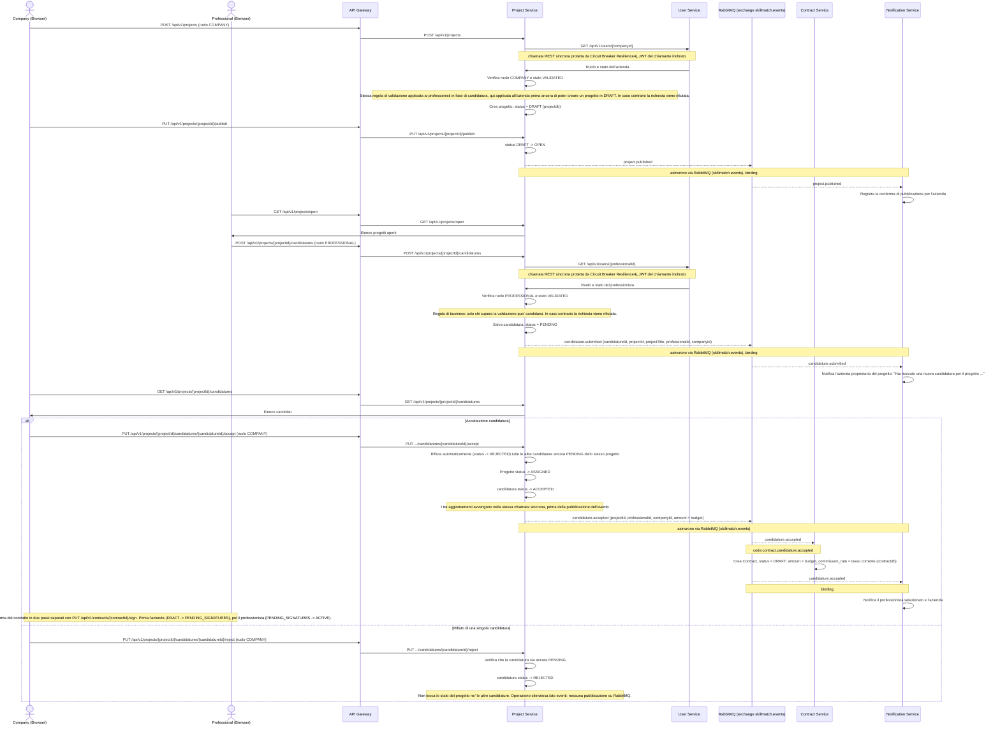

# Flusso di pubblicazione progetto, candidatura e contratto

Questo diagramma copre la pubblicazione di un progetto da parte di un'azienda, la candidatura di un professionista validato, l'accettazione della candidatura e la creazione automatica del micro-contratto. Include la chiamata REST sincrona protetta da Circuit Breaker verso lo User Service e gli eventi asincroni pubblicati sull'exchange `skillmatch.events`. Copre anche l'evento di notifica generato all'invio della candidatura, il rifiuto automatico delle candidature concorrenti in caso di accettazione, e il flusso alternativo di rifiuto di una singola candidatura.

