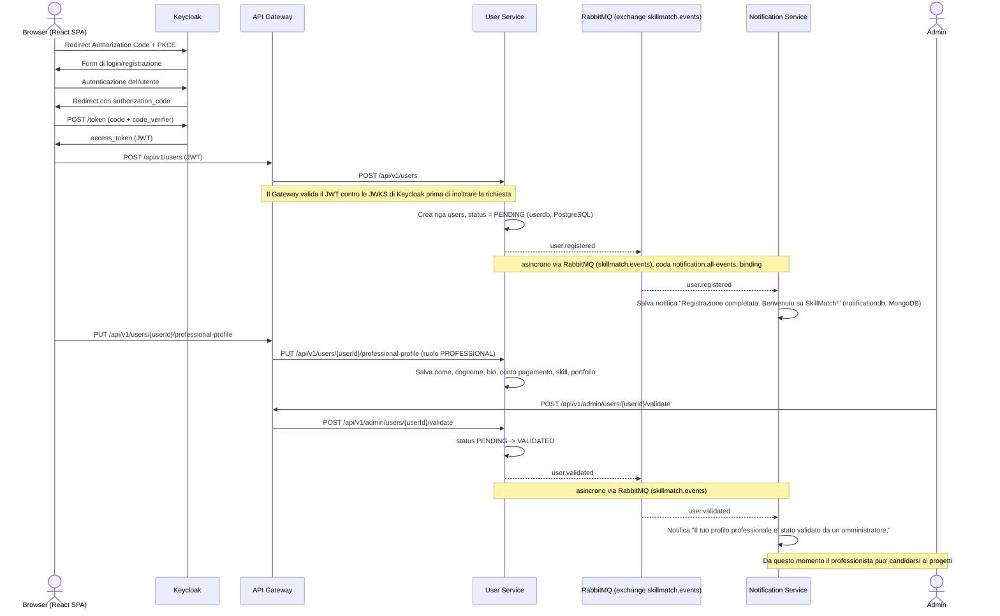

# Flusso di registrazione professionista e validazione

Questo diagramma descrive il percorso completo di un professionista dalla registrazione tramite Keycloak fino alla validazione da parte di un amministratore, passando per la creazione del record applicativo nello User Service e le notifiche asincrone generate sull'exchange RabbitMQ `skillmatch.events`.

