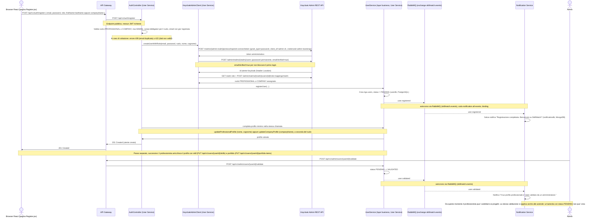

# Flusso di registrazione self-service e validazione

Questo diagramma descrive il percorso completo di registrazione di un nuovo utente (professionista o azienda) tramite l'endpoint applicativo self-service `POST /api/v1/auth/register`, fino alla validazione del professionista da parte di un amministratore.

Il vecchio flusso, in cui il Browser veniva reindirizzato alla UI di Keycloak per la registrazione e completava poi il profilo in una chiamata separata, non e' piu' quello primario: e' stato sostituito da questo endpoint applicativo, che orchestra in un'unica chiamata la creazione dell'utente su Keycloak, l'assegnazione del ruolo e la creazione del record applicativo nello User Service. Keycloak resta usato, invariato, SOLO per il login post-registrazione (Authorization Code + PKCE), non piu' per la registrazione stessa. Le motivazioni di questa scelta sono documentate in [ADR-007-self-service-registration](../adr/ADR-007-self-service-registration.md).

