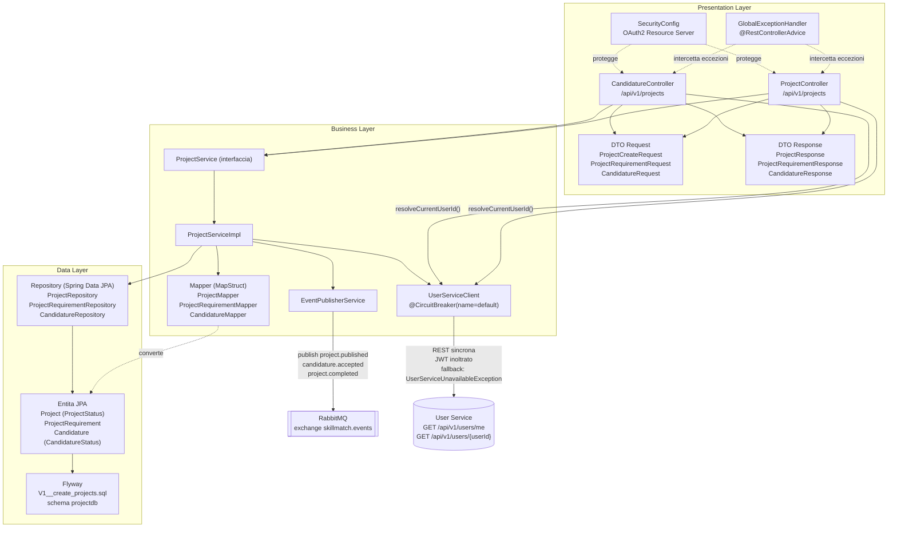

# Architettura a 3 Livelli: Project Service

Questo documento descrive la struttura interna del Project Service secondo il pattern architetturale 3-Tier (Presentation, Business, Data), coerente con la struttura adottata da tutti i microservizi di SkillMatch. Il Project Service gestisce il ciclo di vita dei progetti pubblicati dalle aziende e delle candidature dei professionisti, comunicando in modo sincrono con lo User Service e in modo asincrono con RabbitMQ.

## Diagramma dei Livelli

## Presentation Layer

Responsabilita: esporre l'API REST del Project Service, validare l'input, applicare i controlli di ruolo e risolvere l'identita dell'azienda o del professionista chiamante prima di invocare la logica di business.

- `ProjectController` espone `/api/v1/projects`: `POST /` (ruolo COMPANY, crea il progetto in stato `DRAFT`), `PUT /{projectId}/publish` (ruolo COMPANY, transizione DRAFT verso OPEN), `GET /{projectId}`, `GET /open`, `GET /mine` (ruolo COMPANY) e `PUT /{projectId}/complete` (ruolo COMPANY). L'id dell'azienda chiamante viene risolto qui, tramite `userServiceClient.resolveCurrentUserId()`, con chiamata sincrona a `GET /api/v1/users/me` sullo User Service e inoltro del JWT.
- `CandidatureController` espone `/api/v1/projects`: `POST /{projectId}/candidatures` (ruolo PROFESSIONAL), `GET /candidatures/mine` (ruolo PROFESSIONAL), `GET /{projectId}/candidatures` (ruolo COMPANY), `PUT /{projectId}/candidatures/{candidatureId}/accept` (ruolo COMPANY). Anche in questo controller l'id del chiamante e risolto in Presentation Layer tramite `UserServiceClient.resolveCurrentUserId()`.
- I DTO di richiesta (`ProjectCreateRequest`, `ProjectRequirementRequest`, `CandidatureRequest`) applicano il **DTO Pattern**, disaccoppiando il contratto REST dal modello persistente e abilitando la validazione con `@Valid`.
- `GlobalExceptionHandler` centralizza la gestione di `ProjectNotFoundException`, `CandidatureNotFoundException`, `InvalidProjectOperationException` e `UserServiceUnavailableException`, applicando il pattern **Controller Advice**.
- `SecurityConfig` configura il servizio come OAuth2 Resource Server con validazione JWT, coerente con il pattern **Externalized Configuration**.

## Business Layer

Responsabilita: applicare le regole di dominio sul ciclo di vita del progetto e delle candidature, orchestrare la comunicazione sincrona con lo User Service in modo resiliente e pubblicare gli eventi di dominio verso gli altri microservizi.

- L'interfaccia `ProjectService` e la sua implementazione `ProjectServiceImpl` applicano il **Service Layer Pattern**: creazione, pubblicazione e completamento del progetto, logica di candidatura (`applyToProject`, che verifica in modo sincrono che il professionista sia PROFESSIONAL e VALIDATED) e accettazione della candidatura.
- `EventPublisherService` implementa il lato Publisher del pattern **Pub/Sub (Observer distribuito)**: pubblica `project.published`, `candidature.accepted` e `project.completed` sull'exchange topic `skillmatch.events`, disaccoppiando il Project Service dai consumatori (Contract Service, Notification Service).
- `UserServiceClient` implementa la comunicazione REST sincrona verso lo User Service (`GET /api/v1/users/{userId}`, `GET /api/v1/users/me`), inoltrando il token JWT del chiamante invece di usare un client machine-to-machine separato. E annotato `@CircuitBreaker(name="default", fallbackMethod=...)` (Resilience4j), applicando il pattern **Circuit Breaker**: quando lo User Service non risponde, il metodo di fallback lancia `UserServiceUnavailableException` invece di propagare timeout a cascata.
- I Mapper generati con MapStruct (`ProjectMapper`, `ProjectRequirementMapper`, `CandidatureMapper`) applicano il pattern **Adapter/Mapper** per non esporre mai le entita JPA nelle risposte REST.

## Data Layer

Responsabilita: persistere lo stato dei progetti e delle candidature e fornire un'astrazione di accesso ai dati indipendente dal motore di persistenza sottostante.

- Le entita JPA `Project` (enum `ProjectStatus`: DRAFT, OPEN, ASSIGNED, IN_PROGRESS, COMPLETED, CLOSED), `ProjectRequirement` e `Candidature` (enum `CandidatureStatus`: PENDING, ACCEPTED, REJECTED, WITHDRAWN) rappresentano il modello di dominio persistente. L'enum locale `ReputationLevel`, duplicato rispetto allo User Service, e usato solo per leggere il campo `min_reputation_level` dei requisiti: ogni servizio mantiene il proprio modello, in linea con il pattern **Database per Service**.
- I repository Spring Data JPA (`ProjectRepository`, `ProjectRequirementRepository`, `CandidatureRepository`) applicano il **Repository Pattern**.
- Le migrazioni Flyway in `db/migration/V1__create_projects.sql` gestiscono l'evoluzione dello schema `projectdb` su PostgreSQL.

## Design Pattern per Layer

| Pattern | Layer | Dove (classe/file) |
|---|---|---|
| DTO Pattern | Presentation | `ProjectCreateRequest`, `ProjectRequirementRequest`, `CandidatureRequest`, `ProjectResponse`, `ProjectRequirementResponse`, `CandidatureResponse` |
| Controller Advice (gestione centralizzata errori) | Presentation | `GlobalExceptionHandler` |
| Repository Pattern | Data | `ProjectRepository`, `ProjectRequirementRepository`, `CandidatureRepository` |
| Mapper/Adapter Pattern | Business | `ProjectMapper`, `ProjectRequirementMapper`, `CandidatureMapper` (MapStruct) |
| Service Layer Pattern | Business | `ProjectService` / `ProjectServiceImpl` |
| Circuit Breaker | Business | `UserServiceClient` (Resilience4j, chiamate REST verso User Service) |
| Pub/Sub Observer | Business | `EventPublisherService` (publish `project.published`, `candidature.accepted`, `project.completed`) |
| Dependency Injection | Trasversale | Costruttori `@RequiredArgsConstructor` (Lombok) in controller, service e client |
| Database per Service | Data | Schema `projectdb` dedicato, migrazioni in `db/migration/V1__create_projects.sql` |
