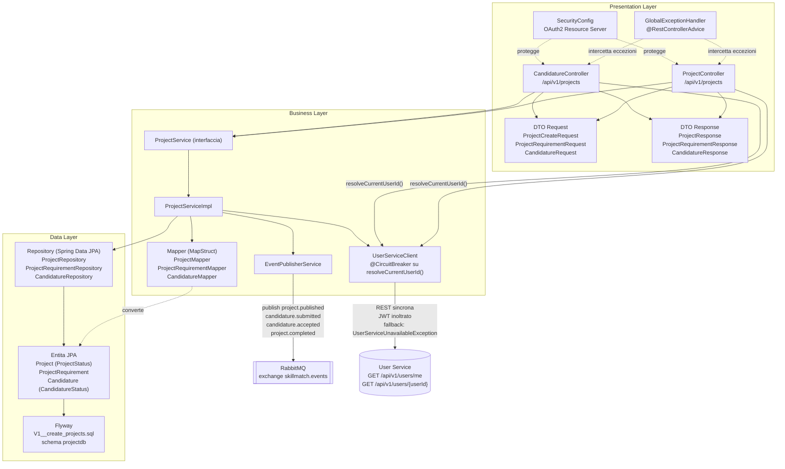

# Architettura a 3 Livelli: Project Service

Questo documento descrive la struttura interna del Project Service secondo il pattern architetturale 3-Tier (Presentation, Business, Data), coerente con la struttura adottata da tutti i microservizi di SkillMatch. Il Project Service gestisce il ciclo di vita dei progetti pubblicati dalle aziende e delle candidature dei professionisti, comunicando in modo sincrono con lo User Service e in modo asincrono con RabbitMQ.

## Diagramma dei Livelli

## Presentation Layer

Responsabilita: esporre l'API REST del Project Service, validare l'input, applicare i controlli di ruolo e risolvere l'identita dell'azienda o del professionista chiamante prima di invocare la logica di business.

- `ProjectController` espone `/api/v1/projects`: `POST /` (ruolo COMPANY, crea il progetto in stato `DRAFT`), `PUT /{projectId}/publish` (ruolo COMPANY, transizione DRAFT verso OPEN), `GET /{projectId}`, `GET /open`, `GET /mine` (ruolo COMPANY) e `PUT /{projectId}/complete` (ruolo COMPANY). L'id dell'azienda chiamante viene risolto qui, tramite `userServiceClient.resolveCurrentUserId()`, con chiamata sincrona a `GET /api/v1/users/me` sullo User Service e inoltro del JWT.
- `CandidatureController` espone `/api/v1/projects`: `POST /{projectId}/candidatures` (ruolo PROFESSIONAL), `GET /candidatures/mine` (ruolo PROFESSIONAL), `GET /{projectId}/candidatures` (ruolo COMPANY), `PUT /{projectId}/candidatures/{candidatureId}/accept` (ruolo COMPANY) e, di aggiunta recente, `PUT /{projectId}/candidatures/{candidatureId}/reject` (ruolo COMPANY): rifiuta una singola candidatura in stato PENDING senza toccare lo stato del progetto ne le altre candidature, e non pubblica alcun evento. Anche in questo controller l'id del chiamante e risolto in Presentation Layer tramite `UserServiceClient.resolveCurrentUserId()`.
- I DTO di richiesta (`ProjectCreateRequest`, `ProjectRequirementRequest`, `CandidatureRequest`) applicano il **DTO Pattern**, disaccoppiando il contratto REST dal modello persistente e abilitando la validazione con `@Valid`.
- `GlobalExceptionHandler` centralizza la gestione di `ProjectNotFoundException`, `CandidatureNotFoundException`, `InvalidProjectOperationException` e `UserServiceUnavailableException`, applicando il pattern **Controller Advice**.
- `SecurityConfig` configura il servizio come OAuth2 Resource Server con validazione JWT, coerente con il pattern **Externalized Configuration**.

## Business Layer

Responsabilita: applicare le regole di dominio sul ciclo di vita del progetto e delle candidature, orchestrare la comunicazione sincrona con lo User Service in modo resiliente e pubblicare gli eventi di dominio verso gli altri microservizi.

- L'interfaccia `ProjectService` e la sua implementazione `ProjectServiceImpl` applicano il **Service Layer Pattern**: creazione, pubblicazione e completamento del progetto, logica di candidatura (`applyToProject`, che verifica in modo sincrono che il professionista sia PROFESSIONAL e VALIDATED, e che pubblica il nuovo evento `candidature.submitted`) e accettazione della candidatura. Di aggiunta recente, anche `createProject` verifica in modo sincrono (stessa chiamata a `UserServiceClient.getUserStatus`) che il chiamante sia una COMPANY con stato VALIDATED, prima di creare il progetto in `DRAFT`: la regola di validazione admin, prima riservata ai soli professionisti, ora vale anche per le aziende. Di aggiunta recente, `acceptCandidature(...)` non si limita piu a salvare la candidatura ACCEPTED e pubblicare `candidature.accepted`: rifiuta automaticamente, tramite il metodo privato `rejectRemainingPendingCandidatures`, tutte le altre candidature ancora PENDING sullo stesso progetto, e porta esplicitamente il progetto allo stato ASSIGNED (in precedenza questo passaggio avveniva altrove o non era esplicito nel codice). E stato inoltre aggiunto il metodo `rejectCandidature(...)`: verifica che il progetto appartenga alla company chiamante, che la candidatura appartenga al progetto e sia PENDING, quindi la porta a REJECTED, senza pubblicare eventi.
- `EventPublisherService` implementa il lato Publisher del pattern **Pub/Sub (Observer distribuito)**: pubblica `project.published`, `project.completed`, `candidature.accepted` e, di aggiunta recente, `candidature.submitted` (routing key `candidature.submitted`, pubblicato da `applyToProject` con payload candidatureId, projectId, projectTitle, professionalId, companyId) sull'exchange topic `skillmatch.events`, disaccoppiando il Project Service dai consumatori (Contract Service, Notification Service).
- `UserServiceClient` implementa la comunicazione REST sincrona verso lo User Service (`GET /api/v1/users/{userId}`, `GET /api/v1/users/me`), inoltrando il token JWT del chiamante invece di usare un client machine-to-machine separato. Il metodo pubblico `resolveCurrentUserId()` e annotato `@CircuitBreaker(name="default", fallbackMethod=...)` (Resilience4j), applicando il pattern **Circuit Breaker**: quando lo User Service non risponde, il metodo di fallback lancia `UserServiceUnavailableException` invece di propagare timeout a cascata.
  - **Nota tecnica sul bug corretto**: l'annotazione `@CircuitBreaker` deve stare direttamente sul metodo pubblico invocato dall'esterno della classe (qui `resolveCurrentUserId()`), mai su un metodo che ne delega poi la logica a un metodo privato annotato. Spring AOP realizza il Circuit Breaker con un proxy che intercetta solo le chiamate provenienti dall'esterno dell'istanza: una self-invocation, cioe un metodo che ne chiama un altro sulla stessa istanza, bypassa il proxy silenziosamente, e con esso l'intera logica di circuit breaker e fallback, senza generare alcun errore visibile. Il codice sembra funzionare normalmente, ma il fallback non scatta mai in caso di guasto a valle. Questo bug era presente in `UserServiceClient` (e in client analoghi di altri servizi) ed e stato corretto spostando l'annotazione sul metodo pubblico.
- I Mapper generati con MapStruct (`ProjectMapper`, `ProjectRequirementMapper`, `CandidatureMapper`) applicano il pattern **Adapter/Mapper** per non esporre mai le entita JPA nelle risposte REST.

## Data Layer

Responsabilita: persistere lo stato dei progetti e delle candidature e fornire un'astrazione di accesso ai dati indipendente dal motore di persistenza sottostante.

- Le entita JPA `Project` (enum `ProjectStatus`: DRAFT, OPEN, ASSIGNED, IN_PROGRESS, COMPLETED, CLOSED), `ProjectRequirement` e `Candidature` (enum `CandidatureStatus`: PENDING, ACCEPTED, REJECTED, WITHDRAWN) rappresentano il modello di dominio persistente. La colonna `min_reputation_level` su `ProjectRequirement`, insieme all'enum locale `ReputationLevel` che la leggeva, e stata rimossa (`V2__drop_min_reputation_level.sql`): veniva raccolta alla creazione del progetto ma non era mai stata applicata ne in fase di candidatura ne mostrata ai professionisti, un campo rimosso perche implicava una garanzia che la piattaforma non offriva davvero.
- I repository Spring Data JPA (`ProjectRepository`, `ProjectRequirementRepository`, `CandidatureRepository`) applicano il **Repository Pattern**.
- Le migrazioni Flyway in `db/migration/V1__create_projects.sql` gestiscono l'evoluzione dello schema `projectdb` su PostgreSQL.

## Design Pattern per Layer

| Pattern | Layer | Dove (classe/file) |
|---|---|---|
| DTO Pattern | Presentation | `ProjectCreateRequest`, `ProjectRequirementRequest`, `CandidatureRequest`, `ProjectResponse`, `ProjectRequirementResponse`, `CandidatureResponse` |
| Controller Advice (gestione centralizzata errori) | Presentation | `GlobalExceptionHandler` |
| Repository Pattern | Data | `ProjectRepository`, `ProjectRequirementRepository`, `CandidatureRepository` |
| Mapper/Adapter Pattern | Business | `ProjectMapper`, `ProjectRequirementMapper`, `CandidatureMapper` (MapStruct) |
| Service Layer Pattern | Business | `ProjectService` / `ProjectServiceImpl` |
| Circuit Breaker | Business | `UserServiceClient` (Resilience4j, annotazione su `resolveCurrentUserId()`, metodo pubblico; mai su un metodo privato delegato, per evitare che la self-invocation bypassi il proxy AOP e disattivi silenziosamente fallback e circuit breaker) |
| Pub/Sub Observer | Business | `EventPublisherService` (publish `project.published`, `candidature.submitted`, `candidature.accepted`, `project.completed`) |
| Dependency Injection | Trasversale | Costruttori `@RequiredArgsConstructor` (Lombok) in controller, service e client |
| Database per Service | Data | Schema `projectdb` dedicato, migrazioni in `db/migration/V1__create_projects.sql` |

## Metriche di Qualita'

Anche il `pom.xml` del Project Service configura, come lo User Service, due plugin Maven eseguiti in fase `verify`, per rispondere al requisito della traccia d'esame di riportare metriche come complessita' e copertura dei test sui servizi core:

- **JaCoCo** (`jacoco-maven-plugin`): gate di build con copertura minima del 90% sulle linee, a livello BUNDLE (`LINE COVEREDRATIO >= 0.90`), con le stesse esclusioni dello User Service (classi `*Application` e implementazioni generate da MapStruct, `*MapperImpl`). Se la copertura scende sotto il 90%, la build fallisce in fase `verify`.
- **PMD** (`maven-pmd-plugin`), con lo stesso ruleset custom (`pmd-ruleset.xml`) che applica la regola `CyclomaticComplexity`, soglia 10 per metodo e 80 per classe: se un metodo la supera, la build fallisce.

Nota: questi due gate sono presenti solo su Project Service e User Service, i due servizi scelti come core per questa Service Architecture, non sugli altri cinque microservizi.
