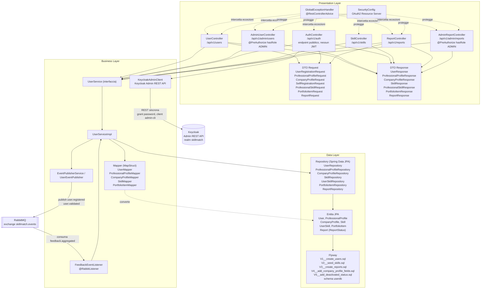

# Architettura a 3 Livelli: User Service

Questo documento descrive la struttura interna dello User Service secondo il pattern architetturale 3-Tier (Presentation, Business, Data), coerente con la struttura adottata da tutti i microservizi di SkillMatch. Lo User Service gestisce la registrazione degli utenti (professionisti e aziende), i relativi profili, la validazione da parte dell'admin e il calcolo della reputazione dei professionisti.

## Diagramma dei Livelli

## Presentation Layer

Responsabilita: esporre l'API REST pubblica dello User Service, validare l'input, autenticare/autorizzare le richieste tramite JWT e tradurre gli errori di dominio in risposte HTTP corrette.

- `UserController` espone `/api/v1/users` per la registrazione (`POST /`), la lettura di un utente (`GET /{userId}`), la risoluzione dell'utente autenticato dal token (`GET /me`), l'aggiornamento dei profili professionale e azienda (`PUT /{userId}/professional-profile`, `PUT /{userId}/company-profile`, protetti dai ruoli PROFESSIONAL e COMPANY), la ricerca dei professionisti (`GET /professionals/search`) e, di aggiunta recente, la gestione delle skill e del portfolio di un professionista (`PUT /{userId}/skills`, `PUT /{userId}/portfolio-items`, ruolo PROFESSIONAL) e la lettura del profilo dedicato per ruolo (`GET /{userId}/professional-profile`, ruolo PROFESSIONAL o, di aggiunta recente, COMPANY, per permettere a un'azienda di consultare nome e reputazione di un candidato; `GET /{userId}/company-profile`, ruolo COMPANY).
- `AdminUserController` espone `/api/v1/admin/users`, con l'intera classe annotata `@PreAuthorize("hasRole('ADMIN')")`: elenco utenti (esclusi gli account `DEACTIVATED`), dettaglio profilo professionale, dettaglio profilo azienda (`GET /{userId}/company-profile`, di aggiunta recente, per esaminare una registrazione azienda in attesa), validazione, sospensione, la lista delle segnalazioni a carico di un utente (`GET /{userId}/reports`) e, di aggiunta più recente, la disattivazione permanente (`POST /{userId}/deactivate`): a differenza della sospensione, irreversibile e disabilita anche l'identità Keycloak, tramite il nuovo metodo `KeycloakAdminClient.disableUser(keycloakId)`.
- Anche `UserController` espone ora `GET /{userId}/reports` (ruoli PROFESSIONAL o COMPANY), non riservato all'admin: chiunque abbia uno di questi due ruoli può consultare le segnalazioni presentate contro un dato utente, senza alcun vincolo di aver avuto una relazione contrattuale con lui.
- `AuthController` espone `/api/v1/auth` con un unico endpoint pubblico, `POST /register`, raggiungibile senza JWT: e il punto di ingresso della registrazione self-service (vedi `docs/adr/ADR-007-self-service-registration.md`). Valida che il ruolo richiesto non sia mai ADMIN e che siano presenti i campi obbligatori per il ruolo scelto, quindi orchestra in un'unica chiamata la creazione dell'utente su Keycloak, la creazione dell'utente sullo User Service e la creazione di un profilo minimo (professionale o azienda).
- `SkillController` espone `/api/v1/skills` con `GET /`, che accetta un parametro `search` e restituisce al massimo 20 risultati dal catalogo skill condiviso, con ricerca case-insensitive sul nome.
- `ReportController` espone `/api/v1/reports` con `POST /`, riservato ai ruoli PROFESSIONAL e COMPANY, per presentare una segnalazione contro la controparte di una collaborazione.
- `AdminReportController` espone `/api/v1/admin/reports`, con l'intera classe annotata `@PreAuthorize("hasRole('ADMIN')")`: `POST /{reportId}/close` chiude una segnalazione aperta.
- I DTO di richiesta (`UserRegistrationRequest`, `ProfessionalProfileRequest`, `CompanyProfileRequest`, e di aggiunta recente `SelfRegistrationRequest`, `ProfessionalSkillRequest`, `PortfolioItemRequest`, `ReportRequest`) sono annotati con Jakarta Bean Validation e ricevuti con `@Valid`: questo e il **DTO Pattern**, che disaccoppia il contratto REST dal modello di dominio interno. Sul lato risposta si aggiungono `ProfessionalSkillResponse`, `PortfolioItemResponse` e `ReportResponse`.
- `GlobalExceptionHandler` applica il pattern **Chain of Responsibility / Controller Advice** di Spring per centralizzare la gestione degli errori (`UserNotFoundException`, `DuplicateEmailException`, `InvalidUserOperationException` e, di aggiunta recente, `KeycloakAdminException`, `ReportNotFoundException`), evitando duplicazione di logica try/catch nei controller.
- `SecurityConfig` configura il servizio come OAuth2 Resource Server, valida i JWT emessi da Keycloak e mappa i ruoli del realm su authority Spring (`ROLE_*`), applicando il pattern **Externalized Configuration** (12-Factor) per i parametri dell'issuer.

## Business Layer

Responsabilita: implementare le regole di dominio (registrazione, validazione, calcolo reputazione), orchestrare l'accesso ai dati e comunicare in modo asincrono con gli altri microservizi tramite eventi.

- L'interfaccia `UserService` con la relativa implementazione `UserServiceImpl` applica il **Strategy/Service Layer Pattern**: la logica di business (registrazione, validazione/sospensione admin, aggiornamento profili, `calculateReputationLevel` per la regola Junior/Affidabile/Top Performer, `updateReputation(...)` e, di aggiunta recente, `emailExists(email)`, `updateSkills(...)`, `updatePortfolioItems(...)`, `createReport(reporterKeycloakId, request)`, `closeReport(reportId)`, `listReportsForUser(userId)`) e isolata dietro un'interfaccia, permettendo di sostituire l'implementazione senza toccare i controller.
- `EventPublisherService` / `UserEventPublisher` implementano il lato Publisher del pattern **Pub/Sub (Observer distribuito)**: pubblicano gli eventi `user.registered` e `user.validated` sull'exchange topic `skillmatch.events` di RabbitMQ, disaccoppiando lo User Service dai consumatori (es. Notification Service).
- `FeedbackEventListener` implementa il lato Subscriber dello stesso pattern: tramite `@RabbitListener` sulla coda `user-service.feedback.aggregated` consuma l'evento `feedback.aggregated` e invoca `userService.updateReputation(...)`, chiudendo il ciclo di calcolo della reputazione in modo asincrono.
- `KeycloakAdminClient` (package `client`), di aggiunta recente, comunica con la Admin REST API di Keycloak per creare l'utente e assegnargli i ruoli del realm durante la registrazione self-service, autenticandosi con grant `password` come admin bootstrap del realm sul client `admin-cli`. A differenza di `UserServiceClient` del Project Service (che chiama un altro microservizio applicativo), qui il client REST parla con un sistema esterno di infrastruttura, Keycloak, non con un'altra applicazione SkillMatch. Espone anche `disableUser(keycloakId)`, di aggiunta più recente (`PUT /admin/realms/{realm}/users/{id}` con `enabled: false`), usato dalla disattivazione permanente. In caso di errore lancia `KeycloakAdminException`.
- I Mapper generati con MapStruct (`UserMapper`, `ProfessionalProfileMapper`, `CompanyProfileMapper`, `SkillMapper`, esteso, e il nuovo `PortfolioItemMapper`) applicano il pattern **Adapter/Mapper**, garantendo che le entita JPA non vengano mai esposte direttamente nelle risposte REST.

## Data Layer

Responsabilita: persistere lo stato del dominio utente e fornire un'astrazione di accesso ai dati indipendente dal motore di persistenza sottostante.

- Le entita JPA (`User` con gli enum `UserRole` e `UserStatus`, `ProfessionalProfile` con l'enum `ReputationLevel`, `CompanyProfile`, `Skill`, `UserSkill` con chiave composta `UserSkillId`, `PortfolioItem` e, di aggiunta recente, `Report` con l'enum `ReportStatus`: OPEN/CLOSED) rappresentano il modello di dominio persistente.
- I repository Spring Data JPA (`UserRepository`, `ProfessionalProfileRepository`, `CompanyProfileRepository`, `SkillRepository`, `UserSkillRepository`, `PortfolioItemRepository` e, di aggiunta recente, `ReportRepository`) applicano il **Repository Pattern**, incapsulando le query dietro interfacce dichiarative. `SkillRepository` e stato esteso con `findTop20ByNameContainingIgnoreCaseOrderByNameAsc`, usata da `SkillController` per la ricerca nel catalogo.
- Le migrazioni Flyway in `db/migration/V1__create_users.sql` gestiscono l'evoluzione dello schema `userdb` su PostgreSQL, coerente con il pattern **Database per Service**: lo schema e di esclusiva proprieta dello User Service. Di aggiunta recente: `V2__seed_skills.sql` popola circa 35 skill di partenza raggruppate per categoria nel catalogo condiviso; `V3__create_reports.sql` crea la tabella `reports`, con foreign key verso `users` sia per `reporter_id` sia per `reported_user_id`, e un indice su `reported_user_id` per velocizzare la lista segnalazioni per utente; `V4__add_company_profile_fields.sql` aggiunge `description` e `payment_account` a `company_profiles`; `V5__add_deactivated_status.sql` estende il CHECK su `users.status` con il valore `DEACTIVATED`. Le eccezioni di dominio `KeycloakAdminException` e `ReportNotFoundException` completano il quadro delle nuove funzionalita.

## Design Pattern per Layer

| Pattern | Layer | Dove (classe/file) |
|---|---|---|
| DTO Pattern | Presentation | `UserRegistrationRequest`, `ProfessionalProfileRequest`, `CompanyProfileRequest`, `SelfRegistrationRequest`, `ProfessionalSkillRequest`, `PortfolioItemRequest`, `ReportRequest`, `UserResponse`, `ProfessionalProfileResponse`, `CompanyProfileResponse`, `SkillResponse`, `ProfessionalSkillResponse`, `PortfolioItemResponse`, `ReportResponse` |
| Controller Advice (gestione centralizzata errori) | Presentation | `GlobalExceptionHandler` |
| Repository Pattern | Data | `UserRepository`, `ProfessionalProfileRepository`, `CompanyProfileRepository`, `SkillRepository`, `UserSkillRepository`, `PortfolioItemRepository`, `ReportRepository` |
| Mapper/Adapter Pattern | Business | `UserMapper`, `ProfessionalProfileMapper`, `CompanyProfileMapper`, `SkillMapper`, `PortfolioItemMapper` (MapStruct) |
| Service Layer Pattern | Business | `UserService` / `UserServiceImpl` |
| Pub/Sub Observer | Business | `EventPublisherService` / `UserEventPublisher` (publisher), `FeedbackEventListener` (subscriber) |
| Client Pattern (REST verso sistema esterno) | Business | `KeycloakAdminClient` (Admin REST API di Keycloak, non un altro microservizio applicativo) |
| Dependency Injection | Trasversale | Costruttori `@RequiredArgsConstructor` (Lombok) in controller, service e mapper |
| Database per Service | Data | Schema `userdb` dedicato, migrazioni in `db/migration/V1__create_users.sql`, `V2__seed_skills.sql`, `V3__create_reports.sql`, `V4__add_company_profile_fields.sql`, `V5__add_deactivated_status.sql` |

## Metriche di Qualita'

Il `pom.xml` dello User Service configura due plugin Maven eseguiti in fase `verify`, per rispondere al requisito della traccia d'esame di riportare metriche come complessita' e copertura dei test sui servizi core:

- **JaCoCo** (`jacoco-maven-plugin`, versione dichiarata in `jacoco.version` nel pom radice): agisce da gate di build imponendo una copertura minima del 90% sulle linee, a livello BUNDLE (`LINE COVEREDRATIO >= 0.90`). Sono escluse dal calcolo le classi `*Application` e le implementazioni generate automaticamente da MapStruct (`*MapperImpl`), perche non contengono logica di dominio da testare. Se la copertura scende sotto il 90%, la build fallisce in fase `verify`.
- **PMD** (`maven-pmd-plugin`), configurato con un ruleset custom (`pmd-ruleset.xml`) che applica una sola regola, `CyclomaticComplexity`, con soglia 10 per metodo e 80 per classe. Se un metodo supera la complessita' ciclomatica 10, la build fallisce.

Nota: questi due gate sono presenti solo su User Service e Project Service, i due servizi scelti come core per questa Service Architecture, non sugli altri cinque microservizi.
