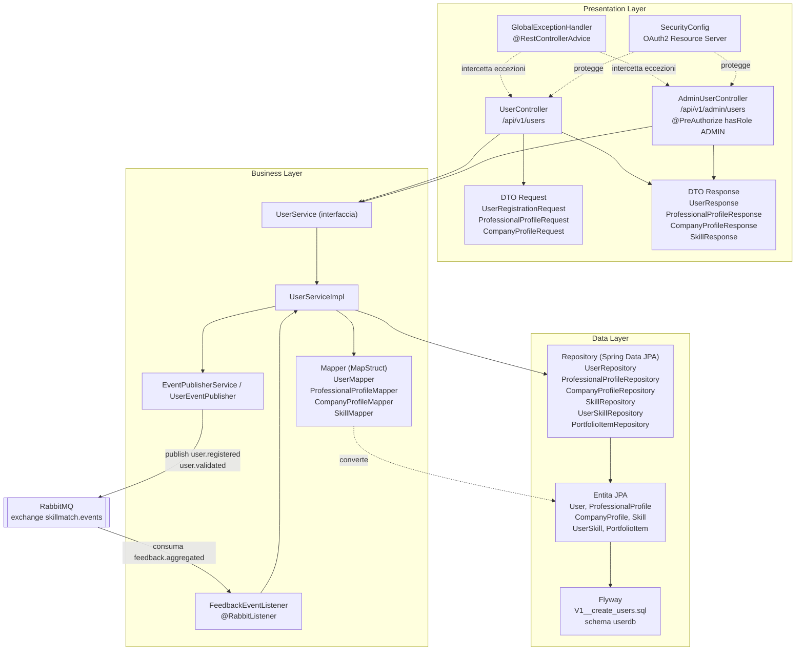

# Architettura a 3 Livelli: User Service

Questo documento descrive la struttura interna dello User Service secondo il pattern architetturale 3-Tier (Presentation, Business, Data), coerente con la struttura adottata da tutti i microservizi di SkillMatch. Lo User Service gestisce la registrazione degli utenti (professionisti e aziende), i relativi profili, la validazione da parte dell'admin e il calcolo della reputazione dei professionisti.

## Diagramma dei Livelli

## Presentation Layer

Responsabilita: esporre l'API REST pubblica dello User Service, validare l'input, autenticare/autorizzare le richieste tramite JWT e tradurre gli errori di dominio in risposte HTTP corrette.

- `UserController` espone `/api/v1/users` per la registrazione (`POST /`), la lettura di un utente (`GET /{userId}`), la risoluzione dell'utente autenticato dal token (`GET /me`), l'aggiornamento dei profili professionale e azienda (`PUT /{userId}/professional-profile`, `PUT /{userId}/company-profile`, protetti dai ruoli PROFESSIONAL e COMPANY) e la ricerca dei professionisti (`GET /professionals/search`).
- `AdminUserController` espone `/api/v1/admin/users`, con l'intera classe annotata `@PreAuthorize("hasRole('ADMIN')")`: elenco utenti, dettaglio profilo professionale, validazione e sospensione.
- I DTO di richiesta (`UserRegistrationRequest`, `ProfessionalProfileRequest`, `CompanyProfileRequest`) sono annotati con Jakarta Bean Validation e ricevuti con `@Valid`: questo e il **DTO Pattern**, che disaccoppia il contratto REST dal modello di dominio interno.
- `GlobalExceptionHandler` applica il pattern **Chain of Responsibility / Controller Advice** di Spring per centralizzare la gestione degli errori (`UserNotFoundException`, `DuplicateEmailException`, `InvalidUserOperationException`), evitando duplicazione di logica try/catch nei controller.
- `SecurityConfig` configura il servizio come OAuth2 Resource Server, valida i JWT emessi da Keycloak e mappa i ruoli del realm su authority Spring (`ROLE_*`), applicando il pattern **Externalized Configuration** (12-Factor) per i parametri dell'issuer.

## Business Layer

Responsabilita: implementare le regole di dominio (registrazione, validazione, calcolo reputazione), orchestrare l'accesso ai dati e comunicare in modo asincrono con gli altri microservizi tramite eventi.

- L'interfaccia `UserService` con la relativa implementazione `UserServiceImpl` applica il **Strategy/Service Layer Pattern**: la logica di business (registrazione, validazione/sospensione admin, aggiornamento profili, `calculateReputationLevel` per la regola Junior/Affidabile/Top Performer, `updateReputation(...)`) e isolata dietro un'interfaccia, permettendo di sostituire l'implementazione senza toccare i controller.
- `EventPublisherService` / `UserEventPublisher` implementano il lato Publisher del pattern **Pub/Sub (Observer distribuito)**: pubblicano gli eventi `user.registered` e `user.validated` sull'exchange topic `skillmatch.events` di RabbitMQ, disaccoppiando lo User Service dai consumatori (es. Notification Service).
- `FeedbackEventListener` implementa il lato Subscriber dello stesso pattern: tramite `@RabbitListener` sulla coda `user-service.feedback.aggregated` consuma l'evento `feedback.aggregated` e invoca `userService.updateReputation(...)`, chiudendo il ciclo di calcolo della reputazione in modo asincrono.
- I Mapper generati con MapStruct (`UserMapper`, `ProfessionalProfileMapper`, `CompanyProfileMapper`, `SkillMapper`) applicano il pattern **Adapter/Mapper**, garantendo che le entita JPA non vengano mai esposte direttamente nelle risposte REST.

## Data Layer

Responsabilita: persistere lo stato del dominio utente e fornire un'astrazione di accesso ai dati indipendente dal motore di persistenza sottostante.

- Le entita JPA (`User` con gli enum `UserRole` e `UserStatus`, `ProfessionalProfile` con l'enum `ReputationLevel`, `CompanyProfile`, `Skill`, `UserSkill` con chiave composta `UserSkillId`, `PortfolioItem`) rappresentano il modello di dominio persistente.
- I repository Spring Data JPA (`UserRepository`, `ProfessionalProfileRepository`, `CompanyProfileRepository`, `SkillRepository`, `UserSkillRepository`, `PortfolioItemRepository`) applicano il **Repository Pattern**, incapsulando le query dietro interfacce dichiarative.
- Le migrazioni Flyway in `db/migration/V1__create_users.sql` gestiscono l'evoluzione dello schema `userdb` su PostgreSQL, coerente con il pattern **Database per Service**: lo schema e di esclusiva proprieta dello User Service.

## Design Pattern per Layer

| Pattern | Layer | Dove (classe/file) |
|---|---|---|
| DTO Pattern | Presentation | `UserRegistrationRequest`, `ProfessionalProfileRequest`, `CompanyProfileRequest`, `UserResponse`, `ProfessionalProfileResponse`, `CompanyProfileResponse`, `SkillResponse` |
| Controller Advice (gestione centralizzata errori) | Presentation | `GlobalExceptionHandler` |
| Repository Pattern | Data | `UserRepository`, `ProfessionalProfileRepository`, `CompanyProfileRepository`, `SkillRepository`, `UserSkillRepository`, `PortfolioItemRepository` |
| Mapper/Adapter Pattern | Business | `UserMapper`, `ProfessionalProfileMapper`, `CompanyProfileMapper`, `SkillMapper` (MapStruct) |
| Service Layer Pattern | Business | `UserService` / `UserServiceImpl` |
| Pub/Sub Observer | Business | `EventPublisherService` / `UserEventPublisher` (publisher), `FeedbackEventListener` (subscriber) |
| Dependency Injection | Trasversale | Costruttori `@RequiredArgsConstructor` (Lombok) in controller, service e mapper |
| Database per Service | Data | Schema `userdb` dedicato, migrazioni in `db/migration/V1__create_users.sql` |
