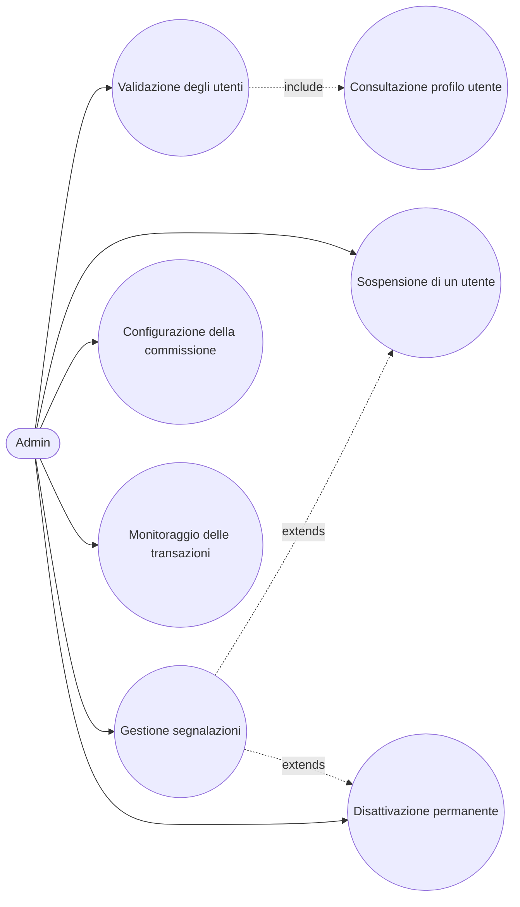

# Use Case: Admin

L'admin e lo stakeholder che supervisiona il funzionamento della piattaforma SkillMatch: valida le registrazioni di professionisti e aziende, configura la commissione trattenuta dalla piattaforma su ogni pagamento, monitora l'insieme delle transazioni per garantire correttezza e trasparenza economica e gestisce segnalazioni, sospensioni (reversibili) e disattivazioni permanenti degli utenti. Di seguito sono descritti i casi d'uso principali con i relativi endpoint REST reali esposti dai microservizi coinvolti.

## Caso d'uso 1: Validazione degli utenti

**Attore**: Admin

**Precondizioni**: L'admin e autenticato tramite Keycloak con ruolo ADMIN. Esistono utenti, professionisti o aziende, con `status=PENDING`. La regola di validazione non distingue i due ruoli: lo stesso endpoint valida entrambi.

**Flusso principale**:
1. L'admin consulta l'elenco degli utenti registrati con `GET /api/v1/admin/users`.
2. Consulta il profilo dettagliato: `GET /api/v1/admin/users/{userId}/professional-profile` per un candidato professionista (competenze, portfolio, conto di pagamento), oppure `GET /api/v1/admin/users/{userId}/company-profile` per un'azienda (ragione sociale, P.IVA, indirizzo, referente, descrizione, conto di pagamento), quest'ultimo di aggiunta più recente.
3. Valutati i dati, valida la registrazione con `POST /api/v1/admin/users/{userId}/validate`, che porta lo `status` da `PENDING` a `VALIDATED`, indipendentemente dal ruolo (`PROFESSIONAL` o `COMPANY`).
4. L'operazione pubblica l'evento `user.validated` sull'exchange `skillmatch.events`, notificando l'utente.

**Postcondizioni**: L'utente risulta `VALIDATED`. Da questo momento un professionista puo candidarsi ai progetti pubblicati dalle aziende, un'azienda puo creare e pubblicare i propri progetti.

## Caso d'uso 2: Sospensione di un utente

**Attore**: Admin

**Precondizioni**: E stata ricevuta una segnalazione o rilevata una violazione da parte di un utente registrato.

**Flusso principale**:
1. L'admin individua l'utente da sospendere tramite `GET /api/v1/admin/users`.
2. Applica la sospensione con `POST /api/v1/admin/users/{userId}/suspend`, che porta lo `status` a `SUSPENDED`.
3. L'utente sospeso non puo piu candidarsi a nuovi progetti ne pubblicarne, a seconda del proprio ruolo.

**Postcondizioni**: L'utente risulta `SUSPENDED`. E una misura reversibile: l'identita Keycloak resta abilitata, e l'admin puo ripristinare l'utente richiamando lo stesso endpoint di validazione (`POST /api/v1/admin/users/{userId}/validate`, che accetta sia `PENDING` sia `SUSPENDED` come stato di partenza), riportandolo a `VALIDATED`.

## Caso d'uso 6: Disattivazione permanente di un utente

**Attore**: Admin

**Precondizioni**: L'admin ha deciso, tipicamente in seguito a una o piu segnalazioni gravi, che l'account non deve piu poter accedere alla piattaforma in alcun modo, in via definitiva.

**Flusso principale**:
1. L'admin individua l'utente tramite `GET /api/v1/admin/users`.
2. Applica la disattivazione con `POST /api/v1/admin/users/{userId}/deactivate`.
3. Lo User Service disabilita l'identita su Keycloak stesso (`enabled: false` via Admin REST API): l'utente non potra piu autenticarsi, nemmeno con credenziali corrette.
4. Lo `status` dell'utente passa a `DEACTIVATED`.

**Postcondizioni**: L'utente risulta `DEACTIVATED`, in modo permanente: a differenza della sospensione, non esiste un endpoint per tornare indietro. La riga utente resta nel database dello User Service, cosi che contratti, pagamenti e feedback gia collegati a quell'id restano consultabili dagli admin. L'utente disattivato non compare piu nell'elenco `GET /api/v1/admin/users`.

## Caso d'uso 3: Configurazione della commissione

**Attore**: Admin

**Precondizioni**: L'admin e autenticato con ruolo ADMIN.

**Flusso principale**:
1. L'admin consulta la commissione attualmente in vigore con `GET /api/v1/admin/commission-config` (default 8%, memorizzata nella tabella `commission_config`).
2. Decide di modificare il tasso e invia la nuova configurazione con `PUT /api/v1/admin/commission-config`.
3. Il Payment Service inserisce una nuova riga nella tabella `commission_config`, con `rate_percentage`, `effective_from` e `set_by_admin_id`.
4. Da questo momento tutte le nuove transazioni calcolano la commissione utilizzando il tasso piu recente, mentre le transazioni gia concluse mantengono il tasso applicato al momento del pagamento.

**Postcondizioni**: Il nuovo tasso di commissione e attivo e verra applicato a tutti i pagamenti futuri.

## Caso d'uso 4: Monitoraggio delle transazioni

**Attore**: Admin

**Precondizioni**: L'admin e autenticato con ruolo ADMIN. Esistono transazioni registrate sulla piattaforma.

**Flusso principale**:
1. L'admin consulta l'elenco completo delle transazioni con `GET /api/v1/transactions/admin/all` (risposta paginata), opzionalmente filtrando per `status`, e per intervallo temporale con i query param `from` e `to`.
2. Analizza per ciascuna transazione l'importo lordo, la commissione trattenuta e l'importo netto corrisposto al professionista.
3. Per una visione aggregata senza dover scorrere l'elenco analitico, consulta `GET /api/v1/transactions/admin/summary` (con gli stessi filtri opzionali `status`, `from`, `to`), che restituisce il volume totale, la commissione totale trattenuta, l'importo netto totale versato ai professionisti e il numero di transazioni nel periodo filtrato.
4. Utilizza i dati aggregati per monitorare i guadagni della piattaforma e individuare eventuali anomalie.

**Postcondizioni**: L'admin ha una visione completa e aggiornata di tutte le transazioni economiche avvenute sulla piattaforma, sia in dettaglio sia in forma aggregata.

## Caso d'uso 5: Gestione segnalazioni

**Attore**: Admin

**Precondizioni**: L'admin e autenticato con ruolo ADMIN. Esistono una o piu segnalazioni inviate da professionisti o aziende tramite `POST /api/v1/reports`.

**Flusso principale**:
1. L'admin consulta le segnalazioni ricevute su un utente specifico con `GET /api/v1/admin/users/{userId}/reports`.
2. Valuta il motivo della segnalazione e, se necessario, decide un'azione separata sull'utente segnalato: una sospensione reversibile (`POST /api/v1/admin/users/{userId}/suspend`) o, per i casi piu gravi, una disattivazione permanente (`POST /api/v1/admin/users/{userId}/deactivate`, vedi caso d'uso "Disattivazione permanente di un utente").
3. Conclusa la revisione, chiude la segnalazione con `POST /api/v1/admin/reports/{reportId}/close`. Si tratta di una pura operazione di bookkeeping: chiudere una segnalazione non sospende automaticamente nessun utente.

**Postcondizioni**: La segnalazione risulta chiusa e tracciata. L'eventuale sospensione o disattivazione dell'utente segnalato, se decisa dall'admin, resta un'azione indipendente e separata.
