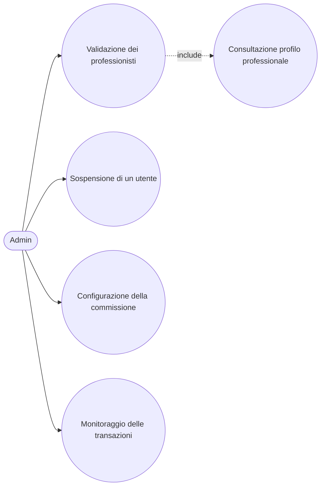

# Use Case: Admin

L'admin e lo stakeholder che supervisiona il funzionamento della piattaforma SkillMatch: valida le registrazioni dei professionisti, configura la commissione trattenuta dalla piattaforma su ogni pagamento e monitora l'insieme delle transazioni per garantire correttezza e trasparenza economica. Di seguito sono descritti i casi d'uso principali con i relativi endpoint REST reali esposti dai microservizi coinvolti.

## Caso d'uso 1: Validazione dei professionisti

**Attore**: Admin

**Precondizioni**: L'admin e autenticato tramite Keycloak con ruolo ADMIN. Esistono utenti professionisti con `status=PENDING`.

**Flusso principale**:
1. L'admin consulta l'elenco degli utenti registrati con `GET /api/v1/admin/users`.
2. Per un candidato specifico, consulta il profilo professionale dettagliato con `GET /api/v1/admin/users/{userId}/professional-profile`, che riporta competenze, portfolio e conto di pagamento.
3. Valutati i dati, valida la registrazione con `POST /api/v1/admin/users/{userId}/validate`, che porta lo `status` da `PENDING` a `VALIDATED`.
4. L'operazione pubblica l'evento `user.validated` sull'exchange `skillmatch.events`, notificando il professionista.

**Postcondizioni**: Il professionista risulta `VALIDATED` e da questo momento puo candidarsi ai progetti pubblicati dalle aziende.

## Caso d'uso 2: Sospensione di un utente

**Attore**: Admin

**Precondizioni**: E stata ricevuta una segnalazione o rilevata una violazione da parte di un utente registrato.

**Flusso principale**:
1. L'admin individua l'utente da sospendere tramite `GET /api/v1/admin/users`.
2. Applica la sospensione con `POST /api/v1/admin/users/{userId}/suspend`, che porta lo `status` a `SUSPENDED`.
3. L'utente sospeso non puo piu candidarsi a nuovi progetti ne pubblicarne, a seconda del proprio ruolo.

**Postcondizioni**: L'utente risulta `SUSPENDED` e le sue capacita operative sulla piattaforma sono bloccate fino a un eventuale ripristino manuale.

## Caso d'uso 3: Configurazione della commissione

**Attore**: Admin

**Precondizioni**: L'admin e autenticato con ruolo ADMIN.

**Flusso principale**:
1. L'admin consulta la commissione attualmente in vigore con `GET /api/v1/admin/commission-config` (default 8%, memorizzata nella tabella `commission_config`).
2. Decide di modificare il tasso e invia la nuova configurazione con `PUT /api/v1/admin/commission-config`.
3. Il Payment Service inserisce una nuova riga nella tabella `commission_config`, con `rate_percentage`, `effective_from` e `set_by_admin_id`.
4. Da questo momento tutte le nuove transazioni calcolano la commissione utilizzando il tasso piu recente, mentre le transazioni gia concluse mantengono il tasso applicato al momento del pagamento.

**Postcondizioni**: Il nuovo tasso di commissione e attivo e verra applicato a tutti i pagamenti futuri.

## Caso d'uso 4: Monitoraggio delle transazioni

**Attore**: Admin

**Precondizioni**: L'admin e autenticato con ruolo ADMIN. Esistono transazioni registrate sulla piattaforma.

**Flusso principale**:
1. L'admin consulta l'elenco completo delle transazioni con `GET /api/v1/transactions/admin/all` (risposta paginata).
2. Analizza per ciascuna transazione l'importo lordo, la commissione trattenuta e l'importo netto corrisposto al professionista.
3. Utilizza i dati aggregati per monitorare i guadagni della piattaforma e individuare eventuali anomalie.

**Postcondizioni**: L'admin ha una visione completa e aggiornata di tutte le transazioni economiche avvenute sulla piattaforma.
