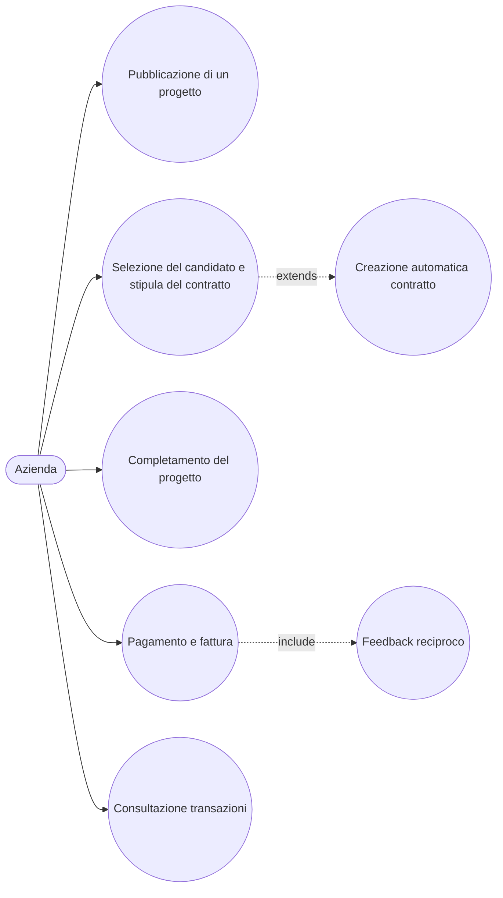

# Use Case: Azienda

L'azienda e lo stakeholder che pubblica micro-progetti sulla piattaforma SkillMatch per trovare professionisti qualificati a cui affidare attivita di formazione, consulenza o prototipazione a breve termine. Il suo percorso comprende la pubblicazione del progetto, la selezione del candidato tramite firma del micro-contratto, il pagamento a fine lavoro e la ricezione della relativa fattura. Di seguito sono descritti i casi d'uso principali con i relativi endpoint REST reali esposti dai microservizi coinvolti.

## Caso d'uso 1: Pubblicazione di un progetto

**Attore**: Azienda

**Precondizioni**: L'azienda e autenticata tramite Keycloak con ruolo COMPANY.

**Flusso principale**:
1. L'azienda crea un progetto in bozza con `POST /api/v1/projects` (ruolo COMPANY), specificando titolo, descrizione, durata in giorni, budget e requisiti di competenze. Il progetto viene salvato con stato iniziale `DRAFT`.
2. Quando pronta, l'azienda pubblica il progetto con `PUT /api/v1/projects/{projectId}/publish`, che porta lo stato da `DRAFT` a `OPEN`.
3. La pubblicazione genera l'evento `project.published`, consumato dal Notification Service, che notifica i professionisti con competenze corrispondenti e conferma la pubblicazione all'azienda.
4. L'azienda puo consultare i propri progetti in qualunque momento con `GET /api/v1/projects/mine`.

**Postcondizioni**: Il progetto e visibile pubblicamente tra quelli aperti (`GET /api/v1/projects/open`) ed e pronto a ricevere candidature.

## Caso d'uso 2: Selezione del candidato e stipula del contratto

**Attore**: Azienda

**Precondizioni**: Il progetto e `OPEN` e ha ricevuto almeno una candidatura da parte di professionisti validati.

**Flusso principale**:
1. L'azienda consulta le candidature ricevute con `GET /api/v1/projects/{projectId}/candidatures`.
2. Valuta i profili e accetta un candidato con `PUT /api/v1/projects/{projectId}/candidatures/{candidatureId}/accept`.
3. L'accettazione pubblica l'evento `candidature.accepted`, che fa creare automaticamente un contratto in stato `DRAFT` presso il Contract Service, con importo pari al budget del progetto e commissione pari al tasso corrente configurato dall'admin (default 8%).
4. L'azienda firma per prima il contratto con `PUT /api/v1/contracts/{contractId}/sign`, portandolo da `DRAFT` a `PENDING_SIGNATURES`.
5. Il contratto diventa `ACTIVE` solo dopo la controfirma del professionista.

**Postcondizioni**: Esiste un contratto `ACTIVE` che vincola azienda e professionista alle condizioni pattuite (importo e commissione).

## Caso d'uso 3: Completamento del progetto

**Attore**: Azienda

**Precondizioni**: Il contratto e `ACTIVE` e il lavoro concordato e stato terminato.

**Flusso principale**:
1. L'azienda segna il progetto come completato con `PUT /api/v1/projects/{projectId}/complete`, che pubblica l'evento `project.completed`.
2. L'evento notifica il Payment Service, abilitando l'avvio del pagamento, e il Contract Service.
3. L'azienda chiude il contratto con `PUT /api/v1/contracts/{contractId}/complete`, che porta lo stato da `ACTIVE` a `COMPLETED`.

**Postcondizioni**: Il progetto risulta concluso e il contratto e `COMPLETED`, condizione necessaria per poter avviare il pagamento.

## Caso d'uso 4: Pagamento e fattura

**Attore**: Azienda

**Precondizioni**: Il contratto e `COMPLETED` e non e ancora stato pagato.

**Flusso principale**:
1. L'azienda avvia il pagamento con `POST /api/v1/payments`, indicando il `contractId`.
2. Il Payment Service recupera sincronamente i dettagli del contratto dal Contract Service, calcola la commissione di piattaforma (percentuale configurata dall'admin, di default 8%) e l'importo netto spettante al professionista.
3. Il Payment Service crea la transazione e genera un'unica fattura per l'azienda, comprensiva sia del compenso del professionista sia della commissione trattenuta dalla piattaforma.
4. Viene pubblicato l'evento `payment.completed`, che abilita il feedback reciproco nel Feedback Service e notifica entrambe le parti tramite il Notification Service.

**Postcondizioni**: La transazione e registrata, la fattura e disponibile e il flusso di feedback reciproco e sbloccato.

## Caso d'uso 5: Consultazione transazioni

**Attore**: Azienda

**Precondizioni**: L'azienda ha effettuato almeno un pagamento tramite la piattaforma.

**Flusso principale**:
1. L'azienda consulta lo storico delle proprie transazioni con `GET /api/v1/transactions/company/mine`.
2. Seleziona una transazione specifica e ne scarica la fattura con `GET /api/v1/transactions/{transactionId}/invoice`.

**Postcondizioni**: L'azienda dispone di uno storico completo dei pagamenti effettuati e delle relative fatture ai fini amministrativi e contabili.
