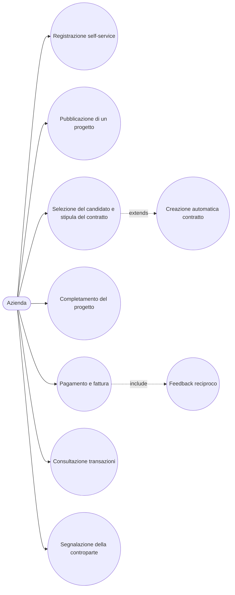

# Use Case: Azienda

L'azienda e lo stakeholder che pubblica micro-progetti sulla piattaforma SkillMatch per trovare professionisti qualificati a cui affidare attivita di formazione, consulenza o prototipazione a breve termine. Il suo percorso comprende la pubblicazione del progetto, la selezione del candidato tramite firma del micro-contratto, il pagamento a fine lavoro e la ricezione della relativa fattura. Di seguito sono descritti i casi d'uso principali con i relativi endpoint REST reali esposti dai microservizi coinvolti.

## Caso d'uso 0: Registrazione self-service

**Attore**: Azienda

**Precondizioni**: L'azienda non possiede ancora un account sulla piattaforma. Il ruolo ADMIN non e selezionabile in questo flusso: non e ammessa l'auto-registrazione come amministratore.

**Flusso principale**:
1. L'azienda compila un unico modulo di registrazione (email, password, ragione sociale, ruolo COMPANY) e invia `POST /api/v1/auth/register` (endpoint pubblico, nessun JWT richiesto).
2. Lo User Service crea l'identita su Keycloak tramite Admin REST API, quindi crea in un'unica transazione applicativa la riga utente (`status=PENDING`) e il profilo minimo (ragione sociale, `companyName`).
3. Lo User Service pubblica l'evento `user.registered` sull'exchange `skillmatch.events`, consumato dal Notification Service, che invia una notifica di benvenuto.
4. L'azienda puo ora autenticarsi tramite Keycloak con il flusso Authorization Code + PKCE e iniziare a pubblicare progetti.

Dettagli implementativi e motivazioni della scelta architetturale sono descritti in [ADR-007: Registrazione self-service](../adr/ADR-007-self-service-registration.md).

**Postcondizioni**: L'azienda ha un account Keycloak e un profilo minimo con ragione sociale registrata. Come il professionista, deve comunque attendere la validazione di un admin prima di poter creare un progetto (vedi caso d'uso successivo).

## Caso d'uso 1: Pubblicazione di un progetto

**Attore**: Azienda

**Precondizioni**: L'azienda e autenticata tramite Keycloak con ruolo COMPANY, ed e stata validata da un admin (`status=VALIDATED`): la stessa regola di validazione che si applica ai professionisti prima di potersi candidare vale anche per le aziende prima di poter creare un progetto, tramite lo stesso endpoint amministrativo (`POST /api/v1/admin/users/{userId}/validate`).

**Flusso principale**:
1. L'azienda crea un progetto in bozza con `POST /api/v1/projects` (ruolo COMPANY). Il Project Service verifica sincronamente presso lo User Service che l'azienda sia `VALIDATED` (altrimenti rifiuta la richiesta), quindi salva titolo, descrizione, durata in giorni, budget e requisiti di competenze con stato iniziale `DRAFT`.
2. Quando pronta, l'azienda pubblica il progetto con `PUT /api/v1/projects/{projectId}/publish`, che porta lo stato da `DRAFT` a `OPEN`.
3. La pubblicazione genera l'evento `project.published`, consumato dal Notification Service, che notifica i professionisti con competenze corrispondenti e conferma la pubblicazione all'azienda.
4. L'azienda puo consultare i propri progetti in qualunque momento con `GET /api/v1/projects/mine`.

**Postcondizioni**: Il progetto e visibile pubblicamente tra quelli aperti (`GET /api/v1/projects/open`) ed e pronto a ricevere candidature.

## Caso d'uso 2: Selezione del candidato e stipula del contratto

**Attore**: Azienda

**Precondizioni**: Il progetto e `OPEN` e ha ricevuto almeno una candidatura da parte di professionisti validati.

**Flusso principale**:
1. Quando un professionista invia una candidatura viene pubblicato l'evento `candidature.submitted`, che notifica l'azienda proprietaria del progetto tramite il Notification Service.
2. L'azienda consulta le candidature ricevute con `GET /api/v1/projects/{projectId}/candidatures`.
3. Puo scartare i candidati non idonei rifiutandoli singolarmente con `PUT /api/v1/projects/{projectId}/candidatures/{candidatureId}/reject`, senza che questo influisca sullo stato del progetto ne sulle altre candidature: e un'azione indipendente, utilizzabile anche prima di aver scelto il candidato definitivo.
4. Per valutare un candidato, consulta il suo profilo e la sua reputazione con `GET /api/v1/users/{userId}/professional-profile` (endpoint riservato al professionista stesso o, di aggiunta recente, a un'azienda che sta esaminando una candidatura), ed eventuali segnalazioni pregresse a suo carico con `GET /api/v1/users/{userId}/reports` (aperto a qualunque professionista o azienda autenticati, non solo all'admin). Valutati i profili, accetta il candidato scelto con `PUT /api/v1/projects/{projectId}/candidatures/{candidatureId}/accept`.
5. L'accettazione pubblica l'evento `candidature.accepted`, che fa creare automaticamente un contratto in stato `DRAFT` presso il Contract Service, con importo pari al budget del progetto e commissione pari al tasso corrente configurato dall'admin (default 8%); contestualmente vengono rifiutate automaticamente tutte le altre candidature ancora `PENDING` per lo stesso progetto e il progetto passa a stato `ASSIGNED`.
6. L'azienda firma per prima il contratto con `PUT /api/v1/contracts/{contractId}/sign`, portandolo da `DRAFT` a `PENDING_SIGNATURES`.
7. Il contratto diventa `ACTIVE` solo dopo la controfirma del professionista.

**Postcondizioni**: Il progetto e `ASSIGNED`, tutte le candidature diverse da quella accettata risultano rifiutate (esplicitamente o automaticamente) ed esiste un contratto `ACTIVE` che vincola azienda e professionista alle condizioni pattuite (importo e commissione).

## Caso d'uso 3: Completamento del progetto

**Attore**: Azienda

**Precondizioni**: Il contratto e `ACTIVE` e il lavoro concordato e stato terminato.

**Flusso principale**:
1. L'azienda segna il progetto come completato con `PUT /api/v1/projects/{projectId}/complete`, che pubblica l'evento `project.completed`.
2. L'evento notifica il Payment Service, abilitando l'avvio del pagamento, e il Contract Service.
3. L'azienda chiude il contratto con `PUT /api/v1/contracts/{contractId}/complete`, che porta lo stato da `ACTIVE` a `COMPLETED`.

**Postcondizioni**: Il progetto risulta concluso e il contratto e `COMPLETED`, condizione necessaria per poter avviare il pagamento.

## Caso d'uso 4: Pagamento e fattura

**Attore**: Azienda

**Precondizioni**: Il contratto e `COMPLETED` e non e ancora stato pagato.

**Flusso principale**:
1. Prima ancora di pagare, l'azienda puo consultare il tasso di commissione attualmente in vigore con `GET /api/v1/commission-config/current` (aperto a qualunque utente autenticato, non solo all'admin), per mostrare una stima corretta sul contratto: la percentuale puo cambiare nel tempo, e quella mostrata deve coincidere con quella che verra davvero applicata al momento del pagamento.
2. L'azienda avvia il pagamento con `POST /api/v1/payments`, indicando il `contractId`.
3. Il Payment Service recupera sincronamente i dettagli del contratto dal Contract Service, calcola la commissione di piattaforma (percentuale configurata dall'admin, di default 8%, la stessa consultata al passo 1) e l'importo netto spettante al professionista.
4. Il Payment Service crea la transazione e genera un'unica fattura per l'azienda, comprensiva sia del compenso del professionista sia della commissione trattenuta dalla piattaforma.
5. Viene pubblicato l'evento `payment.completed`, che abilita il feedback reciproco nel Feedback Service e notifica entrambe le parti tramite il Notification Service.

**Postcondizioni**: La transazione e registrata, la fattura e disponibile e il flusso di feedback reciproco e sbloccato.

## Caso d'uso 5: Consultazione transazioni

**Attore**: Azienda

**Precondizioni**: L'azienda ha effettuato almeno un pagamento tramite la piattaforma.

**Flusso principale**:
1. L'azienda consulta lo storico delle proprie transazioni con `GET /api/v1/transactions/company/mine`.
2. Seleziona una transazione specifica e ne scarica la fattura con `GET /api/v1/transactions/{transactionId}/invoice`.

**Postcondizioni**: L'azienda dispone di uno storico completo dei pagamenti effettuati e delle relative fatture ai fini amministrativi e contabili.

## Caso d'uso 6: Segnalazione della controparte

**Attore**: Azienda (o Professionista, con lo stesso endpoint)

**Precondizioni**: L'azienda ha collaborato con un professionista sulla piattaforma e ritiene di doverne segnalare il comportamento.

**Flusso principale**:
1. L'azienda invia una segnalazione con `POST /api/v1/reports` (ruolo PROFESSIONAL o COMPANY), indicando l'utente segnalato e il motivo della segnalazione.
2. Non e possibile segnalare se stessi: il sistema rifiuta la richiesta se il segnalante e il segnalato coincidono.
3. La segnalazione viene messa a disposizione di un admin per la revisione (vedi caso d'uso admin "Gestione segnalazioni").

**Postcondizioni**: La segnalazione e registrata e in attesa di revisione da parte di un admin. L'azione e puramente informativa: non sospende automaticamente nessun utente.
