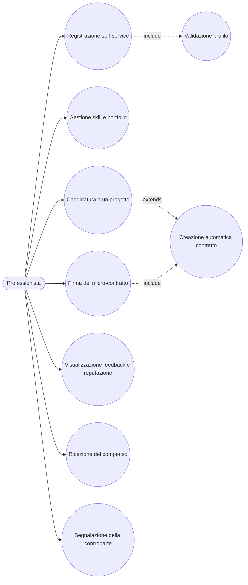

# Use Case: Professionista

Il professionista e lo stakeholder che offre le proprie competenze sulla piattaforma SkillMatch per svolgere micro-progetti su commissione delle aziende. Il suo percorso tipico comprende la registrazione e la validazione del profilo, la candidatura ai progetti aperti, la firma dei micro-contratti e, a lavoro concluso, la ricezione del compenso e dei feedback. Di seguito sono descritti i casi d'uso principali con i relativi endpoint REST reali esposti dai microservizi coinvolti.

## Caso d'uso 1: Registrazione self-service

**Attore**: Professionista

**Precondizioni**: L'utente non possiede ancora un account sulla piattaforma. Il ruolo ADMIN non e selezionabile in questo flusso: non e ammessa l'auto-registrazione come amministratore.

**Flusso principale**:
1. Il professionista compila un unico modulo di registrazione (email, password, nome, cognome, ruolo PROFESSIONAL) e invia `POST /api/v1/auth/register` (endpoint pubblico, nessun JWT richiesto).
2. Lo User Service crea l'identita su Keycloak tramite Admin REST API, quindi crea in un'unica transazione applicativa la riga utente (`status=PENDING`) e il profilo minimo (nome e cognome per il professionista).
3. Lo User Service pubblica l'evento `user.registered` sull'exchange `skillmatch.events`, consumato dal Notification Service, che invia una notifica di benvenuto.
4. Il professionista puo ora autenticarsi tramite Keycloak con il flusso Authorization Code + PKCE.
5. Il profilo resta in attesa di validazione da parte di un ADMIN (vedi caso d'uso admin "Validazione dei professionisti", `POST /api/v1/admin/users/{userId}/validate`), che porta `status` a `VALIDATED` e pubblica l'evento `user.validated`.

Dettagli implementativi e motivazioni della scelta architetturale sono descritti in [ADR-007: Registrazione self-service](../adr/ADR-007-self-service-registration.md).

**Postcondizioni**: L'utente ha un account Keycloak e un profilo professionale minimo con `status=PENDING`. Solo dopo la validazione dell'admin lo `status` diventa `VALIDATED` e il professionista puo candidarsi ai progetti.

## Caso d'uso 1b: Gestione skill e portfolio

**Attore**: Professionista

**Precondizioni**: Il professionista e autenticato con ruolo PROFESSIONAL e ha un profilo registrato.

**Flusso principale**:
1. Il professionista cerca competenze nel catalogo condiviso con `GET /api/v1/skills?search=` (ricerca case-insensitive, restituisce al massimo 20 risultati, pensata per l'autocomplete lato frontend).
2. Aggiorna l'elenco delle proprie competenze con `PUT /api/v1/users/{userId}/skills` (ruolo PROFESSIONAL), selezionando le voci dal catalogo.
3. Aggiorna il proprio portfolio (elenco di lavori/esperienze) con `PUT /api/v1/users/{userId}/portfolio-items`.
4. Consulta in qualsiasi momento il proprio profilo professionale dettagliato, completo di competenze e portfolio, con `GET /api/v1/users/{userId}/professional-profile` (ruolo PROFESSIONAL).

**Postcondizioni**: Il profilo professionale riflette le competenze e il portfolio aggiornati, visibili alle aziende in fase di valutazione delle candidature.

## Caso d'uso 2: Candidatura a un progetto

**Attore**: Professionista

**Precondizioni**: Il professionista e autenticato e il proprio profilo ha `status=VALIDATED`.

**Flusso principale**:
1. Il professionista consulta i progetti aperti con `GET /api/v1/projects/open`.
2. Sceglie un progetto e invia la candidatura con `POST /api/v1/projects/{projectId}/candidatures` (ruolo PROFESSIONAL).
3. Il Project Service verifica sincronamente, tramite chiamata REST protetta da Circuit Breaker Resilience4j, che lo `status` dell'utente presso lo User Service sia `VALIDATED`, applicando la regola di business "solo chi supera la validazione puo candidarsi ai progetti".
4. Se la verifica ha esito positivo, la candidatura viene registrata, viene pubblicato l'evento `candidature.submitted` (che notifica l'azienda proprietaria del progetto) e il professionista puo consultarla con `GET /api/v1/projects/candidatures/mine`.
5. Se l'azienda accetta la candidatura tramite `PUT /api/v1/projects/{projectId}/candidatures/{candidatureId}/accept`, viene pubblicato l'evento `candidature.accepted`, che fa nascere automaticamente un micro-contratto in stato `DRAFT` presso il Contract Service; contestualmente vengono rifiutate automaticamente tutte le altre candidature ancora `PENDING` per lo stesso progetto e il progetto passa a stato `ASSIGNED`.
6. In alternativa, l'azienda puo rifiutare esplicitamente e singolarmente una candidatura non idonea con `PUT /api/v1/projects/{projectId}/candidatures/{candidatureId}/reject`, senza che questo influisca sullo stato del progetto ne sulle altre candidature.

**Postcondizioni**: La candidatura risulta registrata (e successivamente accettata o rifiutata dall'azienda, oppure rifiutata automaticamente in seguito all'accettazione di un'altra candidatura sullo stesso progetto). In caso di accettazione esiste un contratto `DRAFT` associato pronto per la firma e il progetto e `ASSIGNED`.

## Caso d'uso 3: Firma del micro-contratto

**Attore**: Professionista

**Precondizioni**: Esiste un contratto in stato `DRAFT` o `PENDING_SIGNATURES` generato a seguito dell'accettazione della candidatura, e l'azienda ha gia firmato per prima.

**Flusso principale**:
1. Il professionista consulta il contratto proposto (creato automaticamente in stato `DRAFT` dal Contract Service in seguito all'evento `candidature.accepted`).
2. L'azienda firma per prima, portando il contratto da `DRAFT` a `PENDING_SIGNATURES`.
3. Il professionista firma a sua volta con `PUT /api/v1/contracts/{contractId}/sign`.
4. Con entrambe le firme presenti, il contratto transita da `PENDING_SIGNATURES` ad `ACTIVE`.

**Postcondizioni**: Il contratto e `ACTIVE` e il micro-progetto puo iniziare. Al termine del lavoro l'azienda segnera il progetto come completato e chiudera il contratto (`ACTIVE`->`COMPLETED`).

## Caso d'uso 4: Visualizzazione feedback e reputazione

**Attore**: Professionista

**Precondizioni**: Il contratto e stato completato e il pagamento e avvenuto (evento `payment.completed` pubblicato dal Payment Service).

**Flusso principale**:
1. Il Feedback Service riceve l'evento `payment.completed` e abilita la valutazione reciproca per il progetto.
2. Il professionista lascia un feedback all'azienda tramite `POST /api/v1/feedbacks`, indicando un rating da 1 a 5 e un commento opzionale.
3. Riceve a sua volta un feedback dall'azienda tramite lo stesso endpoint, invocato dal lato azienda.
4. Consulta i feedback ricevuti con `GET /api/v1/feedbacks/received/mine` e quelli dati con `GET /api/v1/feedbacks/given/mine`.
5. Alla ricezione di un nuovo feedback, viene pubblicato l'evento `feedback.aggregated`, consumato dallo User Service, che ricalcola automaticamente il livello di reputazione secondo le regole: Junior (media inferiore a 3.5 oppure recensioni totali inferiori a 3), Affidabile (media maggiore o uguale a 3.5 e recensioni totali maggiori o uguali a 3), Top Performer (media maggiore o uguale a 4.5 e recensioni totali maggiori o uguali a 10).

**Postcondizioni**: Il feedback e registrato e il livello di reputazione del professionista e aggiornato e consultabile pubblicamente sul suo profilo.

## Caso d'uso 5: Ricezione del compenso

**Attore**: Professionista

**Precondizioni**: Il contratto e `COMPLETED` e l'azienda ha avviato il pagamento tramite `POST /api/v1/payments`.

**Flusso principale**:
1. In qualsiasi momento, anche prima del pagamento, il professionista puo consultare il tasso di commissione attualmente in vigore con `GET /api/v1/commission-config/current` (aperto a qualunque utente autenticato, non solo all'admin), per farsi un'idea di quanto trattenuto sara sul proprio compenso.
2. Il Payment Service calcola la commissione di piattaforma (percentuale configurata dall'admin, di default 8%) e l'importo netto spettante al professionista.
3. Il Payment Service registra la transazione e genera un'unica fattura per l'azienda, comprensiva di compenso e commissione.
4. Viene pubblicato l'evento `payment.completed`, che notifica il professionista dell'avvenuto pagamento e abilita il flusso di feedback reciproco.
5. Il professionista consulta le proprie transazioni con `GET /api/v1/transactions/professional/mine`, e la fattura di ciascuna con `GET /api/v1/transactions/{transactionId}/invoice`: l'endpoint accetta come parte della transazione sia l'azienda sia il professionista fin dalla sua introduzione, ma solo di recente il frontend ha aggiunto la schermata che lo rende usabile dal professionista.

**Postcondizioni**: Il professionista ha ricevuto il compenso netto sul proprio conto di pagamento e puo visualizzare lo storico delle transazioni e delle relative fatture.

## Caso d'uso 6: Segnalazione della controparte

**Attore**: Professionista (o Azienda, con lo stesso endpoint)

**Precondizioni**: Il professionista ha collaborato con un'azienda sulla piattaforma e ritiene di doverne segnalare il comportamento.

**Flusso principale**:
1. Il professionista invia una segnalazione con `POST /api/v1/reports` (ruolo PROFESSIONAL o COMPANY), indicando l'utente segnalato e il motivo della segnalazione.
2. Non e possibile segnalare se stessi: il sistema rifiuta la richiesta se il segnalante e il segnalato coincidono.
3. La segnalazione viene messa a disposizione di un admin per la revisione (vedi caso d'uso admin "Gestione segnalazioni").

**Postcondizioni**: La segnalazione e registrata e in attesa di revisione da parte di un admin. L'azione e puramente informativa: non sospende automaticamente nessun utente.
